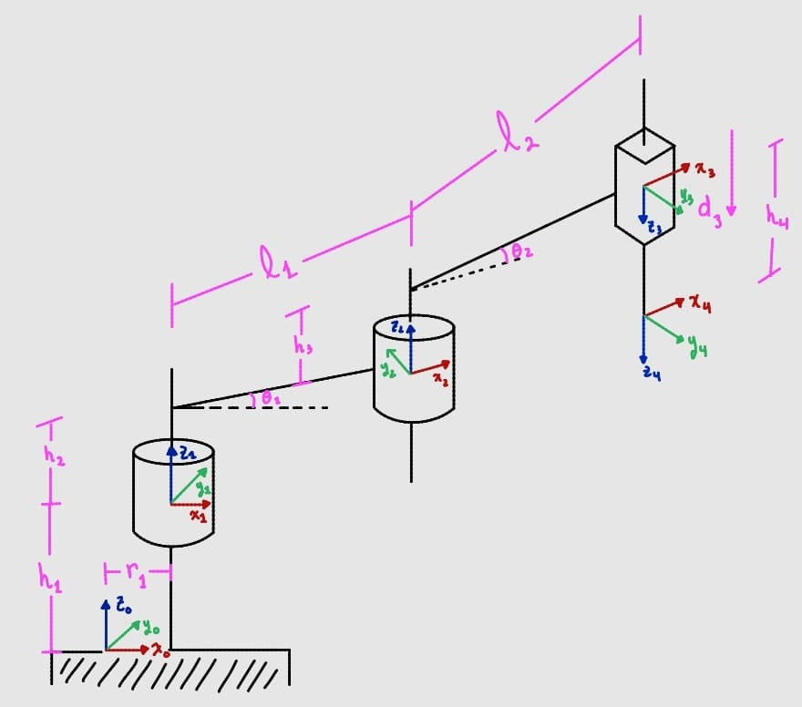
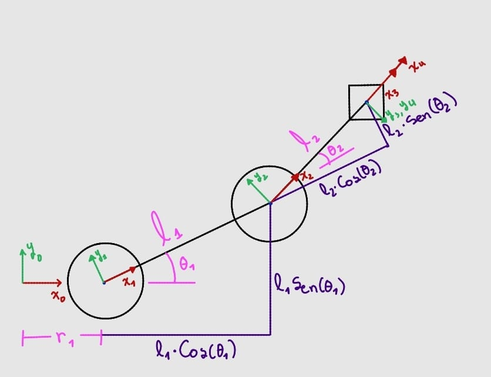

# Cinemática Directa del Robot SCARA

Este documento desarrolla la **cinemática directa** del robot SCARA del proyecto, es decir, el cálculo de la posición y orientación del efector final respecto a la base, en función de las variables articulares del robot.

El robot cuenta con **3 grados de libertad activos**:

| Articulación | Tipo | Variable |
|---|---|---|
| 1 | Rotacional | $\theta_1$ |
| 2 | Rotacional | $\theta_2$ |
| 3 | Prismática | $d_3$ |

Para comprobar la consistencia del modelo, la cinemática directa se resolvió por **dos métodos independientes**:

1. **Matrices de Transformación Homogénea (MTH)** — construidas "a mano" analizando cada desplazamiento y rotación entre sistemas de referencia consecutivos.
2. **Denavit–Hartenberg (DH)** — usando la tabla de parámetros estándar y la matriz genérica $A_i$.

Como se muestra al final, **ambos métodos arrojan exactamente la misma matriz final**, lo que confirma que la asignación de sistemas de referencia y el modelo geométrico del robot son correctos.

---

## 0. Vistas del robot y sistemas de referencia

Antes de entrar en las matrices, estas dos vistas muestran cómo se ubicaron los sistemas de referencia $\{0\},\{1\},\{2\},\{3\},\{4\}$ sobre el robot y de dónde salen físicamente cada uno de los parámetros ($r_1$, $l_1$, $l_2$, $h_1$–$h_4$, $d_3$, $\theta_1$, $\theta_2$) usados en las matrices.

### Vista general (isométrica)

  

Aquí se ve la cadena completa de eslabones desde la base ($\{0\}$) hasta el efector final ($\{4\}$):

- $\{0\}$ está en la base, elevado una altura $h_1$ y desplazado $r_1$ respecto al punto de apoyo.
- $\{1\}$ es el origen de la primera articulación rotacional ($\theta_1$), a una altura adicional $h_2$.
- $\{2\}$ es el origen de la segunda articulación rotacional ($\theta_2$), separado de $\{1\}$ por el eslabón $l_1$ y a una altura $h_3$.
- $\{3\}$ está al final del eslabón $l_2$, en la base de la articulación prismática.
- $\{4\}$ es el sistema del efector final, desplazado verticalmente por $d_3$ (variable) y $h_4$ (fijo) respecto a $\{3\}$.

Esta vista es la que sustenta directamente las traslaciones y rotaciones usadas en las matrices $T_1^0, T_2^1, T_3^2, T_4^3$ (y sus equivalentes DH $A_1, A_2, A_3, A_4$) de las secciones 1 y 2.

### Vista superior (plano XY)

  

Esta vista, tomada desde arriba, muestra el plano en el que realmente se mueve el efector final (el eje $z$ queda "de frente" al lector). Aquí se aprecia con claridad la construcción geométrica que da origen a las componentes $p_x$ y $p_y$ de la posición final:

- El eslabón $l_1$, rotado un ángulo $\theta_1$ respecto al eje $x_0$, se proyecta sobre los ejes como $l_1\cos\theta_1$ (horizontal) y $l_1\sin\theta_1$ (vertical).
- El eslabón $l_2$, rotado un ángulo adicional $\theta_2$ respecto a $x_1$ (medido desde el eje $x_2$, solidario al primer eslabón), se proyecta como $l_2\cos\theta_2$ y $l_2\sin\theta_2$ en el sistema $\{2\}$.
- Sumando vectorialmente ambas proyecciones, más el desfase inicial $r_1$, se obtiene directamente:

$$p_x = r_1 + l_1\cos\theta_1 + l_2\cos(\theta_1+\theta_2)$$
$$p_y = l_1\sin\theta_1 + l_2\sin(\theta_1+\theta_2)$$

Estas dos expresiones son exactamente las que aparecen en la última columna de la matriz $T_4^0$ obtenida en las secciones 1 y 2 — es decir, esta vista superior es una forma **geométrica/intuitiva** de llegar al mismo resultado que se obtuvo algebraicamente multiplicando matrices, y sirve como tercera verificación cruzada del modelo.

---

## 1. Método 1: Matrices de Transformación Homogénea (MTH)

La idea de este método es recorrer la cadena cinemática eslabón por eslabón, y en cada tramo preguntarse: *"¿qué rotación y qué traslación hay entre el sistema $i-1$ y el sistema $i$?"*. Cada respuesta se traduce en una matriz homogénea $4\times4$, y la transformación total es el producto de todas ellas:

$$
T_4^0 = T_1^0 \cdot T_2^1 \cdot T_3^2 \cdot T_4^3
$$

### Tramo 0 → 1 ($T_1^0$)

Del sistema base al sistema 1 solo hay traslación pura: una separación $r_1$ en $x$ y una altura $h_1$ en $z$ (no hay rotación entre estos dos ejes).

$$
T_1^0 =
\begin{bmatrix}
1 & 0 & 0 & r_1 \\
0 & 1 & 0 & 0 \\
0 & 0 & 1 & h_1 \\
0 & 0 & 0 & 1
\end{bmatrix}
$$

### Tramo 1 → 2 ($T_2^1$)

Aquí aparece la primera articulación rotacional $\theta_1$ (rotación en torno a $z$), combinada con una traslación de $l_1$ a lo largo del nuevo eje $x$ y una altura $h_2$ en $z$:

$$
T_2^1 =
\begin{bmatrix}
\cos\theta_1 & -\sin\theta_1 & 0 & l_1\cos\theta_1 \\
\sin\theta_1 & \cos\theta_1 & 0 & l_1\sin\theta_1 \\
0 & 0 & 1 & h_2 \\
0 & 0 & 0 & 1
\end{bmatrix}
$$

### Tramo 2 → 3 ($T_3^2$)

Segunda articulación rotacional $\theta_2$. A diferencia del tramo anterior, aquí el sistema 3 está **girado 180° respecto a $x$** (por eso aparece el $-1$ en la componente $z$ y los signos cambiados en la segunda fila/columna: $R_z(\theta_2)\cdot R_x(180°)$). También hay traslación $l_2$ en $x$ y $h_3$ en $z$:

$$
T_3^2 =
\begin{bmatrix}
\cos\theta_2 & \sin\theta_2 & 0 & l_2\cos\theta_2 \\
\sin\theta_2 & -\cos\theta_2 & 0 & l_2\sin\theta_2 \\
0 & 0 & -1 & h_3 \\
0 & 0 & 0 & 1
\end{bmatrix}
$$

### Tramo 3 → 4 ($T_4^3$)

Tramo final, correspondiente a la articulación prismática. No hay rotación, solo una traslación vertical dada por la suma de la altura fija $h_4$ más el desplazamiento variable $d_3$:

$$
T_4^3 =
\begin{bmatrix}
1 & 0 & 0 & 0 \\
0 & 1 & 0 & 0 \\
0 & 0 & 1 & d_3 + h_4 \\
0 & 0 & 0 & 1
\end{bmatrix}
$$

> **Nota:** en el desarrollo a mano esta última matriz quedó rotulada como $T_1^0$ por error de transcripción; en realidad corresponde a $T_4^3$, que es la que se usa en el producto final.

### Resultado del producto $T_4^0$

Multiplicando las cuatro matrices en orden, y usando las identidades trigonométricas de suma de ángulos ($\cos\theta_1\cos\theta_2 - \sin\theta_1\sin\theta_2 = \cos(\theta_1+\theta_2)$, etc.), se llega a:

$$
T_4^0 =
\begin{bmatrix}
\cos(\theta_1+\theta_2) & \sin(\theta_1+\theta_2) & 0 & l_1\cos\theta_1 + l_2\cos(\theta_1+\theta_2) + r_1 \\
\sin(\theta_1+\theta_2) & -\cos(\theta_1+\theta_2) & 0 & l_1\sin\theta_1 + l_2\sin(\theta_1+\theta_2) \\
0 & 0 & -1 & h_1+h_2+h_3-h_4-d_3 \\
0 & 0 & 0 & 1
\end{bmatrix}
$$

---

## 2. Método 2: Denavit–Hartenberg (DH)

El método DH es más sistemático: en lugar de "pensar" geométricamente cada tramo, se sigue una convención fija de 4 parámetros por eslabón ($\theta_i$, $d_i$, $\alpha_i$, $a_i$) obtenidos a partir de reglas de asignación de ejes.

### 2.1 Asignación de sistemas de referencia

Para cada eslabón se definieron los ejes $z_i$ y $x_i$ siguiendo la convención estándar:

**Ejes $z_i$** (eje de cada articulación):

| $i$ | Regla | Resultado |
|---|---|---|
| 1 | $x_{i-1} = x_0 \Rightarrow x_i = x_1$, con $z_0$ fijo | Distancia respecto a $z_0$: $h_1$ |
| 2 | $x_{i-1}=x_1 \Rightarrow x_i=x_2$, con $z_1$ fijo | Distancia respecto a $z_1$: $h_2$ |
| 3 | $x_{i-1}=x_2 \Rightarrow x_i=x_3$, con $z_2$ fijo | Distancia respecto a $z_2$: $h_3$ |
| 4 | $x_{i-1}=x_3 \Rightarrow x_i=x_4$, con $z_3$ fijo | Distancia respecto a $z_3$: $h_4+d_3$ |

**Ejes $x_i$** (perpendicular común entre $z_{i-1}$ y $z_i$):

| $i$ | Regla | Resultado |
|---|---|---|
| 1 | $z_{i-1}=z_0 \Rightarrow z_i=z_1$, con $x_1$ fijo | Distancia respecto a $x_1$: $r_1$ |
| 2 | $z_{i-1}=z_1 \Rightarrow z_i=z_2$, con $x_2$ fijo | Distancia respecto a $x_2$: $l_1$ |
| 3 | $z_{i-1}=z_2 \Rightarrow z_i=z_3$, con $x_3$ fijo (ángulo $\pi$ entre ejes) | Distancia respecto a $x_3$: $l_2$ |
| 4 | $z_{i-1}=z_3 \Rightarrow z_i=z_4$, con $x_4$ fijo | Distancia respecto a $x_4$: $0$ |

### 2.2 Tabla de parámetros DH

| $i$ | $\theta_i$ | $d_i$ | $\alpha_i$ | $a_i$ |
|---|---|---|---|---|
| 1 | $0$ | $h_1$ | $0$ | $r_1$ |
| 2 | $\theta_1$ | $h_2$ | $0$ | $l_1$ |
| 3 | $\theta_2$ | $h_3$ | $\pi$ | $l_2$ |
| 4 | $0$ | $h_4+d_3$ | $0$ | $0$ |

Variables articulares del robot:

$$q_1=\theta_1 \qquad q_2=\theta_2 \qquad q_3=d_3$$

### 2.3 Matriz genérica $A_i$

Cada fila de la tabla se convierte en una matriz homogénea usando la fórmula estándar de Denavit–Hartenberg:

$$
A_i =
\begin{bmatrix}
\cos\theta_i & -\sin\theta_i\cos\alpha_i & \sin\theta_i\sin\alpha_i & a_i\cos\theta_i \\
\sin\theta_i & \cos\theta_i\cos\alpha_i & -\cos\theta_i\sin\alpha_i & a_i\sin\theta_i \\
0 & \sin\alpha_i & \cos\alpha_i & d_i \\
0 & 0 & 0 & 1
\end{bmatrix}
$$

### 2.4 Matrices individuales

**$A_1$** ($\theta_1=0,\ d_1=h_1,\ \alpha_1=0,\ a_1=r_1$):

$$
A_1 =
\begin{bmatrix}
1 & 0 & 0 & r_1 \\
0 & 1 & 0 & 0 \\
0 & 0 & 1 & h_1 \\
0 & 0 & 0 & 1
\end{bmatrix}
$$

**$A_2$** ($\theta_2=\theta_1,\ d_2=h_2,\ \alpha_2=0,\ a_2=l_1$):

$$
A_2 =
\begin{bmatrix}
\cos\theta_1 & -\sin\theta_1 & 0 & l_1\cos\theta_1 \\
\sin\theta_1 & \cos\theta_1 & 0 & l_1\sin\theta_1 \\
0 & 0 & 1 & h_2 \\
0 & 0 & 0 & 1
\end{bmatrix}
$$

**$A_3$** ($\theta_3=\theta_2,\ d_3=h_3,\ \alpha_3=\pi,\ a_3=l_2$). Al evaluar $\cos\pi=-1$ y $\sin\pi=0$:

$$
A_3 =
\begin{bmatrix}
\cos\theta_2 & \sin\theta_2 & 0 & l_2\cos\theta_2 \\
\sin\theta_2 & -\cos\theta_2 & 0 & l_2\sin\theta_2 \\
0 & 0 & -1 & h_3 \\
0 & 0 & 0 & 1
\end{bmatrix}
$$

**$A_4$** ($\theta_4=0,\ d_4=h_4+d_3,\ \alpha_4=0,\ a_4=0$):

$$
A_4 =
\begin{bmatrix}
1 & 0 & 0 & 0 \\
0 & 1 & 0 & 0 \\
0 & 0 & 1 & h_4+d_3 \\
0 & 0 & 0 & 1
\end{bmatrix}
$$

### 2.5 Producto final

$$
T_4^0 = A_1 \cdot A_2 \cdot A_3 \cdot A_4
$$

---

## 3. Comparación de resultados

Nótese que **$A_1=T_1^0$**, **$A_2=T_2^1$**, **$A_3=T_3^2$** y **$A_4=T_4^3$** son idénticas matriz a matriz entre ambos métodos. Esto no es casualidad: significa que la asignación de ejes hecha "intuitivamente" en el método MTH coincide exactamente con la que exige la convención formal de Denavit-Hartenberg.

Como consecuencia, el producto final es el mismo por los dos caminos:

$$
T_4^0 =
\begin{bmatrix}
\cos(\theta_1+\theta_2) & \sin(\theta_1+\theta_2) & 0 & l_1\cos\theta_1 + l_2\cos(\theta_1+\theta_2) + r_1 \\
\sin(\theta_1+\theta_2) & -\cos(\theta_1+\theta_2) & 0 & l_1\sin\theta_1 + l_2\sin(\theta_1+\theta_2) \\
0 & 0 & -1 & h_1+h_2+h_3-h_4-d_3 \\
0 & 0 & 0 & 1
\end{bmatrix}
$$

De esta matriz se puede leer directamente:

- **Posición del efector final** (última columna):
  - $p_x = l_1\cos\theta_1 + l_2\cos(\theta_1+\theta_2) + r_1$
  - $p_y = l_1\sin\theta_1 + l_2\sin(\theta_1+\theta_2)$
  - $p_z = h_1+h_2+h_3-h_4-d_3$
- **Orientación del efector final** (submatriz $3\times3$ superior izquierda): rotación neta $\theta_1+\theta_2$ en torno a $z$, combinada con la inversión de $z$ heredada del giro de 180° introducido en el eslabón 3.

## 4. Conclusión

Obtener la **misma matriz $T_4^0$** por MTH y por DH confirma que:

1. La geometría del robot (longitudes $l_1$, $l_2$, alturas $h_1$–$h_4$, offset $r_1$) fue interpretada correctamente en ambos métodos.
2. La orientación de los ejes en cada sistema de referencia es consistente.
3. El modelo de cinemática directa está listo para usarse como base de la **cinemática inversa** (siguiente sección de este repositorio), ya que las ecuaciones de posición ($p_x, p_y, p_z$) obtenidas aquí son el punto de partida para despejar $\theta_1$, $\theta_2$ y $d_3$ en función de una posición deseada del efector final.