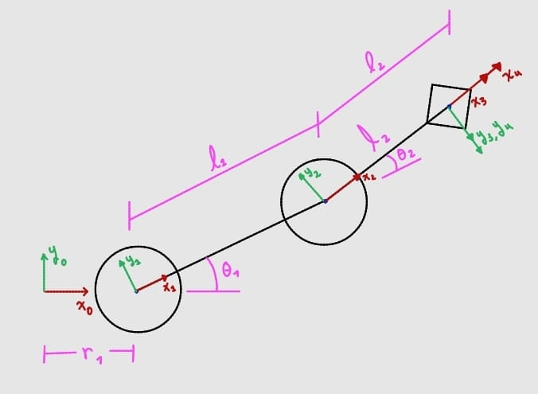
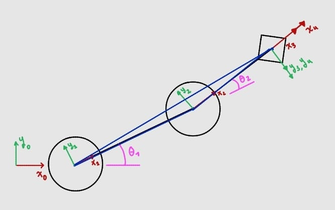
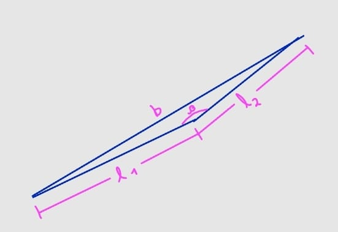
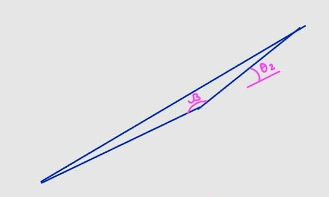
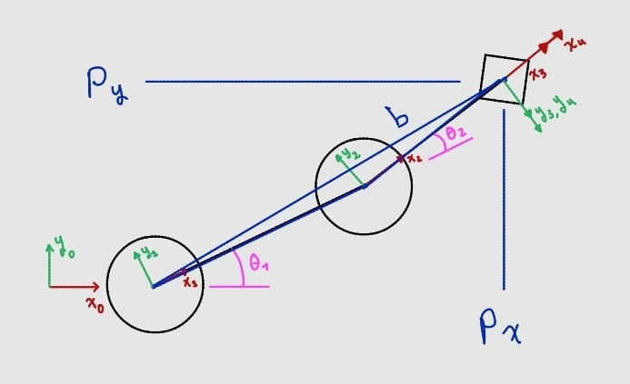
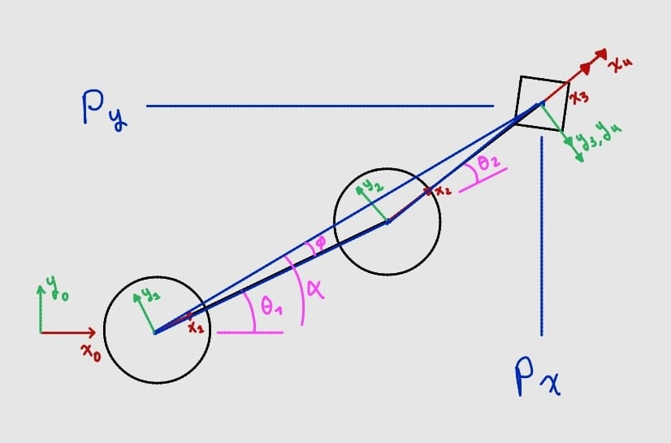
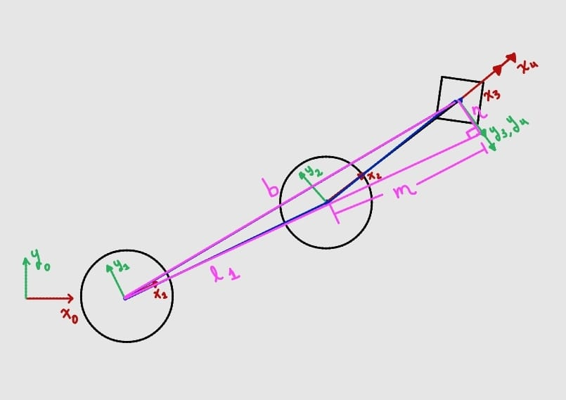
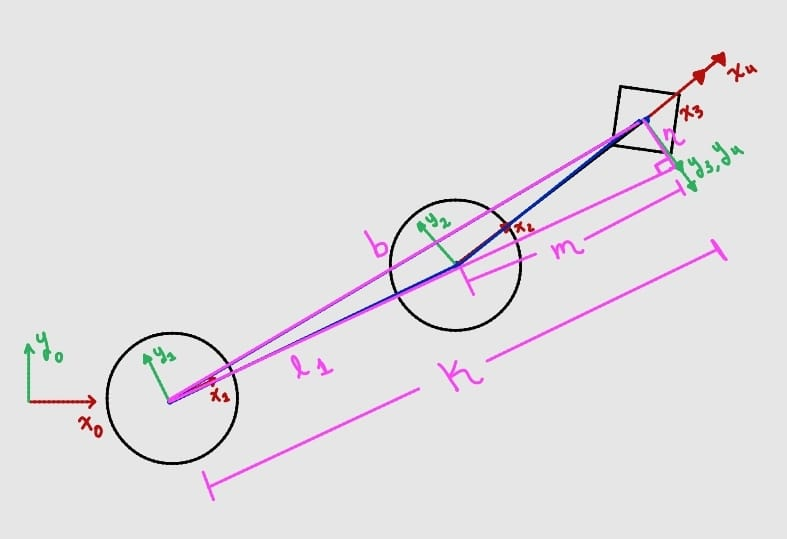

# Cinemática Inversa del Robot SCARA

Este documento desarrolla la **cinemática inversa** del robot SCARA: dado un punto deseado del efector final $(p_x, p_y, p_z)$, se busca calcular las variables articulares $\theta_1$, $\theta_2$ y $d_3$ necesarias para alcanzarlo.

La estrategia usada es **desacoplamiento geométrico**: como el robot es un SCARA, el movimiento se separa en dos problemas independientes que se resuelven por separado y luego se combinan:

1. Un problema **planar** (en $x,y$) para hallar $\theta_1$ y $\theta_2$, resuelto con geometría de triángulos (ley de cosenos).
2. Un problema **de una sola variable** (en $z$) para hallar $d_3$, resuelto despejando directamente de la ecuación de posición vertical.

Esta separación es posible porque, como se vio en la cinemática directa, la altura del efector final ($p_z$) depende **únicamente** de $d_3$ y de constantes del robot, mientras que $p_x$ y $p_y$ dependen **únicamente** de $\theta_1$ y $\theta_2$.

---

## 0. Planteamiento del problema

  

Se parte de un punto objetivo $(p_x, p_y, p_z)$ para el efector final, en el mismo sistema de referencia $\{0\}$ usado en la cinemática directa. El robot conserva la misma geometría vista antes: offset de base $r_1$, eslabones $l_1$ y $l_2$, alturas $h_1$–$h_4$, y articulación prismática $d_3$.

---

## 1. Reducción al plano de trabajo

  

Vista desde arriba (plano $xy$), donde se aprecia cómo $\theta_1$ y $\theta_2$ determinan la posición del efector final. Para simplificar el problema, se trabaja con las coordenadas del punto objetivo **relativas al origen del sistema $\{1\}$** (es decir, ya descontado el offset fijo $r_1$ de la base):

$$\rho_x = p_x - r_1 \qquad \rho_y = p_y$$

De aquí en adelante, $\rho_x$ y $\rho_y$ son los catetos del triángulo que se usa para resolver $\theta_1$ y $\theta_2$. El cálculo de $\theta_1$, $\theta_2$ es completamente independiente del de $d_3$ (sección 4).

---

## 2. Cálculo de $\theta_2$ (ley de cosenos)

### 2.1 Construcción del triángulo

Se traza la línea recta $b$ desde el origen de $\{1\}$ hasta el punto objetivo (efector final). Junto con los eslabones $l_1$ y $l_2$, esta línea forma un triángulo:

  

Aislando el triángulo de lados $l_1$, $l_2$ y $b$:

  

El ángulo interno del triángulo opuesto a $b$ es $\beta$. Por la geometría del mecanismo, $\beta$ y $\theta_2$ son ángulos suplementarios:

  

$$\beta + \theta_2 = 180^\circ \quad\Rightarrow\quad \beta = 180^\circ - \theta_2$$

Aplicando **ley de cosenos** en el triángulo:

$$b^2 = l_2^2 + l_1^2 - 2\,l_1 l_2 \cos(\beta)$$

### 2.2 Distancia $b$ al punto objetivo

  

Del triángulo rectángulo formado por $\rho_x$, $\rho_y$ y $b$:

$$b = \sqrt{\rho_x^2 + \rho_y^2}$$

### 2.3 Despeje de $\theta_2$

Sustituyendo $\beta = 180^\circ-\theta_2$ y usando $\cos(180^\circ-\theta_2) = -\cos(\theta_2)$:

$$b^2 = l_2^2 + l_1^2 - 2\,l_1 l_2 \cos(180^\circ-\theta_2) = l_2^2 + l_1^2 + 2\,l_1 l_2 \cos(\theta_2)$$

Despejando el coseno:

$$\cos(\theta_2) = \frac{b^2 - l_1^2 - l_2^2}{2\,l_1 l_2}$$

Y usando la identidad $\sin^2(\theta_2)+\cos^2(\theta_2)=1$:

$$\sin(\theta_2) = \pm\sqrt{1-\left(\frac{b^2-l_1^2-l_2^2}{2\,l_1 l_2}\right)^2}$$

Dividiendo seno entre coseno para obtener la tangente, y despejando $\theta_2$:

$$
\boxed{
\theta_2 = \arctan\left(
\dfrac{\pm\sqrt{1-\left(\dfrac{b^2-l_1^2-l_2^2}{2\,l_1 l_2}\right)^2}\;\cdot\;2\,l_1 l_2}
{b^2-l_1^2-l_2^2}
\right)
}
$$

> **Sobre el signo $\pm$:** el radical de $\sin(\theta_2)$ tiene dos soluciones válidas. Físicamente corresponden a las dos configuraciones posibles del brazo para alcanzar el mismo punto: **codo arriba** y **codo abajo**. Elegir el signo `+` o `-` selecciona cuál de las dos configuraciones adopta el robot.

---

## 3. Cálculo de $\theta_1$ (triángulos auxiliares)

### 3.1 Ángulos $\alpha$ y $\varphi$

  

Se definen dos ángulos auxiliares que, combinados, dan $\theta_1$:

- $\alpha$: ángulo entre el eje $x_0$ y la línea $b$ (línea recta hacia el punto objetivo).
- $\varphi$: ángulo entre la línea $b$ y el eslabón $l_1$.

De la geometría se cumple:

$$\alpha = \theta_1 + \varphi \quad\Rightarrow\quad \theta_1 = \alpha - \varphi$$

Por definición de tangente en el triángulo rectángulo formado por $\rho_x$, $\rho_y$ y $b$:

$$\tan(\alpha) = \frac{\rho_y}{\rho_x} \quad\Rightarrow\quad \alpha = \arctan\left(\frac{\rho_y}{\rho_x}\right)$$

### 3.2 Proyección del eslabón $l_2$

  

Se proyecta el eslabón $l_2$ sobre la dirección de $l_1$ (componente $m$) y sobre su perpendicular (componente $n$, definida de forma análoga a $m$):

$$m = l_2\cos(\theta_2) \qquad n = l_2\sin(\theta_2)$$

### 3.3 Distancia total $k$

  

La distancia total en la dirección de $l_1$ es:

$$k = l_1 + m = l_1 + l_2\cos(\theta_2)$$

Y $\varphi$ es el ángulo cuya tangente relaciona $n$ y $k$:

$$\tan(\varphi) = \frac{n}{k} = \frac{l_2\sin(\theta_2)}{l_1+l_2\cos(\theta_2)} \quad\Rightarrow\quad \varphi = \arctan\left(\frac{l_2\sin(\theta_2)}{l_1+l_2\cos(\theta_2)}\right)$$

### 3.4 Despeje de $\theta_1$

Sustituyendo $\alpha$ y $\varphi$ en $\theta_1=\alpha-\varphi$:

$$
\boxed{
\theta_1 = \arctan\left(\dfrac{\rho_y}{\rho_x}\right) - \arctan\left(\dfrac{l_2\sin(\theta_2)}{l_1+l_2\cos(\theta_2)}\right)
}
$$

> **Nota práctica:** en una implementación real conviene usar la función `atan2(ρy, ρx)` en vez de `arctan(ρy/ρx)`, ya que `atan2` sí distingue en qué cuadrante está el punto objetivo (evita ambigüedades cuando $\rho_x$ es negativo o cero).

---

## 4. Cálculo de $d_3$ (componente vertical)

De la cinemática directa (matriz $T_4^0$) se obtuvo que la altura del efector final es:

$$p_z = h_1+h_2+h_3-h_4-d_3$$

Como esta ecuación depende **únicamente** de $d_3$ (todo lo demás son constantes fijas del robot), se despeja directamente:

$$
\boxed{
d_3 = h_1+h_2+h_3-h_4-p_z
}
$$

---

## 5. Solución completa de la cinemática inversa

| Variable | Fórmula |
|---|---|
| $\rho_x,\ \rho_y$ | $\rho_x = p_x - r_1,\quad \rho_y = p_y$ |
| $b$ | $b=\sqrt{\rho_x^2+\rho_y^2}$ |
| $\theta_2$ | $\theta_2=\arctan\!\left(\dfrac{\pm\sqrt{1-\left(\frac{b^2-l_1^2-l_2^2}{2l_1l_2}\right)^2}\cdot 2l_1l_2}{b^2-l_1^2-l_2^2}\right)$ |
| $\theta_1$ | $\theta_1=\arctan\!\left(\dfrac{\rho_y}{\rho_x}\right)-\arctan\!\left(\dfrac{l_2\sin\theta_2}{l_1+l_2\cos\theta_2}\right)$ |
| $d_3$ | $d_3=h_1+h_2+h_3-h_4-p_z$ |

Dado un punto objetivo $(p_x,p_y,p_z)$, el orden de cálculo es:

1. Calcular $\rho_x, \rho_y$ y $b$.
2. Calcular $\theta_2$ (eligiendo signo según configuración deseada: codo arriba o codo abajo).
3. Calcular $\theta_1$ usando el $\theta_2$ obtenido.
4. Calcular $d_3$ de forma independiente, directamente desde $p_z$.

---

## 6. Verificación de consistencia

Un punto objetivo alcanzable por el robot tiene, en general, **dos soluciones válidas** (codo arriba / codo abajo) debido al signo $\pm$ en $\theta_2$, y **una única solución** para $d_3$, ya que la articulación prismática no tiene ambigüedad de configuración.

Como prueba de consistencia del modelo, si se toman los valores de $\theta_1$, $\theta_2$ y $d_3$ obtenidos aquí y se sustituyen en la matriz $T_4^0$ de la [cinemática directa](../cinematica-directa/README.md), se debe recuperar exactamente el punto objetivo $(p_x,p_y,p_z)$ del que se partió — cerrando así el ciclo directa ⇄ inversa.