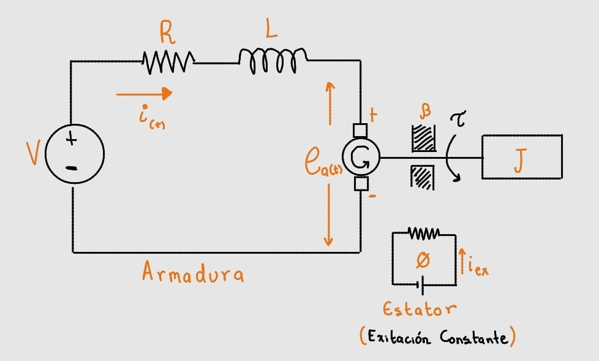
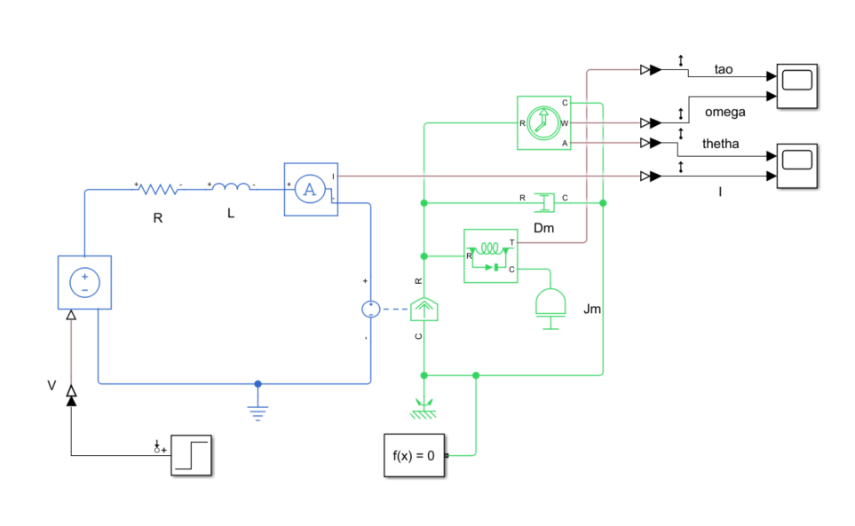
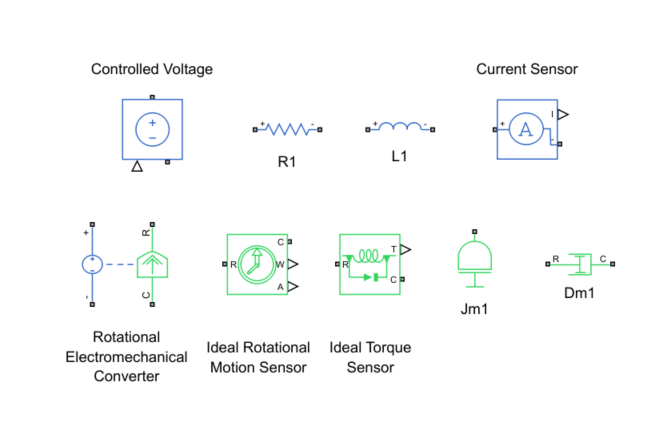
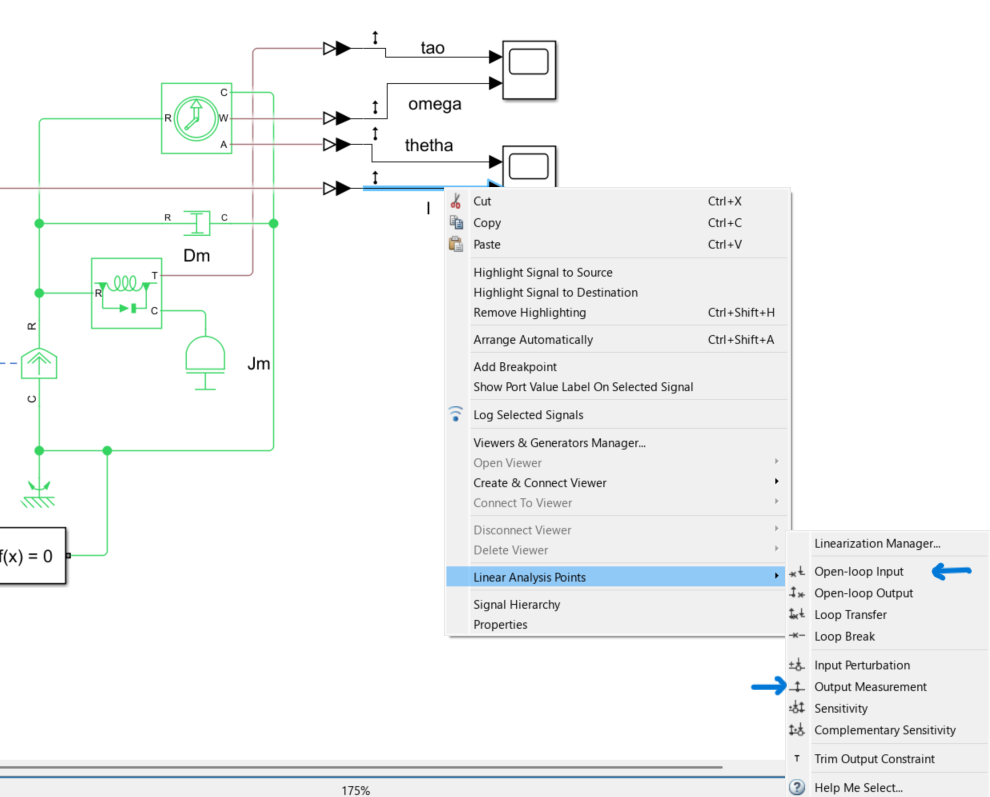
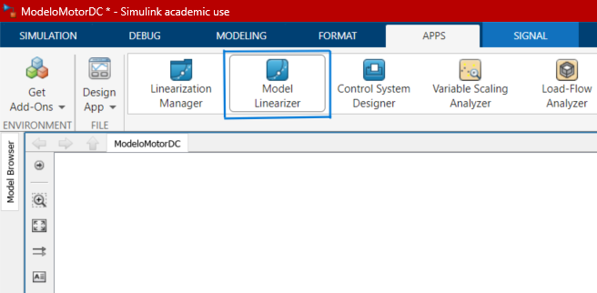
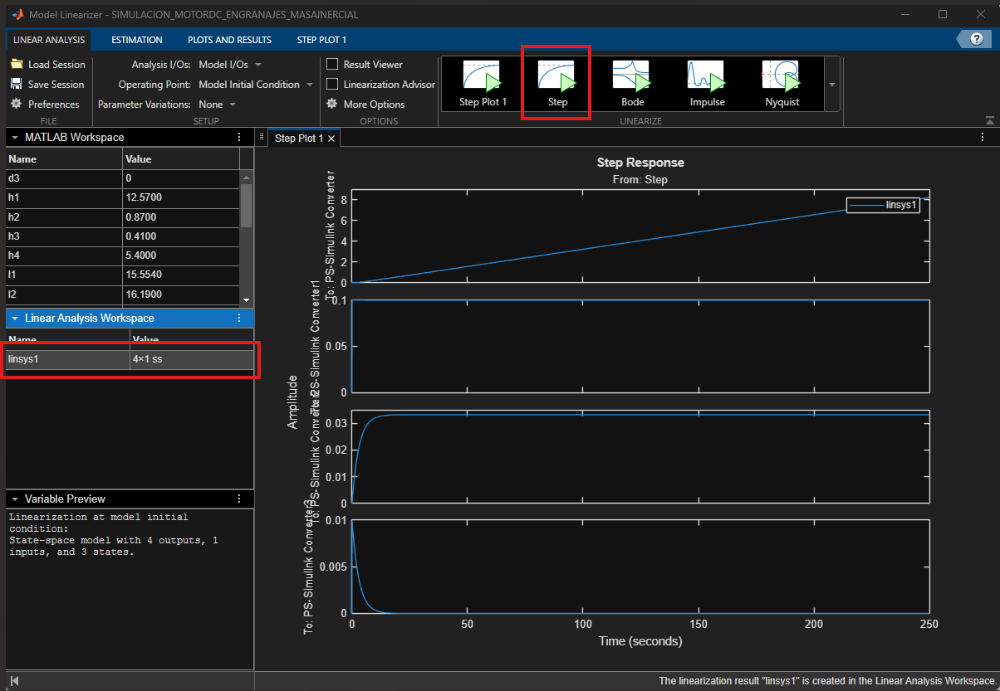
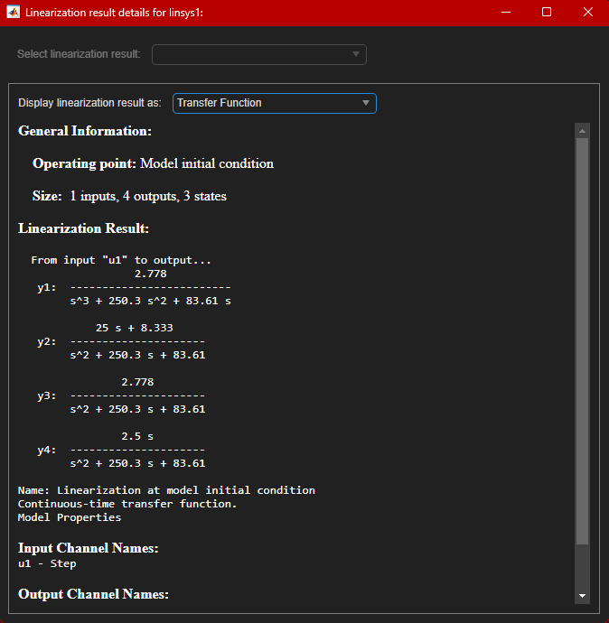

# Modelado de un Motor DC en Simscape

Este documento explica el modelado de un **motor DC de excitación independiente constante**, tanto su deducción matemática (función de transferencia) como su implementación y verificación en **Simscape** (Matlab/Simulink).

El objetivo es obtener, por dos caminos independientes, la relación entre el voltaje de armadura aplicado $V(s)$ y las variables de interés del motor (corriente, torque, velocidad angular y posición angular), y comprobar que ambos caminos coinciden:

1. **Camino analítico:** deducción de las funciones de transferencia a mano, a partir de las ecuaciones eléctricas y mecánicas del motor.
2. **Camino en Simscape:** construcción del circuito físico del motor con bloques de Simscape y extracción de las funciones de transferencia con el **Model Linearizer**.

---

## 0. Modelo físico del motor DC

  

El motor se modela de forma **simplificada, con flujo $\phi$ constante** en el estator (excitación constante). Por esta razón el estator no se modela como un circuito independiente: su efecto queda representado en dos constantes del motor, $K_a$ y $K_m$.

- **Circuito de armadura:** fuente de voltaje $V$, resistencia $R$, inductancia $L$ y corriente de armadura $i(t)$.
- **Fuerza contraelectromotriz:** $e_a(t)$, inducida en la armadura por el giro del motor.
- **Parte mecánica:** el motor entrega un torque $\tau$ a una inercia $J$, con un coeficiente de fricción viscosa $\beta$ que se opone al giro.

---

## 1. Modelo matemático (función de transferencia)

### 1.1 Constantes del motor

**$K_a$** — relación entre el voltaje inducido en la armadura y la velocidad angular del eje del motor:

$$e_a(t) = K_a \cdot \omega(t)$$

Aplicando la transformada de Laplace:

**(1)**

$$E_a(s) = K_a\, W(s)$$

**$K_m$** — relación entre el torque mecánico generado y la corriente que circula por la armadura:

$$\tau = K_m\, i(t)$$

Aplicando la transformada de Laplace:

**(2)**

$$I(s) = \frac{T(s)}{K_m}$$

### 1.2 Análisis de malla eléctrica y de inercia mecánica

**Malla eléctrica** (ley de voltajes de Kirchhoff en el circuito de armadura):

$$V(t) = R\,i(t) + L\,\frac{di}{dt} + e_a(t)$$

Aplicando la transformada de Laplace y despejando:

**(3)**

$$L\,s\,I(s) = V(s) - R\,I(s) - E_a(s)$$

**Inercia mecánica** (segunda ley de Newton para rotación, con fricción viscosa $\beta$):

$$J\ddot\theta = \tau - \beta\dot\theta$$

Aplicando la transformada de Laplace:

$$J s\, W(s) = T(s) - \beta\, W(s)$$

Despejando $W(s)$:

**(4)**

$$W(s) = \frac{T(s)}{Js+\beta}$$

### 1.3 Despeje de ecuaciones

Sustituyendo (1) y (2) en (3):

**(5)**

$$(Ls+R)\left(\frac{T(s)}{K_m}\right) + K_a\, W(s) = V(s)$$

Sustituyendo (4) en (5):

$$\left(\frac{Ls+R}{K_m}+\frac{K_a}{Js+\beta}\right)T(s) = V(s)$$

$$\left(\frac{(Ls+R)(Js+\beta)+K_m K_a}{K_m(Js+\beta)}\right)T(s) = V(s)$$

### 1.4 Funciones de transferencia resultantes

De la ecuación anterior se extraen las cuatro funciones de transferencia del sistema, todas con el mismo denominador característico:

$$
\frac{T(s)}{V(s)} = \frac{K_m(Js+\beta)}{JLs^2+(L\beta+RJ)s+R\beta+K_mK_a} \qquad \text{(Torque / Voltaje)}
$$

$$
\frac{W(s)}{V(s)} = \frac{K_m}{JLs^2+(L\beta+RJ)s+R\beta+K_mK_a} \qquad \text{(Velocidad angular / Voltaje)}
$$

$$
\frac{\theta(s)}{V(s)} = \frac{K_m}{s\big(JLs^2+(L\beta+RJ)s+R\beta+K_mK_a\big)} \qquad \text{(Posición angular / Voltaje)}
$$

$$
\frac{I(s)}{V(s)} = \frac{Js+\beta}{JLs^2+(L\beta+RJ)s+R\beta+K_mK_a} \qquad \text{(Corriente / Voltaje)}
$$

### 1.5 Valores numéricos usados

| Parámetro | Valor |
|---|---|
| $R$ | $10\ \Omega$ |
| $L$ | $40\ \text{mH} = 0.04\ \text{H}$ |
| $J$ | $0.9\ \text{Kg·m}^2$ |
| $\beta$ | $0.3\ \text{Nms/rad}$ |
| $K_m$ | $0.1\ \text{V·s/rad}$ |
| $K_a$ | $0.1\ \text{V·s/rad}$ |

Sustituyendo estos valores (y normalizando dividiendo entre $JL=0.036$), las funciones de transferencia quedan:

$$
\boxed{\dfrac{T(s)}{V(s)} = \dfrac{2.5\,s+0.833}{s^2+250.35\,s+83.61}}
\qquad
\boxed{\dfrac{W(s)}{V(s)} = \dfrac{2.777}{s^2+250.35\,s+83.61}}
$$

$$
\boxed{\dfrac{\theta(s)}{V(s)} = \dfrac{2.777}{s^3+250.35\,s^2+83.61\,s}}
\qquad
\boxed{\dfrac{I(s)}{V(s)} = \dfrac{25\,s+8.33}{s^2+250.35\,s+83.61}}
$$

Estas cuatro funciones de transferencia son el resultado analítico que se va a **contrastar** con lo que arroje Simscape en la sección siguiente.

---

## 2. Modelo en Simscape

  

El circuito físico del motor se construyó directamente con bloques de Simscape, replicando el diagrama de la sección 0:

- **Fuente de voltaje controlada** (`V`), alimentada por un escalón (`Step`), que representa $V(t)$.
- **Resistencia** (`R`) e **inductancia** (`L`) en serie, representando el circuito de armadura.
- **Sensor de corriente** (`A`), que mide $i(t)$.
- **Rotational Electromechanical Converter**, el bloque que traduce el dominio eléctrico al dominio mecánico rotacional (equivale físicamente al motor: aquí se aplican $K_m$ y $K_a$).
- **`Jm`** (Ideal Torque Sensor + inercia): representa la inercia $J$ del sistema mecánico.
- **`Dm`** (amortiguador rotacional ideal): representa la fricción viscosa $\beta$.
- **Ideal Rotational Motion Sensor**: mide torque, velocidad angular y posición angular en el eje.
- Bloque de referencia mecánica (`f(x)=0`) y tierra eléctrica, necesarios para cerrar los dominios físicos de Simscape.
- Cuatro salidas conectadas a osciloscopios: `tao` (torque), `omega` (velocidad angular), `thetha` (posición angular) e `I` (corriente).

### 2.1 Bloques principales utilizados

  

| Bloque | Función en el modelo |
|---|---|
| Controlled Voltage | Fuente de voltaje de armadura $V(t)$ |
| R1 | Resistencia de armadura $R$ |
| L1 | Inductancia de armadura $L$ |
| Current Sensor | Mide la corriente de armadura $i(t)$ |
| Rotational Electromechanical Converter | Convierte el dominio eléctrico al dominio mecánico rotacional (relaciona $K_m$, $K_a$) |
| Ideal Rotational Motion Sensor | Mide velocidad angular ($\omega$) y posición angular ($\theta$) del eje |
| Ideal Torque Sensor | Mide el torque $\tau$ transmitido en el eje |
| Jm1 | Inercia rotacional $J$ |
| Dm1 | Amortiguador rotacional (fricción viscosa) $\beta$ |

---

## 3. Extracción de las funciones de transferencia con el Model Linearizer

Con el modelo ya armado y parametrizado con los valores de la sección 1.5, se usa la herramienta **Model Linearizer** de Matlab para linealizar el sistema y obtener sus funciones de transferencia de forma automática.

### 3.1 Configurar entradas y salidas de análisis

  

Sobre cada señal del modelo se hace clic derecho → **Linear Analysis Points**, y se define:

- La señal de voltaje `V` como **Input Perturbation** (entrada del sistema a linealizar).
- Las señales `tao`, `omega`, `thetha` e `I` como **Output Measurement** (salidas a medir).

Esto le indica a Matlab exactamente qué relación entrada-salida se quiere linealizar (equivalente a definir $V(s)$ como entrada y $T(s)$, $W(s)$, $\theta(s)$, $I(s)$ como salidas, tal como en la sección 1).

### 3.2 Abrir el Model Linearizer

  

Desde la pestaña **APPS** de Simulink se abre la app **Model Linearizer**.

### 3.3 Ejecutar la linealización (Step)

  

Dentro del Model Linearizer, se presiona el botón **Step**. Esto linealiza el modelo alrededor del punto de operación (condición inicial) y:

- Genera automáticamente las gráficas de respuesta al escalón para cada salida configurada.
- Crea la variable `linsys1` en el **Linear Analysis Workspace**, un modelo en espacio de estados de **1 entrada, 4 salidas y 3 estados** — coincide exactamente con el orden del sistema obtenido a mano (denominador de segundo grado para $T,W,I$ y de tercer grado para $\theta$, es decir, 3 estados en total).

### 3.4 Ver el resultado como función de transferencia

  

Haciendo doble clic sobre `linsys1` y seleccionando **Display linearization result as: Transfer Function**, Matlab muestra las cuatro funciones de transferencia obtenidas por linealización numérica del modelo físico.

---

## 4. Verificación de consistencia

Comparando el resultado del Model Linearizer con las funciones de transferencia obtenidas a mano en la sección 1.4, se observa que **coinciden los mismos coeficientes**:

| Salida | Función de transferencia (Simscape) | Coincide con |
|---|---|---|
| $I(s)/V(s)$ | $\dfrac{25s+8.333}{s^2+250.3s+83.61}$ | Corriente / Voltaje (sección 1.4) |
| $W(s)/V(s)$ | $\dfrac{2.778}{s^2+250.3s+83.61}$ | Velocidad angular / Voltaje |
| $\theta(s)/V(s)$ | $\dfrac{2.778}{s^3+250.3s^2+83.61s}$ | Posición angular / Voltaje |
| $T(s)/V(s)$ | $\dfrac{2.5s+0.833}{s^2+250.3s+83.61}$ | Torque / Voltaje |

El hecho de que el modelo físico armado bloque a bloque en Simscape y el modelo matemático deducido analíticamente arrojen **las mismas funciones de transferencia** confirma que:

1. Las ecuaciones eléctricas y mecánicas se plantearon correctamente.
2. Los bloques de Simscape (y sus parámetros $R$, $L$, $J$, $\beta$, $K_m$, $K_a$) representan fielmente al motor DC modelado.
3. El sistema queda listo para diseñar y probar controladores sobre estas funciones de transferencia en las siguientes etapas del proyecto.