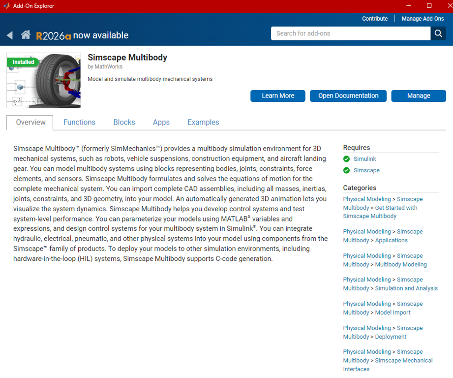
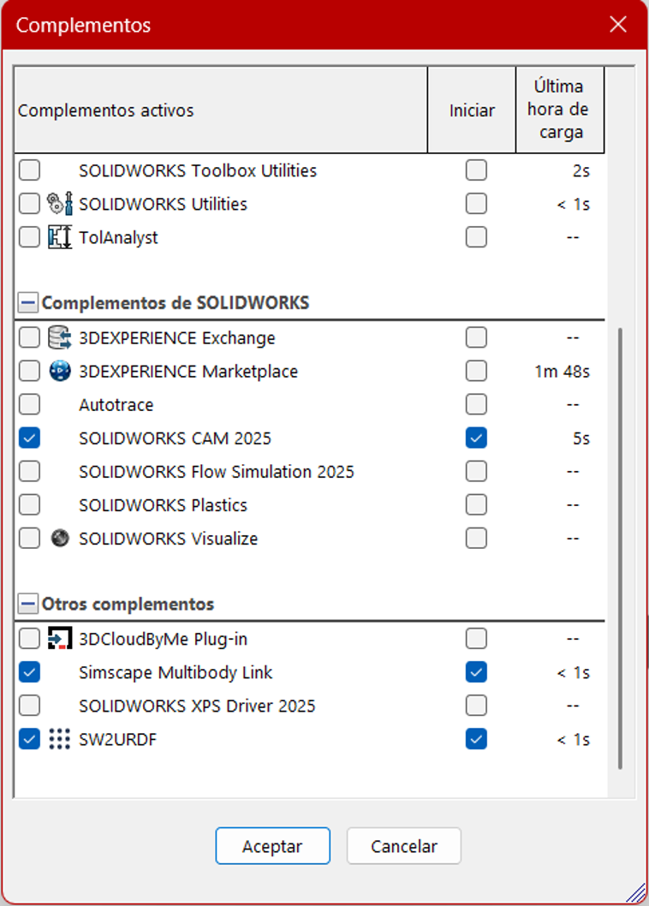
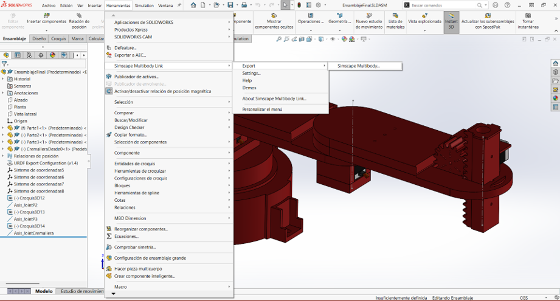
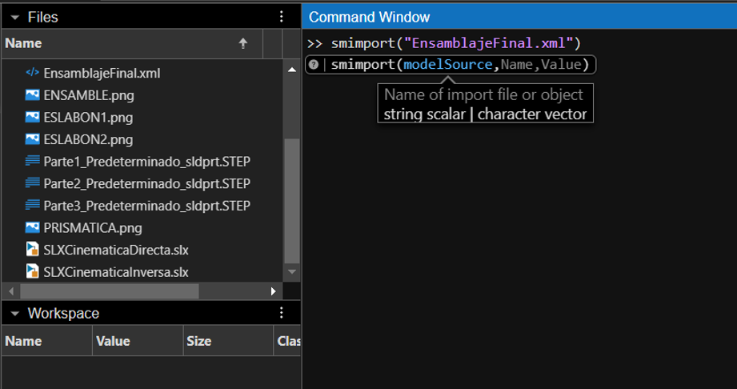
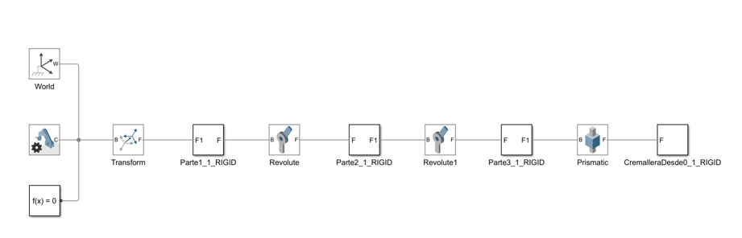
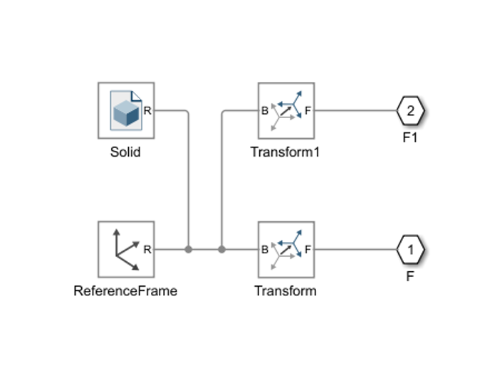
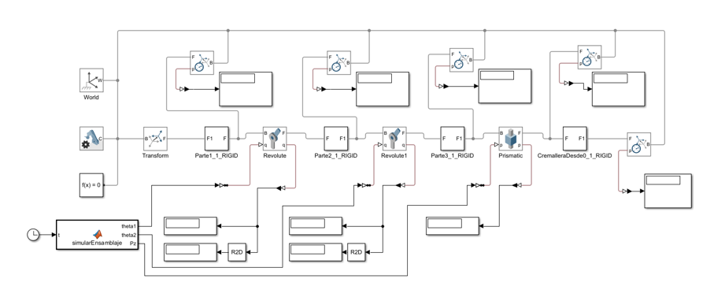
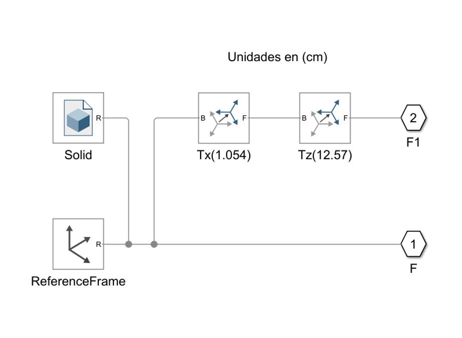
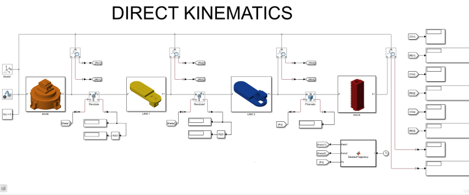
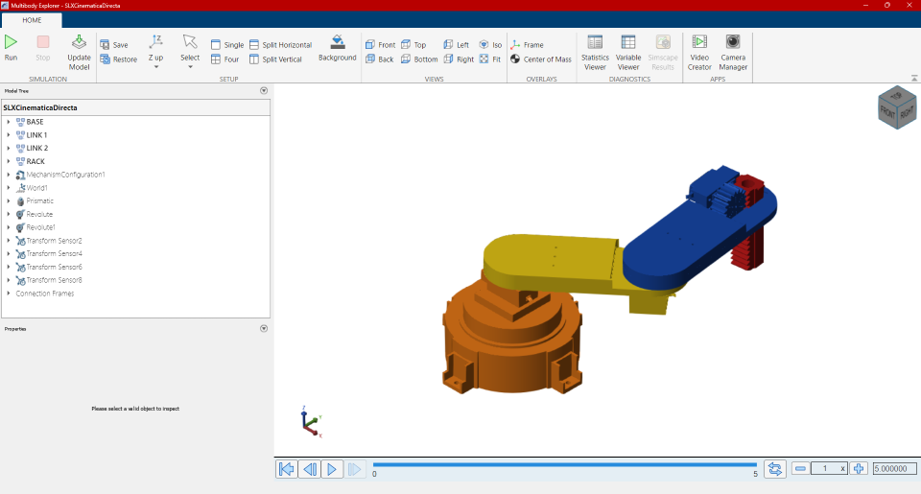

# 5. Matlab_Simscape

Esta carpeta contiene el modelado y la simulación dinámica del robot SCARA en **Matlab/Simulink**, usando **Simscape Multibody** a partir del ensamble 3D desarrollado previamente en SolidWorks. El objetivo es trasladar la geometría, las masas, las inercias y las restricciones cinemáticas del CAD hacia un entorno de simulación multicuerpo, para validar allí tanto la **cinemática directa** como la **cinemática inversa** calculadas analíticamente en las carpetas [`3.Cinematica_Directa`](../3.Cinematica_Directa) y [`4.Cinematica_Inversa`](../4.Cinematica_Inversa).

## Contenido de la carpeta

| Elemento | Descripción |
| --- | --- |
| `EnsamblajeFinal.xml` | Archivo de descripción multicuerpo exportado desde SolidWorks mediante Simscape Multibody Link. |
| `Parte1_Predeterminado_sldprt.STEP`, `Parte2_Predeterminado_sldprt.STEP`, `Parte3_Predeterminado_sldprt.STEP` | Geometría (mallas STEP) de cada eslabón, exportada junto con el XML para la representación 3D dentro de Simscape. |
| `SLXCinematicaDirecta.slx` | Modelo de Simulink que aplica una trayectoria articular deseada (θ1, θ2, d3) y anima el robot: cinemática directa. |
| `SLXCinematicaInversa.slx` | Modelo de Simulink que, a partir de un punto inicial y un punto final en coordenadas cartesianas, calcula las variables articulares necesarias (desacoplamiento geométrico) y anima el robot: cinemática inversa. |
| `ENSAMBLE.png`, `ESLABON1.png`, `ESLABON2.png`, `PRISMATICA.png` | Imágenes de cada eslabón/subsistema, usadas para personalizar visualmente los bloques del modelo en Simulink. |

> 📌 Los archivos `.STEP` y el `.xml` son generados automáticamente por el complemento **Simscape Multibody Link** de SolidWorks; no deben editarse manualmente, ya que cualquier cambio en el CAD requiere volver a exportarlos.

## 1. Requisitos previos

Antes de exportar o simular es necesario tener instalados y habilitados los siguientes complementos:

**En Matlab:** el paquete **Simscape Multibody** debe estar instalado desde el *Add-On Explorer*. Este paquete permite modelar y simular sistemas mecánicos multicuerpo en 3D (robots, suspensiones, tren de aterrizaje, etc.), formulando y resolviendo automáticamente las ecuaciones de movimiento del sistema completo, e incluye la posibilidad de importar ensambles CAD completos (masas, inercias, juntas, restricciones y geometría 3D).

<p align="center">
  
</p>

**En SolidWorks:** en el menú **Complementos**, deben activarse **Simscape Multibody Link** (el enlace que permite exportar el ensamble hacia Matlab) y, opcionalmente, **SW2URDF** si más adelante se va a trabajar la carpeta `7. URDF`.

<p align="center">
  
</p>

## 2. Exportación del ensamble desde SolidWorks

Con el CAD completo del robot ya armado —y simplificado en la mayor medida posible para aligerar la simulación (eliminando chaflanes, agujeros de tornillería, redondeos menores, etc.)— se exporta el ensamble hacia Simscape Multibody desde:

`Herramientas > Simscape Multibody Link > Export > Simscape Multibody...`

<p align="center">
  
</p>

Este proceso genera automáticamente:
- Un archivo **`.xml`** con la descripción del árbol de cuerpos, juntas, sistemas de coordenadas y propiedades de masa/inercia de cada pieza.
- Un archivo **`.STEP`** por cada pieza del ensamble, usado para la representación gráfica 3D dentro de Simulink.

## 3. Importación en Matlab

Ya en Matlab, el archivo `.xml` se importa con la función `smimport`, indicando el nombre del archivo exportado:

```matlab
smimport("EnsamblajeFinal.xml")
```

<p align="center">
  
</p>

Al ejecutar `smimport`, Matlab genera automáticamente un modelo `.slx` con todos los cuerpos (bloques `Solid`), las juntas (`Revolute`, `Prismatic`) y las transformaciones necesarias para reconstruir la cinemática del ensamble tal como estaba definida en SolidWorks.

## 4. Estructura general del modelo generado

Al finalizar la importación, el modelo `.slx` queda con la disposición general que se muestra a continuación: el bloque **World** como referencia inercial, un bloque **Transform** de posicionamiento inicial, y la cadena cinemática del robot compuesta por los cuerpos rígidos (`Parte1_1_RIGID`, `Parte2_1_RIGID`, `Parte3_1_RIGID`, `CremalleraDesde0_1_RIGID`) enlazados mediante las juntas `Revolute`, `Revolute1` y `Prismatic`, que corresponden a las dos articulaciones rotacionales y a la articulación prismática del SCARA.

<p align="center">
  
</p>

### Interior de los subsistemas `RIGID`

Cada bloque `_RIGID` es en realidad un subsistema que encapsula el sólido (`Solid`, con su geometría y propiedades de masa/inercia importadas del CAD), un `ReferenceFrame` y un par de bloques `Transform`, encargados de ubicar correctamente los puertos de entrada (`F`) y salida (`F1`) de la junta respecto al marco de referencia de la pieza.

<p align="center">
  
</p>

## 5. Instrumentación del modelo: sensores y entradas de movimiento

Con la cadena cinemática ya armada, se agregan las entradas de movimiento (`Motion Input`) en cada una de las juntas —las dos revolutas y la prismática— para poder excitarlas con las señales articulares (θ1, θ2, d3) provenientes de la cinemática directa o inversa. De forma paralela, se añaden **sensores de transformación** (`Transform Sensor`) en cada eslabón y en el efector final, para poder medir y graficar la posición/orientación real del robot durante la simulación.

<p align="center">
  
</p>

### Organización de las transformadas internas

Como mejora, dentro de cada subsistema `RIGID` las transformadas se reorganizan **en serie** (por ejemplo, una traslación en X seguida de una traslación en Z), en lugar de dejarlas como una única transformada compuesta. Esto facilita revisar y depurar visualmente cada desplazamiento geométrico de la pieza respecto a su marco de referencia.

<p align="center">
  
</p>

## 6. Organización final del modelo

En la versión final del modelo se mejora la presentación general: se asignan **imágenes representativas** a cada eslabón y a la articulación prismática (base, `LINK 1`, `LINK 2` y `RACK`), de modo que el diagrama de bloques se identifica visualmente con la pieza real del robot. Además, las entradas articulares ya no se generan manualmente, sino mediante un bloque **Matlab Function**, con dos variantes:

- Una función **`DesiredTrajectory`** para la **cinemática directa**, que interpola linealmente θ1, θ2 y d3 entre una posición inicial y una posición final dadas directamente como ángulos/desplazamiento articular.
- Una función **`DesiredTrajectory`** (con soporte de cinemática inversa) que recibe un punto cartesiano inicial y uno final del efector, calcula las variables articulares correspondientes mediante desacoplamiento geométrico, y luego interpola entre ellas.

<p align="center">
  
</p>

## 7. Resultado: animación y verificación

Finalmente, al correr la simulación desde el **Mechanics Explorer** de Simscape, se observa la animación 3D completa del robot ensamblado (base, `LINK 1`, `LINK 2` y `RACK`), confirmando que el efector alcanza correctamente la posición final deseada, tanto para la trayectoria definida por cinemática directa como para la calculada por cinemática inversa.

<p align="center">
  
</p>

## 8. Código: cinemática directa (`SLXCinematicaDirecta.slx`)

La función `DesiredTrajectory` genera una trayectoria articular interpolada linealmente en el tiempo, entre una posición inicial (home) y una posición final expresada directamente en variables articulares (θ1, θ2, Pz):

```matlab
function [theta1, theta2, Pz] = DesiredTrajectory(t)
    t_max = 5;

    theta10 = 0.0;
    theta20 = 0.0;
    Pz0     = 0.0;

    theta11 = theta10 + deg2rad(40);
    theta21 = theta20 + deg2rad(57);
    Pz1     = Pz0 + (3.5)/100;

    theta1 = theta10 + (theta11 - theta10) * (t / t_max);
    theta2 = theta20 + (theta21 - theta20) * (t / t_max);
    Pz     = Pz0    + (Pz1    - Pz0)    * (t / t_max);
end
```

- `t_max` define la duración total del movimiento (5 s).
- Se parte de una posición articular de referencia (`theta10`, `theta20`, `Pz0` = 0) hasta llegar a `theta11 = 40°`, `theta21 = 57°` y un desplazamiento prismático `Pz1 = 3.5 cm`.
- La interpolación es lineal respecto al tiempo normalizado `t / t_max`, entregando en cada instante los valores de θ1, θ2 y Pz que alimentan directamente las juntas `Revolute`, `Revolute1` y `Prismatic` del modelo.

## 9. Código: cinemática inversa (`SLXCinematicaInversa.slx`)

A diferencia del caso anterior, aquí la trayectoria se define en el **espacio cartesiano** (posición del efector Px, Py, Pz), y la función interna `calcIK` resuelve las variables articulares mediante **desacoplamiento geométrico** (ley de cosenos para θ1 y θ2, y despeje directo para d3), consistente con el desarrollo analítico de la carpeta [`4.Cinematica_Inversa`](../4.Cinematica_Inversa):

```matlab
function [theta1, theta2, d3] = DesiredTrajectory(t)
    %% Parámetros del robot (en cm)
    l1 = 15.554;
    l2 = 16.190;
    h1 = 12.57;
    h2 = 0.87;
    h3 = 0.41;
    h4 = 5.40;
    r1 = 1.054;
    t_max = 5;

    %% Punto inicio (posicion home)
    Px0 = 32.798;  Py0 = 0.0001;  Pz0 = 8.45;

    %% Punto destino
    Px1 = 10.9960; Py1 = 26.0672;  Pz1 = 4.95;

    %% Cinematica inversa punto inicio
    [th1_0, th2_0, d3_0] = calcIK(Px0, Py0, Pz0, l1, l2, h1, h2, h3, h4, r1);

    %% Cinematica inversa punto destino
    [th1_1, th2_1, d3_1] = calcIK(Px1, Py1, Pz1, l1, l2, h1, h2, h3, h4, r1);

    %% Interpolar en angulos (igual que la cinematica directa)
    s      = max(0, min(1, t / t_max));
    theta1 = th1_0 + (th1_1 - th1_0) * s;
    theta2 = th2_0 + (th2_1 - th2_0) * s;
    d3     = d3_0  + (d3_1  - d3_0)  * s;
end

%% -------------------------------------------------------
function [theta1, theta2, d3] = calcIK(Pxd, Py, Pz, l1, l2, h1, h2, h3, h4, r1)
    Px = Pxd - r1;
    b  = sqrt(Px^2 + Py^2);

    cos_t2 = (b^2 - l1^2 - l2^2) / (2*l1*l2);
    cos_t2 = max(-1, min(1, cos_t2));
    sen_t2 = sqrt(1 - cos_t2^2);
    theta2 = atan2(sen_t2, cos_t2);

    alpha  = atan2(Py, Px);
    phi    = atan2(l2*sen_t2, l1 + l2*cos_t2);
    theta1 = alpha - phi;

    d3 = (h1 + h2 + h3 - h4 - Pz) / 100;
end
```

**Notas sobre los parámetros:**
- `l1`, `l2`: longitudes de los eslabones 1 y 2 (cm).
- `h1`, `h2`, `h3`, `h4`: alturas geométricas del robot usadas para relacionar la coordenada `Pz` del efector con el desplazamiento `d3` de la articulación prismática.
- `r1`: excentricidad/offset en X entre el eje de la base y el primer eslabón, que se resta a `Px` antes de resolver el triángulo formado por `l1` y `l2`.
- `calcIK` aplica **ley de cosenos** para obtener `θ2` a partir de la distancia `b` al punto objetivo, y luego obtiene `θ1` como la diferencia entre el ángulo del vector al efector (`alpha`) y el ángulo interno del triángulo (`phi`).
- El `s = max(0, min(1, t/t_max))` satura la interpolación para evitar extrapolar fuera del intervalo `[0, t_max]`.

## 10. Comparación cuantitativa: analítico vs Simscape

Para cerrar el ciclo se compararon los resultados de las carpetas [`3.Cinematica_Directa`](../3.Cinematica_Directa) y [`4.Cinematica_Inversa`](../4.Cinematica_Inversa) con lo que entrega Simscape. Se simularon los dos modelos (5 s) y se tomó la **posición del efector** del bloque `Transform Sensor8` (la misma señal que muestran los `Display` del modelo, pasada de m a cm). Los valores analíticos son los de la matriz $T_4^0$ y los de las ecuaciones de la inversa, con las dimensiones de la sección 9.

### 10.1 Cinemática directa (`SLXCinematicaDirecta.slx`)

Entrada: $\theta_1=40^\circ$, $\theta_2=57^\circ$, $d_3=3.5$ cm.

<div align="center">

| Posición del efector [cm] | $p_x$ | $p_y$ | $p_z$ |
|---|:-:|:-:|:-:|
| Analítico ($T_4^0$) | 10.9960 | 26.0672 | 4.9500 |
| Simscape | 11.0105 | 26.0640 | 4.9514 |
| Error | 0.0145 | −0.0033 | 0.0014 |

</div>

Norma del error: **0.0149 cm** (0.15 mm). En la posición inicial (todas las articulaciones en 0) Simscape da $(32.7978,\ -0.0015,\ 8.4500)$ contra el $(32.7980,\ 0,\ 8.4500)$ analítico.

### 10.2 Cinemática inversa (`SLXCinematicaInversa.slx`)

Puntos del modelo: inicio $(32.798,\ 0.0001,\ 8.45)$ y destino $(10.9960,\ 26.0672,\ 4.95)$ cm.

<div align="center">

| | $\theta_1$ | $\theta_2$ | $d_3$ [cm] |
|---|:-:|:-:|:-:|
| Inversa analítica, inicio | 0.0002° | 0.0000° | 0.0000 |
| Inversa analítica, destino | 39.9998° | 57.0003° | 3.5000 |
| Simscape, final ($t=5$ s) | 39.9838° | 56.9775° | 3.4986 |

</div>

El destino de la inversa es, a propósito, **el mismo punto de la cinemática directa** ($40^\circ,\ 57^\circ,\ 3.5$ cm): al evaluar la directa con los ángulos de la inversa se recupera $(10.9960,\ 26.0672,\ 4.9500)$, y los dos modelos de Simscape terminan en la misma pose.

<div align="center">

| Posición del efector [cm] | $p_x$ | $p_y$ | $p_z$ | $\lVert e\rVert$ |
|---|:-:|:-:|:-:|:-:|
| Objetivo, final | 10.9960 | 26.0672 | 4.9500 | |
| Simscape, final | 11.0105 | 26.0639 | 4.9514 | 0.0149 |
| Simscape, $t=2.5$ s | 26.3904 | 17.4529 | 6.6989 | |
| Directa con las articulaciones interpoladas en $t=2.5$ s | 26.3978 | 17.4454 | 6.7000 | 0.0106 |

</div>

La interpolación del modelo es **lineal en las articulaciones**, no en el espacio cartesiano; por eso el punto intermedio se compara contra la cinemática directa de los ángulos interpolados, y no contra el punto medio de la recta entre los dos puntos.

### 10.3 Conclusión

- El error máximo del efector es de **0.015 cm (0.15 mm)**, cerca del 0.05 % de la longitud total $l_1+l_2$: la cinemática analítica y el modelo multicuerpo importado del CAD **coinciden**.
- Al final de los 5 s las articulaciones de Simscape quedan unas centésimas por debajo de la consigna (0.016° en $\theta_1$, 0.023° en $\theta_2$, 0.0014 cm en $d_3$), lo que equivale a un retraso de apenas ≈ 2 ms respecto a la rampa. Es el orden de magnitud del filtrado de entrada de los conversores Simulink-PS, y no una diferencia del modelo geométrico.

## Estado de esta sección

- [x] Instalación y verificación de requisitos (Simscape Multibody en Matlab / Simscape Multibody Link en SolidWorks)
- [x] Exportación del ensamble desde SolidWorks
- [x] Importación del modelo multicuerpo en Matlab (`smimport`)
- [x] Construcción y organización del modelo en Simulink (RIGID, transformadas, sensores, motion inputs)
- [x] Simulación de cinemática directa (`SLXCinematicaDirecta.slx`)
- [x] Simulación de cinemática inversa (`SLXCinematicaInversa.slx`)
- [x] Comparación cuantitativa entre resultados analíticos (carpetas 3 y 4) y resultados de Simscape
