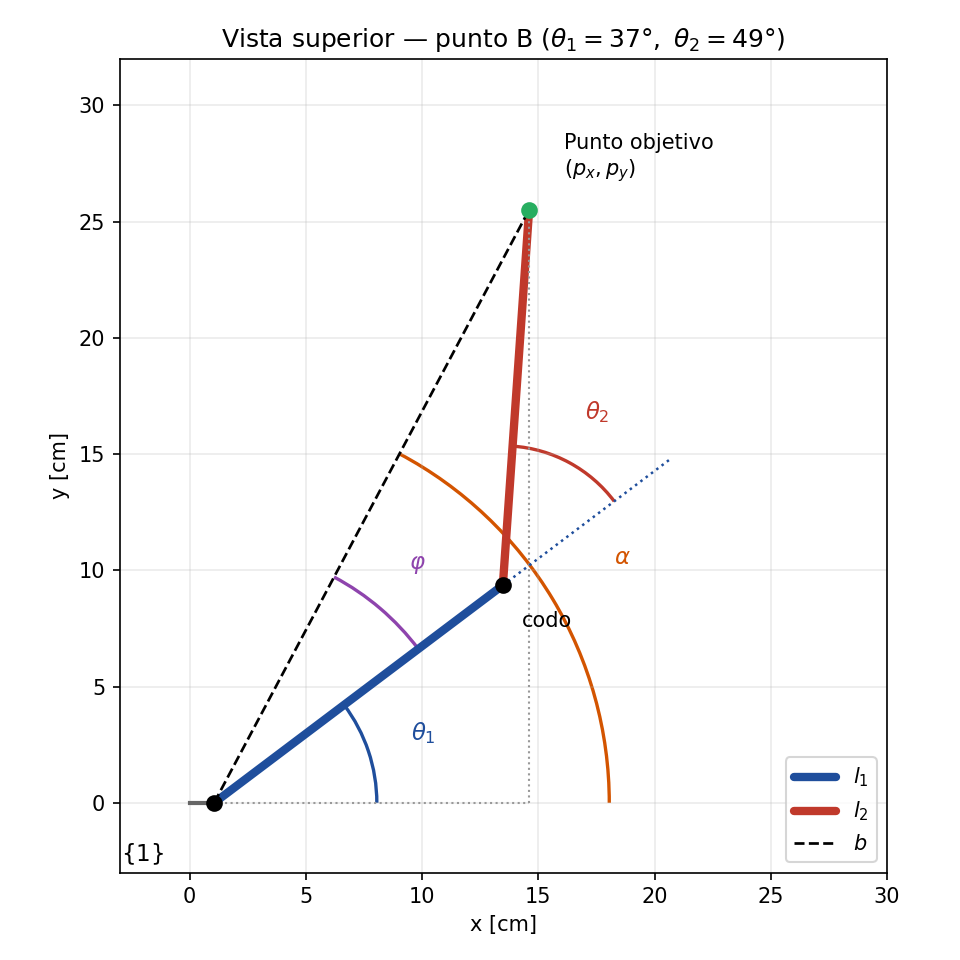
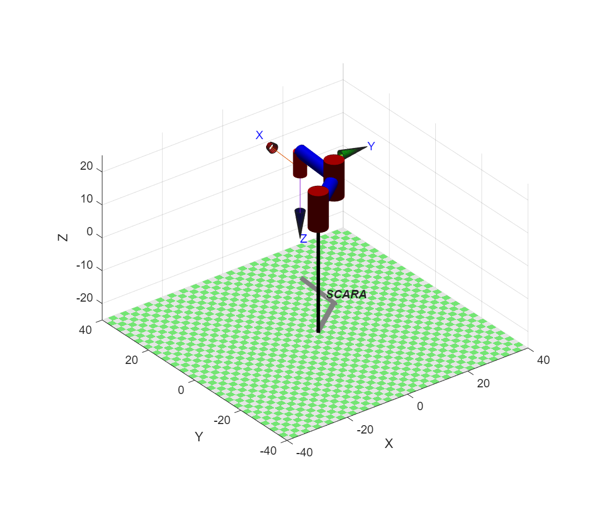
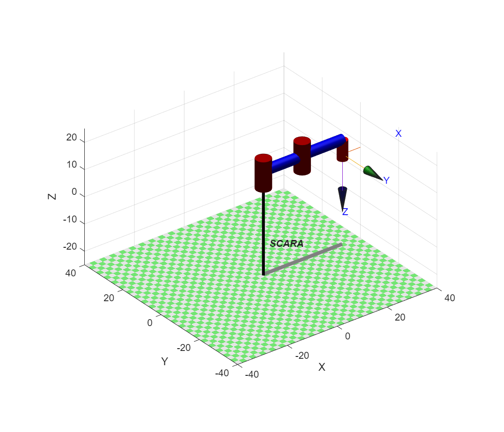

# Cinemática Inversa del SCARA con Peter Corke (Robotics Toolbox)

Esta carpeta lleva la **cinemática inversa** del robot SCARA (ya deducida a mano en [`4.Cinematica_Inversa`](../4.Cinematica_Inversa/README.md)) a MATLAB usando el **Robotics Toolbox de Peter Corke (RTB 10.4)**. El flujo es:

1. Se calcula $\theta_1$, $\theta_2$ y $d_3$ con las fórmulas analíticas (geometría + ley de cosenos).
2. Se construye el robot en el toolbox con la **tabla DH** de la [cinemática directa](../3.Cinematica_Directa/README.md) (`Link` + `SerialLink`).
3. Se **verifica** con `fkine`: al meter los ángulos calculados, el toolbox debe devolver exactamente el punto del que se partió. Si coincide, el ciclo directa ⇄ inversa queda cerrado y el modelo DH es correcto.
4. Se dibuja el robot (`plot`) y se puede mover con sliders (`teach`).

> El toolbox **no resuelve** la inversa por ti en este caso: la resolvemos analíticamente y el toolbox sirve para **comprobarla y visualizarla**.

---

## 0. Contenido de la carpeta

| Archivo | Qué hace |
|---|---|
| `Inv_PetCor_Proy_BASETRASL.m` | Modelo de **3 `Link`** (θ₁, θ₂, d₃). La fila 1 de la tabla DH (traslación $r_1$ en $x$ y $h_1$ en $z$) se absorbe en `Robot.base`. Punto de prueba **B**. |
| `Inv_PetCor_Proy_BASEREVOL.m` | Modelo de **4 `Link`**: la fila 1 de la tabla DH se deja como un joint revoluto **bloqueado** (`qlim = [0 0]`). Punto de prueba **A**. |
| `images/` | Capturas del robot en el toolbox y la figura de la geometría de la inversa usadas en este documento. |

Los dos scripts dan **el mismo robot y el mismo resultado**; solo cambia cómo se representa la primera fila de la tabla DH (sección 3).

### Cómo ejecutarlo

1. Tener instalado el Robotics Toolbox de Peter Corke (carpeta `rvctools`) y activarlo **una vez por sesión** de MATLAB:

   ```matlab
   run('ruta/a/rvctools/startup_rvc.m')
   ```

2. Abrir el script (`BASETRASL` o `BASEREVOL`), editar el punto objetivo (`Pxd`, `Py`, `Pz`) y presionar **Run**.
3. En la consola salen $\theta_2$, $\theta_1$ (en grados) y $d_3$ (en cm); se abre la figura del robot, la ventana `teach` con sliders y se imprime la matriz `fkine`.

> Todas las longitudes están en **centímetros**; los ángulos se calculan en radianes y se imprimen en grados.

---

## 1. Parámetros del robot

<div align="center">

| Símbolo | Variable en MATLAB | Valor | Significado |
|---|---|---|---|
| $l_1$ | `l1` | 15.554 cm | Eslabón 1 (hombro → codo) |
| $l_2$ | `l2` | 16.190 cm | Eslabón 2 (codo → muñeca) |
| $h_1$ | `h1` | 12.57 cm | Altura de la base a $\{1\}$ |
| $h_2$ | `h2` | 0.87 cm | Altura entre $\{1\}$ y $\{2\}$ |
| $h_3$ | `h3` | 0.41 cm | Altura entre $\{2\}$ y $\{3\}$ |
| $h_4$ | `h4` | 5.40 cm | Parte fija de la altura de la prismática |
| $r_1$ | `r1` | 1.054 cm | Offset en $x$ entre la base y el eje de $\theta_1$ |

</div>

Variables articulares: $q=[\theta_1,\ \theta_2,\ d_3]$.

---

## 2. Del modelo DH al toolbox

La tabla DH del robot (sección 2.2 de la [cinemática directa](../3.Cinematica_Directa/README.md)) es:

<div align="center">

| $i$ | $\theta_i$ | $d_i$ | $\alpha_i$ | $a_i$ |
|---|---|---|---|---|
| 1 | $0$ | $h_1$ | $0$ | $r_1$ |
| 2 | $\theta_1$ | $h_2$ | $0$ | $l_1$ |
| 3 | $\theta_2$ | $h_3$ | $\pi$ | $l_2$ |
| 4 | $0$ | $h_4+d_3$ | $0$ | $0$ |

</div>

En Peter Corke cada fila es un `Link`. La regla es: lo que es **constante** se pasa como parámetro, y lo que es **variable** lo pone `fkine/plot` a través de $q$.

| Fila | Código | Qué pasa con la variable |
|---|---|---|
| 1 | `Link('revolute','d',h1,'alpha',0,'a',r1)` | $\theta$ fijo en 0 (no se mueve) |
| 2 | `Link('revolute','d',h2,'alpha',0,'a',l1)` | $\theta = q = \theta_1$ |
| 3 | `Link('revolute','d',h3,'alpha',-pi,'a',l2)` | $\theta = q = \theta_2$ |
| 4 | `Link('prismatic','theta',0,'alpha',0,'a',0,'offset',h4)` | $d = q + \text{offset} = d_3 + h_4$ |

Detalles importantes:

- **`'offset', h4` en la prismática:** en un `Link` prismático, `offset` se **suma a $d$**. Por eso el toolbox arma $d_4 = d_3 + h_4$, tal cual la tabla, y $d_3$ queda como la única variable.
- **`'alpha', -pi` en lugar de `pi`:** $\cos(\pm\pi)=-1$ y $\sin(\pm\pi)\approx 0$, así que la matriz resultante es la misma (la diferencia es del orden de $10^{-16}$). Es el giro de 180° sobre $x$ que invierte el eje $z$ en el eslabón 3 y es el que hace que $p_z$ **baje** cuando $d_3$ aumenta.
- **Límites:** `R(4).qlim = [0, 10]` limita la prismática a 0–10 cm (útil para `teach`).

---

## 3. Las dos formas de modelar la fila 1

La fila 1 de la tabla DH **no mueve nada**: solo traslada $r_1$ en $x$ y $h_1$ en $z$. Hay dos formas válidas de ponerla en el toolbox:

### 3.1 `BASETRASL` — se absorbe en `Robot.base` (3 joints)

```matlab
R(1) = Link('revolute',  'd', h2, 'alpha',  0,  'a', l1, 'offset', 0);   % θ1
R(2) = Link('revolute',  'd', h3, 'alpha', -pi, 'a', l2, 'offset', 0);   % θ2
R(3) = Link('prismatic', 'theta', 0, 'alpha', 0, 'a', 0, 'offset', h4);  % d3
Robot = SerialLink(R, 'name', 'SCARA');
Robot.base = transl(r1, 0, h1);   % = T_1^0
```

- `transl(r1,0,h1)` es exactamente la matriz $T_1^0$ de la cinemática directa.
- El vector de joints es el natural: `q = [θ1, θ2, d3]`.
- Es la opción más limpia: **3 GDL = 3 joints**.

### 3.2 `BASEREVOL` — joint bloqueado (4 joints)

```matlab
R(1) = Link('revolute','d',h1,'alpha',0,'a',r1,'offset',0);
R(1).qlim = [0, 0];                       % joint bloqueado
R(2) = Link('revolute',  'd', h2, 'alpha', 0,   'a', l1, 'offset', 0);
R(3) = Link('revolute',  'd', h3, 'alpha', -pi, 'a', l2, 'offset', 0);
R(4) = Link('prismatic', 'theta', 0, 'alpha', 0, 'a', 0, 'offset', h4);
```

- Respeta la tabla DH **fila por fila** (4 `Link`), útil para comparar contra la tabla.
- El primer joint es "de mentira": `qlim = [0 0]` y siempre se le pasa 0, por eso el vector de joints tiene **4 entradas**: `q = [0, θ1, θ2, d3]`.

> **Ojo con el orden:** en `BASEREVOL` hay un corrimiento. $\theta_1$ va en `q2`, $\theta_2$ en `q3` y $d_3$ en `q4` (el script lo deja comentado). Si se pasa `[θ1, θ2, d3]` a este modelo, el resultado es incorrecto.

<div align="center">

| | `BASETRASL` | `BASEREVOL` |
|---|---|---|
| Nº de `Link` | 3 | 4 |
| Fila 1 de la DH | `Robot.base = transl(r1,0,h1)` | `Link` bloqueado con `qlim=[0 0]` |
| Vector `q` | `[θ1, θ2, d3]` | `[0, θ1, θ2, d3]` |
| Resultado `fkine` | idéntico | idéntico |

</div>

---

## 4. Cinemática inversa paso a paso

La deducción completa (con todos los triángulos) está en la [carpeta 4](../4.Cinematica_Inversa/README.md). Aquí está el **procedimiento tal como se implementa en el código**, con un ejemplo numérico completo.

**Datos del ejemplo (punto B, `BASETRASL`):**

$$p_x = 14.6053,\quad p_y = 25.5112,\quad p_z = 8.450 \ \text{cm}$$

<p align="center">
  
</p>

> **Nombres en el código:** el script llama `Pxd` al $p_x$ deseado y `Px` al valor ya corregido por $r_1$ (lo que en la carpeta 4 se llama $\rho_x$). `Py` es $\rho_y=p_y$.

### Paso 1 — Descontar el offset de la base ($r_1$)

El eje de $\theta_1$ está desplazado $r_1$ en $x$ respecto al origen $\{0\}$. Para trabajar desde el hombro se resta:

$$\rho_x = p_x - r_1 \qquad \rho_y = p_y$$

```matlab
Px = Pxd - r1;
```

$$\rho_x = 14.6053 - 1.054 = 13.5513 \qquad \rho_y = 25.5112$$

### Paso 2 — Distancia hombro → punto ($b$)

Pitágoras en el plano $xy$:

$$b = \sqrt{\rho_x^2+\rho_y^2}$$

```matlab
b = sqrt(Px^2 + Py^2);
```

$$b = \sqrt{13.5513^2 + 25.5112^2} = 28.8870 \text{ cm}$$

**Chequeo de alcance:** el punto solo es alcanzable si $|l_1-l_2| \le b \le l_1+l_2$, es decir $0.636 \le b \le 31.744$ cm. Aquí $28.887$ está dentro. ✅

### Paso 3 — $\cos\theta_2$ (ley de cosenos)

Con $\beta=180^\circ-\theta_2$ el triángulo $l_1,\ l_2,\ b$ da:

$$\cos\theta_2 = \frac{b^2 - l_1^2 - l_2^2}{2\,l_1 l_2}$$

```matlab
cos_theta2 = (b^2 - l1^2 - l2^2) / (2*l1*l2);
cos_theta2 = max(-1, min(1, cos_theta2));   % protección numérica
```

$$\cos\theta_2 = \frac{834.46 - 241.93 - 262.12}{2(15.554)(16.190)} = \frac{330.42}{503.64} = 0.65606$$

> **¿Para qué el `max/min`?** Por redondeo, en el borde del espacio de trabajo el coseno puede salir $1.0000000000001$. Sin esa línea, el siguiente paso calcularía la raíz de un negativo y daría un número **complejo**.

### Paso 4 — $\sin\theta_2$ y la configuración del brazo

De $\sin^2+\cos^2=1$:

$$\sin\theta_2 = \pm\sqrt{1-\cos^2\theta_2}$$

```matlab
sen_theta2 = sqrt(1 - cos_theta2^2);     % signo +
```

$$\sin\theta_2 = +\sqrt{1-0.65606^2} = 0.75471$$

**El signo elige la configuración del brazo** (hay dos soluciones para el mismo punto, ver sección 6). El script usa el signo `+`.

### Paso 5 — $\theta_2$

Se usa `atan2` (no `acos`), porque conserva el signo y el cuadrante:

$$\theta_2 = \mathrm{atan2}(\sin\theta_2,\ \cos\theta_2)$$

```matlab
theta2 = atan2(sen_theta2, cos_theta2);
```

$$\theta_2 = \mathrm{atan2}(0.75471,\ 0.65606) = \mathbf{49.0001^\circ}$$

### Paso 6 — $\theta_1 = \alpha - \varphi$

$\alpha$ es el ángulo de la recta $b$ respecto a $x$, y $\varphi$ es lo que $l_1$ "se queda corto" respecto a esa recta por culpa del codo:

$$\alpha = \mathrm{atan2}(\rho_y,\ \rho_x) \qquad \varphi = \mathrm{atan2}\big(l_2\sin\theta_2,\ \ l_1 + l_2\cos\theta_2\big)$$

$$\theta_1 = \alpha - \varphi$$

```matlab
alpha  = atan2(Py, Px);
phi    = atan2(l2*sen_theta2, l1 + l2*cos_theta2);
theta1 = alpha - phi;
```

$$\alpha = \mathrm{atan2}(25.5112,\ 13.5513) = 62.0232^\circ$$

$$\varphi = \mathrm{atan2}(12.2185,\ 26.1755) = 25.0232^\circ$$

$$\theta_1 = 62.0232^\circ - 25.0232^\circ = \mathbf{37.0000^\circ}$$

> **El orden importa:** $\theta_1$ depende de $\theta_2$ (por $\varphi$), así que **$\theta_2$ se calcula primero**.

### Paso 7 — $d_3$ (independiente del plano)

De la cinemática directa, $p_z = h_1+h_2+h_3-h_4-d_3$. Se despeja:

$$d_3 = h_1+h_2+h_3-h_4-p_z$$

```matlab
d3 = h1 + h2 + h3 - h4 - Pz;
```

$$d_3 = 12.57 + 0.87 + 0.41 - 5.40 - 8.45 = \mathbf{0.00 \text{ cm}}$$

Rango de $p_z$ alcanzable con la prismática limitada a $[0,\,10]$ cm:

$$p_z = 8.45 - d_3 \ \Rightarrow\ p_z\in[-1.55,\ 8.45]\ \text{cm}$$

Ambos puntos de prueba están en $p_z=8.45$, que es la posición más alta del efector ($d_3=0$).

### Paso 8 — Asignar a los joints del toolbox

| Script | Asignación |
|---|---|
| `BASETRASL` | `q = [theta1, theta2, d3]` |
| `BASEREVOL` | `q = [0, theta1, theta2, d3]` |

### Salida en consola (punto B)

```text
theta2: 49.0001 deg
theta1: 37.0000 deg
d3: 0.0000 cm
```

---

## 5. Verificación con `fkine`

Se meten los valores calculados en el toolbox y se compara contra el punto objetivo:

```matlab
Robot.plot([q1,q2,q3], 'scale', 1.2, 'workspace', [-40 40 -40 40 -25 25]);
Robot.teach([q1,q2,q3])
Robot.fkine([q1,q2,q3])
```

Resultado para el punto B (ejecutado en MATLAB R2025b + RTB 10.4, ambos scripts dan lo mismo):

$$
T_4^0 =
\begin{bmatrix}
0.0698 & 0.9976 & 0 & \mathbf{14.6053} \\
0.9976 & -0.0698 & 0 & \mathbf{25.5112} \\
0 & 0 & -1 & \mathbf{8.4500} \\
0 & 0 & 0 & 1
\end{bmatrix}
$$

- La **última columna** coincide con el punto objetivo $(14.6053,\ 25.5112,\ 8.450)$. ✅
- La submatriz de rotación coincide con la forma teórica de la cinemática directa, con $\theta_1+\theta_2 = 86^\circ$: $\cos 86^\circ = 0.0698$ y $\sin 86^\circ = 0.9976$.
- El $-1$ en $z$ confirma que el eje del efector apunta **hacia abajo**.

<p align="center">
  
</p>

---

## 6. La segunda solución (codo opuesto)

Para el mismo punto objetivo existe otra configuración: se cambia el signo de $\sin\theta_2$.

```matlab
sen_theta2 = -sqrt(1 - cos_theta2^2);   % configuración opuesta
```

Como $\varphi$ también usa `sen_theta2`, **solo hay que cambiar esa línea**; $\theta_2$ y $\theta_1$ se ajustan solos.

<div align="center">

| Punto B | $\theta_1$ | $\theta_2$ | $d_3$ | `fkine` |
|---|---|---|---|---|
| $\sin\theta_2>0$ (script) | 37.0000° | +49.0001° | 0 | (14.6053, 25.5112, 8.45) |
| $\sin\theta_2<0$ | 87.0464° | −49.0001° | 0 | (14.6053, 25.5112, 8.45) |

</div>

Las dos llegan al **mismo punto**; solo cambia hacia qué lado "dobla" el codo. En el mundo real se elige según obstáculos o límites mecánicos de cada articulación.

---

## 7. Casos especiales

### 7.1 Brazo totalmente extendido — punto A (`BASEREVOL`)

Punto: $p_x=32.7980,\ p_y=0,\ p_z=8.45$.

$$\rho_x = 32.798-1.054 = 31.744 = l_1+l_2 \ \Rightarrow\ b = l_1 + l_2$$

Entonces $\cos\theta_2 = 1$, $\sin\theta_2 = 0$ y el resultado es:

```text
theta2: 0.0000 deg
theta1: 0.0000 deg
d3: 0.0000 cm
```

Es el **borde del espacio de trabajo**: el brazo queda estirado sobre el eje $x$ y es una **singularidad**, porque las dos configuraciones de codo (sección 6) **coinciden** en una sola. Aquí la protección `max(-1, min(1, ...))` es la que evita que el programa falle por un coseno apenas mayor que 1.

`fkine` devuelve $(32.7980,\ 0,\ 8.4500)$, es decir el punto pedido. ✅

<p align="center">
  
</p>

### 7.2 Punto fuera del alcance

Si $b > l_1+l_2 = 31.744$ cm (o $b < |l_1-l_2| = 0.636$ cm), el punto **no existe** para este robot. Con el `max/min` el script **no marca error**: satura el coseno y devuelve el ángulo del punto alcanzable más cercano, así que el `fkine` **no** coincidirá con el punto pedido. Siempre conviene comprobar:

```matlab
if b > l1 + l2 || b < abs(l1 - l2)
    warning('El punto está fuera del espacio de trabajo');
end
```

### 7.3 Límite de la prismática

Si el $d_3$ calculado queda fuera de $[0,\,10]$ cm, el punto es alcanzable en el plano pero no en altura. `teach` no deja llevar el slider fuera de `qlim`.

---

## 8. Resumen

<div align="center">

| Variable | Fórmula | En MATLAB |
|---|---|---|
| $\rho_x$ | $p_x - r_1$ | `Px = Pxd - r1;` |
| $b$ | $\sqrt{\rho_x^2+\rho_y^2}$ | `b = sqrt(Px^2 + Py^2);` |
| $\cos\theta_2$ | $\dfrac{b^2-l_1^2-l_2^2}{2l_1l_2}$ | `cos_theta2 = (b^2-l1^2-l2^2)/(2*l1*l2);` |
| $\sin\theta_2$ | $\pm\sqrt{1-\cos^2\theta_2}$ | `sen_theta2 = sqrt(1-cos_theta2^2);` |
| $\theta_2$ | $\mathrm{atan2}(\sin\theta_2,\cos\theta_2)$ | `theta2 = atan2(sen_theta2, cos_theta2);` |
| $\alpha$ | $\mathrm{atan2}(\rho_y,\rho_x)$ | `alpha = atan2(Py, Px);` |
| $\varphi$ | $\mathrm{atan2}(l_2\sin\theta_2,\ l_1+l_2\cos\theta_2)$ | `phi = atan2(l2*sen_theta2, l1+l2*cos_theta2);` |
| $\theta_1$ | $\alpha-\varphi$ | `theta1 = alpha - phi;` |
| $d_3$ | $h_1+h_2+h_3-h_4-p_z$ | `d3 = h1+h2+h3-h4-Pz;` |

</div>

Orden de cálculo: **$\rho$ → $b$ → $\theta_2$ → $\theta_1$ → $d_3$** → `fkine` para verificar.

---

## 9. Errores comunes

1. **Olvidar descontar $r_1$** en $p_x$: todo el resultado queda desplazado.
2. **Mal orden de joints en `BASEREVOL`:** hay que pasar `[0, θ1, θ2, d3]`, no `[θ1, θ2, d3]`.
3. **Usar `acos`/`atan` en vez de `atan2`:** se pierde el signo y el cuadrante (sale una solución errónea para $y<0$ o $\rho_x<0$).
4. **Quitar el `max/min` del coseno:** aparecen ángulos complejos en el borde del espacio de trabajo.
5. **Quitar el `'offset', h4` de la prismática:** el eje $z$ quedaría $h_4$ más alto de lo real.
6. **Mezclar unidades:** todo el modelo está en **cm**; si se pasan metros, `d3` y las posiciones salen mal.
7. **No haber ejecutado `startup_rvc`:** MATLAB dará error en `Link`/`SerialLink` (*"Undefined function"*).
