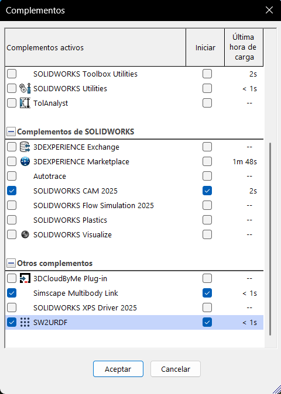
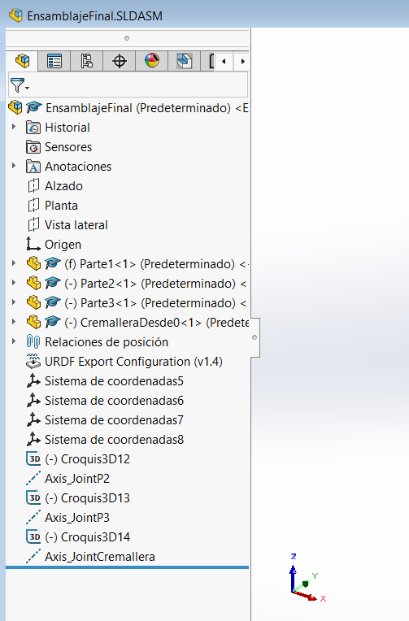
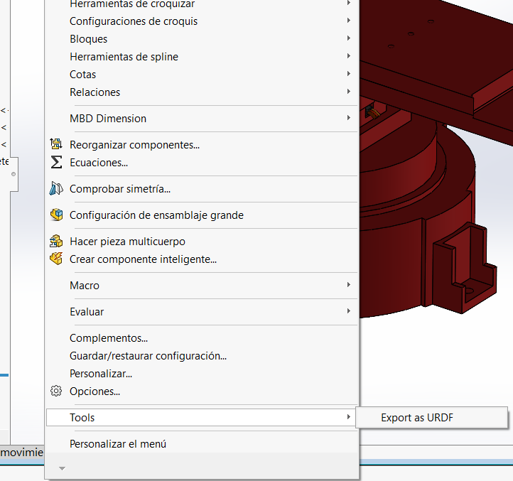
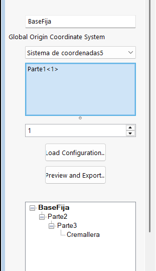
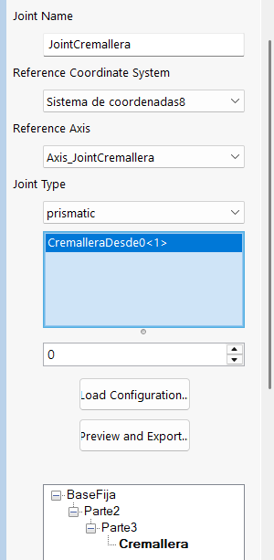
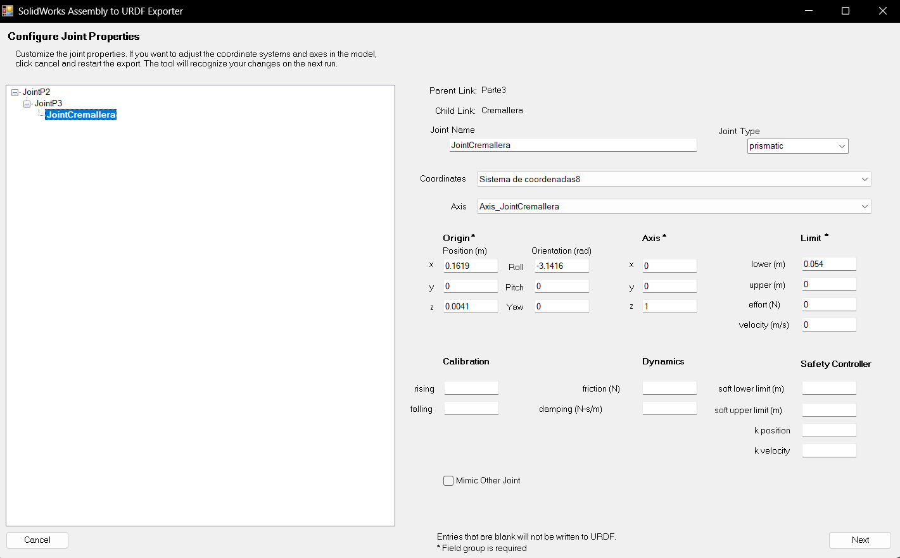
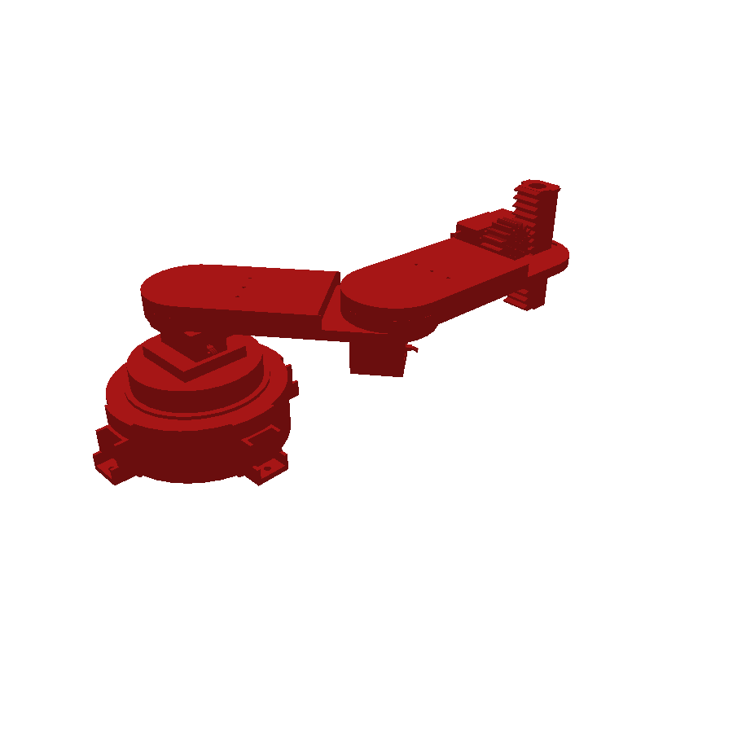
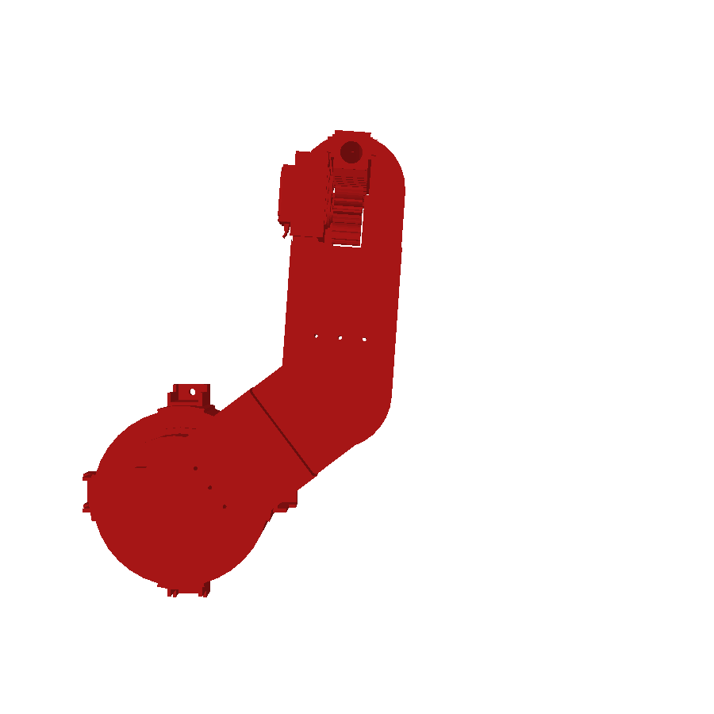
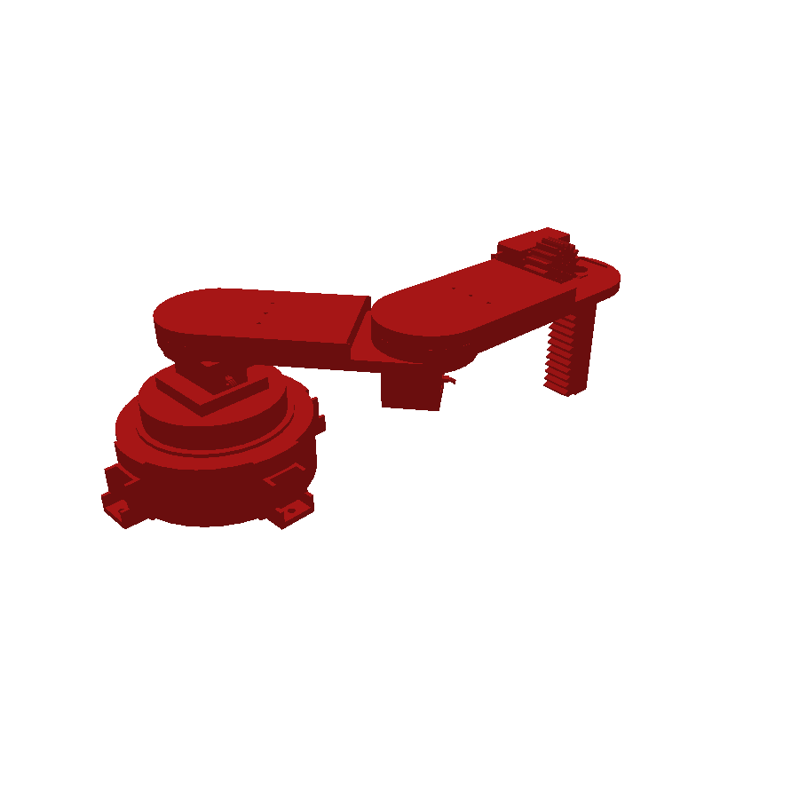
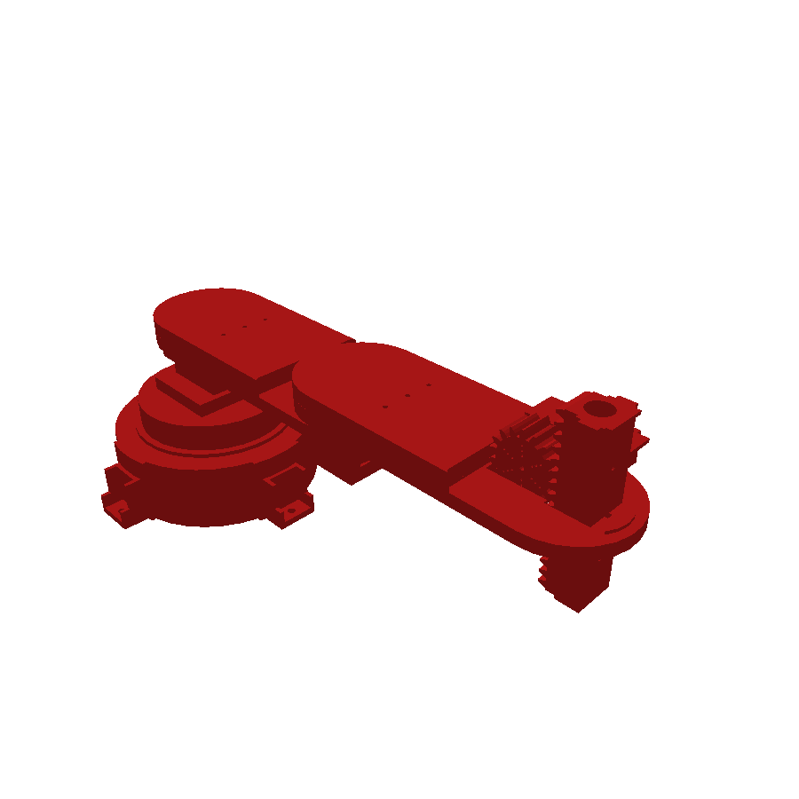

# URDF del Robot SCARA

Esta carpeta contiene el **modelo URDF** del SCARA: una descripción del robot en formato XML (eslabones, articulaciones, ejes, límites, masas e inercias y mallas 3D) que se genera **directamente desde el ensamble de SolidWorks** con el complemento *SW2URDF* (SolidWorks to URDF Exporter).

Para qué sirve:

- Tener el robot en un formato estándar que entienden **ROS, Gazebo, PyBullet, yourdfpy**, etc.
- **Visualizar y mover** el robot real (con sus mallas) usando las variables articulares $\theta_1$, $\theta_2$ y $d_3$.
- **Validar** que el modelo de SolidWorks coincide con la cinemática calculada en las carpetas [3](../3.Cinematica_Directa/README.md), [4](../4.Cinematica_Inversa/README.md) y [6](../6.%20Matlab_PeterCorke/README.md).

El flujo completo es:

```text
Ensamble SolidWorks ──► SW2URDF ──► URDF + mallas STL ──► Python (yourdfpy / PyBullet) ──► comparación con la cinemática
```

---

## 0. Contenido de la carpeta

```text
7. URDF/
├── Exporter/                              Instalador y código del complemento SW2URDF
│   ├── sw2urdfSetup.exe
│   ├── solidworks_urdf_exporter-1.6.1.zip
│   └── solidworks_urdf_exporter-1.6.1.tar.gz
├── ArchivosURDF/                          Resultado de la exportación + scripts de prueba
│   ├── urdf/
│   │   ├── EnsamblajeFinal.SLDASM.urdf    ← el modelo del robot
│   │   └── EnsamblajeFinal.SLDASM.csv     Tabla de joints/links que genera el exportador
│   ├── meshes/                            Mallas 3D (STL) de cada eslabón
│   ├── config/  launch/  package.xml  CMakeLists.txt    Paquete ROS generado automáticamente
│   ├── export.log                         Registro del exportador
│   ├── URDF.py                            Visualizador (yourdfpy)
│   └── URDFMOV.py                         Simulador con sliders (PyBullet)
└── images/                                Capturas usadas en este documento
```

---

## 1. Instalación del exportador (`Exporter/`)

| Archivo | Para qué sirve |
|---|---|
| `sw2urdfSetup.exe` | **Instalador** del complemento. Es el único que se necesita para exportar: se ejecuta con SolidWorks cerrado y deja instalado el add-in *SW2URDF*. |
| `solidworks_urdf_exporter-1.6.1.zip` / `.tar.gz` | **Código fuente** de la versión 1.6.1 (el mismo contenido empaquetado en dos formatos). Se guarda como respaldo por si se necesita recompilar o consultar cómo funciona. |

Después de instalar, hay que **activar el complemento** en SolidWorks: `Herramientas → Complementos…` y marcar **SW2URDF** (casilla de la izquierda para activarlo ahora, casilla *Iniciar* para que cargue siempre).

<p align="center">
  
</p>

> El exportador lo mantiene la comunidad ROS: https://github.com/ros/solidworks_urdf_exporter

---

## 2. Preparar el ensamble en SolidWorks

El exportador **no adivina** dónde están las articulaciones: hay que dejarlas definidas con geometría de referencia en el ensamble. En `EnsamblajeFinal.SLDASM` se hizo así:

<p align="center">
  
</p>

| Elemento del árbol | Qué es |
|---|---|
| `(f) Parte1<1>` | Primer eslabón, **fijo** (`f`): es la base del robot y no se mueve. |
| `(-) Parte2<1>`, `(-) Parte3<1>`, `(-) CremalleraDesde0<1>` | Eslabones **móviles** (`-` = grados de libertad libres). |
| `Sistema de coordenadas5 … 8` | Un sistema de coordenadas por articulación. Define el **origen y la orientación** del joint. El 5 es el origen global de la base y el 8 es el de la cremallera; los otros dos corresponden a los joints P2 y P3. |
| `Axis_JointP2`, `Axis_JointP3`, `Axis_JointCremallera` | **Ejes de movimiento** de cada articulación (creados a partir de un croquis 3D: `Croquis3D12/13/14`). |
| `URDF Export Configuration (v1.4)` | Configuración que el propio exportador guarda en el ensamble para no tener que repetirla. |

> **Regla práctica:** si el sistema de coordenadas o el eje de un joint no existen antes de abrir el exportador, hay que cancelar, crearlos y volver a empezar. El exportador mismo lo advierte en su ventana de configuración.

---

## 3. Exportar paso a paso

### Paso 1 — Abrir el exportador

Con el ensamble abierto: `Herramientas → Tools → Export as URDF`.

<p align="center">
  
</p>

### Paso 2 — Definir el link base

Se abre el *Property Manager* del exportador. Aquí se define el **primer link** (la base):

<p align="center">
  
</p>

- **Link Name:** `BaseFija`.
- **Global Origin Coordinate System:** `Sistema de coordenadas5` (el origen del URDF).
- **Componentes del link:** `Parte1<1>`.
- En el árbol de abajo se ve la cadena que se irá armando: `BaseFija → Parte2 → Parte3 → Cremallera`.

### Paso 3 — Agregar los links hijos y sus joints

Para cada eslabón siguiente (`Parte2`, `Parte3`, `Cremallera`) se agrega un link hijo y se configura su **joint**:

<p align="center">
  
</p>

Ejemplo con la cremallera:

- **Joint Name:** `JointCremallera`.
- **Reference Coordinate System:** `Sistema de coordenadas8`.
- **Reference Axis:** `Axis_JointCremallera`.
- **Joint Type:** `prismatic`.
- **Componentes:** `CremalleraDesde0<1>`.

Los otros dos joints se configuran igual con sus propios sistemas y ejes (`JointP2` con `Axis_JointP2`, `JointP3` con `Axis_JointP3`), de tipo rotacional.

### Paso 4 — Revisar propiedades de cada joint

Con **Preview and Export…** aparece la ventana *Configure Joint Properties*, donde se revisa cada articulación del árbol (`JointP2 → JointP3 → JointCremallera`):

<p align="center">
  
</p>

Qué significa cada bloque (ejemplo `JointCremallera`):

| Campo | Valor | Significado |
|---|---|---|
| **Parent / Child Link** | `Parte3` / `Cremallera` | Quién arrastra a quién. |
| **Origin – Position (m)** | $x=0.1619,\ y=0,\ z=0.0041$ | Dónde está el joint respecto al link padre: $l_2$ en $x$ y $h_3$ en $z$. |
| **Origin – Orientation (rad)** | Roll $=-3.1416$ | Giro de $-\pi$ alrededor de $x$: deja el eje $z$ de la cremallera apuntando **hacia abajo** (ver sección 5.2). |
| **Axis** | $(0,\ 0,\ 1)$ | Eje de movimiento, en el sistema del joint. |
| **Limit** | lower / upper, effort, velocity | Recorrido máximo y límites de fuerza y velocidad. |

> Los campos en blanco (calibración, dinámica, controlador de seguridad) **no se escriben** en el URDF.
>
> **Ajuste manual de límites:** en la ventana el exportador muestra `effort = 0` y `velocity = 0`. En el URDF final del repo están en `effort = 10`, `velocity = 0.1` y el recorrido es `lower = 0`, `upper = 0.054`: esos valores se editaron en el archivo `.urdf` después de exportar.

### Paso 5 — Exportar

Con **Next** se completa el asistente y se elige la carpeta de destino. El exportador genera el paquete completo (sección 4) y escribe el `export.log`.

---

## 4. Qué genera el exportador

| Archivo / carpeta | Contenido |
|---|---|
| `urdf/EnsamblajeFinal.SLDASM.urdf` | **El modelo**: links, joints, masas e inercias. |
| `urdf/EnsamblajeFinal.SLDASM.csv` | Los mismos datos en tabla (sirve para volver a cargar la configuración con *Load Configuration…*). |
| `meshes/*.STL` | Una malla por link: `BaseFija`, `Parte2`, `Parte3`, `Cremallera`. Cada una está expresada en el **sistema de coordenadas de su link**. |
| `package.xml`, `CMakeLists.txt`, `launch/`, `config/` | Esqueleto de paquete ROS (catkin) para usarlo con `roslaunch`. |
| `export.log` | Registro de todo lo que hizo el exportador (útil si algo falla). |

Las rutas de las mallas dentro del URDF aparecen como `package://EnsamblajeFinal.SLDASM/meshes/…`. Esa sintaxis es la de ROS; fuera de ROS hay que traducirla a una ruta local (lo hacen los scripts de la sección 6).

> `launch/display.launch` espera un archivo `urdf.rviz` que el exportador no genera. Si se quiere usar con ROS/RViz, hay que crearlo.

---

## 5. Anatomía del URDF

El URDF se lee de forma muy parecida a la tabla DH: **un `link` por eslabón** y **un `joint` entre cada par**. Todas las unidades están en **metros y radianes** (la tabla DH de las otras carpetas está en cm).

### 5.1 Links

| Link | Mesh | Masa [kg] | Rol |
|---|---|---|---|
| `BaseFija` | `BaseFija.STL` | 1.2446 | Base fija |
| `Parte2` | `Parte2.STL` | 0.24392 | Eslabón 1 ($l_1$) |
| `Parte3` | `Parte3.STL` | 0.23017 | Eslabón 2 ($l_2$) |
| `Cremallera` | `Cremallera.STL` | 0.059831 | Eje prismático (sube y baja) |

Cada link trae también su **centro de masa** y su **tensor de inercia** (calculados por SolidWorks), necesarios si se quiere simular dinámica.

### 5.2 Joints y relación con la tabla DH

```xml
<joint name="JointP2" type="continuous">
  <origin xyz="0.01054 0 0.1257" rpy="0 0 0" />
  <parent link="BaseFija" /> <child link="Parte2" />
  <axis xyz="0 0 1" />
</joint>
<joint name="JointP3" type="continuous">
  <origin xyz="0.15554 -1.5201E-05 0.0087" rpy="0 0 0" />
  <parent link="Parte2" /> <child link="Parte3" />
  <axis xyz="0 0 1" />
</joint>
<joint name="JointCremallera" type="prismatic">
  <origin xyz="0.1619 0 0.0041" rpy="-3.1416 0 0" />
  <parent link="Parte3" /> <child link="Cremallera" />
  <axis xyz="0 0 1" />
  <limit lower="0" upper="0.054" effort="10" velocity="0.1" />
</joint>
```

<div align="center">

| Joint | Tipo | `origin xyz` [m] | Equivale a | Variable |
|---|---|---|---|---|
| `JointP2` | continuo (sin límites) | $(0.01054,\ 0,\ 0.1257)$ | $(r_1,\ 0,\ h_1)$ | $\theta_1$ |
| `JointP3` | continuo (sin límites) | $(0.15554,\ \approx 0,\ 0.0087)$ | $(l_1,\ 0,\ h_2)$ | $\theta_2$ |
| `JointCremallera` | prismático, $0 \ldots 0.054$ m | $(0.1619,\ 0,\ 0.0041)$ | $(l_2,\ 0,\ h_3)$ | $d_3$ |

</div>

Los desplazamientos de `origin` son exactamente los parámetros de la cinemática directa ($r_1=1.054$, $h_1=12.57$, $l_1=15.554$, $h_2=0.87$, $l_2=16.190$, $h_3=0.41$ cm), así que el modelo de SolidWorks y el modelo DH describen **el mismo robot**.

Dos detalles importantes:

1. **El giro de $-\pi$ en `JointCremallera`** (`rpy="-3.1416 0 0"`) es el equivalente URDF del $\alpha_3=\pi$ de la tabla DH: invierte el eje $z$ de la cremallera para que apunte hacia abajo. Por eso un valor **positivo** del joint prismático **baja** el efector, igual que $d_3$ positivo en la DH ($p_z = h_1+h_2+h_3-h_4-d_3$). Resultado: **la variable del joint es directamente $d_3$**.
2. **El origen del link `Cremallera` no es la punta.** Coincide con el sistema $\lbrace 3\rbrace$ de la DH desplazado $d_3$. La punta (efector, sistema $\lbrace 4\rbrace$) está $h_4=5.40$ cm más abajo **sobre el eje $z$ de ese link**:

$$p_{\text{efector}} = p_{\text{origen del link}} + R_{\text{link}} \cdot \begin{bmatrix}0\\0\\h_4\end{bmatrix}$$

### 5.3 Vector de joints

El orden de los joints en el URDF es el mismo que el de las otras carpetas:

$$q = [\theta_1,\ \theta_2,\ d_3] = [\texttt{JointP2},\ \texttt{JointP3},\ \texttt{JointCremallera}]$$

Es decir, **los mismos valores** que se pasan a `BASETRASL` en MATLAB (carpeta 6) se pueden pasar al URDF (con $\theta$ en rad y $d_3$ en **metros**).

---

## 6. Validación en Python

Instalar las librerías (una vez):

```bash
pip install yourdfpy trimesh pyglet pybullet
```

Los dos scripts usan **rutas relativas**: se pueden ejecutar desde cualquier carpeta después de clonar el repositorio.

### 6.1 `URDF.py` — visor con yourdfpy

```bash
python URDF.py
```

Carga el URDF (traduciendo `package://…` a `meshes/…`), imprime los links y joints con su tipo, eje y origen, y abre una ventana 3D con el robot.

### 6.2 `URDFMOV.py` — simulador con sliders (PyBullet)

```bash
python URDFMOV.py
```

Abre PyBullet con tres sliders:

| Slider | Joint | Rango |
|---|---|---|
| `JointP2 (theta1)` | 0 | −π … π rad |
| `JointP3 (theta2)` | 1 | −π … π rad |
| `JointCremallera (d3)` | 2 | 0 … 0.054 m |

En la consola se imprime en tiempo real $\theta_1$, $\theta_2$, $d_3$ y la **posición de la punta** $(X, Y, Z)$ en cm, calculada con la fórmula de la sección 5.2 (origen del frame del link + $h_4$ a lo largo de su eje $z$).

> PyBullet no entiende `package://`. El script resuelve eso creando una **copia temporal** del URDF con las rutas de mallas apuntando a esta carpeta; el URDF original no se modifica.

### 6.3 Poses de prueba

Se cargaron los ángulos de la cinemática inversa de la [carpeta 6](../6.%20Matlab_PeterCorke/README.md) en el URDF:

<div align="center">

| Pose | $q = [\theta_1,\ \theta_2,\ d_3]$ | Punta en el URDF [cm] | Punto de la inversa [cm] |
|---|---|---|---|
| **A** — brazo estirado | $[0°,\ 0°,\ 0]$ | $(32.798,\ -0.002,\ 8.450)$ | $(32.798,\ 0,\ 8.450)$ |
| **B** — codo $\theta_2>0$ | $[37.0°,\ 49.0°,\ 0]$ | $(14.606,\ 25.510,\ 8.450)$ | $(14.605,\ 25.511,\ 8.450)$ |
| **B** — codo $\theta_2<0$ | $[87.05°,\ -49.0°,\ 0]$ | $(14.607,\ 25.511,\ 8.450)$ | $(14.605,\ 25.511,\ 8.450)$ |
| **B** — con $d_3=5.4$ cm | $[37.0°,\ 49.0°,\ 0.054]$ | $(14.606,\ 25.510,\ 3.050)$ | — |

</div>

Las diferencias son **menores a 0.002 cm (0.02 mm)** y vienen del redondeo de los ángulos y del valor $-1.52\times10^{-5}$ m en la coordenada $y$ de `JointP3` en el URDF. Es decir: el modelo de SolidWorks exportado, la cinemática directa, la inversa y el toolbox de Peter Corke **coinciden**. La última fila confirma que con $d_3=5.4$ cm la punta baja de $8.45$ a $3.05$ cm.

<div align="center">

| Pose B — vista isométrica | Pose B — vista superior |
|---|---|
|  |  |

| Pose B con $d_3=5.4$ cm | Pose con todos los joints en 0 |
|---|---|
|  |  |

</div>

---

## 7. Notas y diferencias a tener en cuenta

1. **Joints rotacionales sin límites:** `JointP2` y `JointP3` salieron como `continuous`. Si el mecanismo real tiene topes, se pueden cambiar a `revolute` y agregar `<limit lower=… upper=… />`.
2. **Posición del efector en PyBullet:** `getLinkState(...)[0]` devuelve el **centro de masa** del link y no el origen de su frame. Por eso `URDFMOV.py` usa los índices 4 y 5 (frame del link) y suma $h_4$.
3. **Versión anterior del URDF:** el primer URDF del repo (18-jun) usaba los nombres `Parte1` y `JointC`. Esta versión (exportación del 9-jul) renombra la base a `BaseFija` y el joint a `JointCremallera`, corrige la orientación de la prismática (giro de −π) y el sentido de su recorrido (de −0.054…0 a 0…0.054, de modo que el joint sea directamente $d_3$). El historial de git conserva la versión anterior.
4. **Unidades:** URDF en **m**, DH y MATLAB en **cm**.
