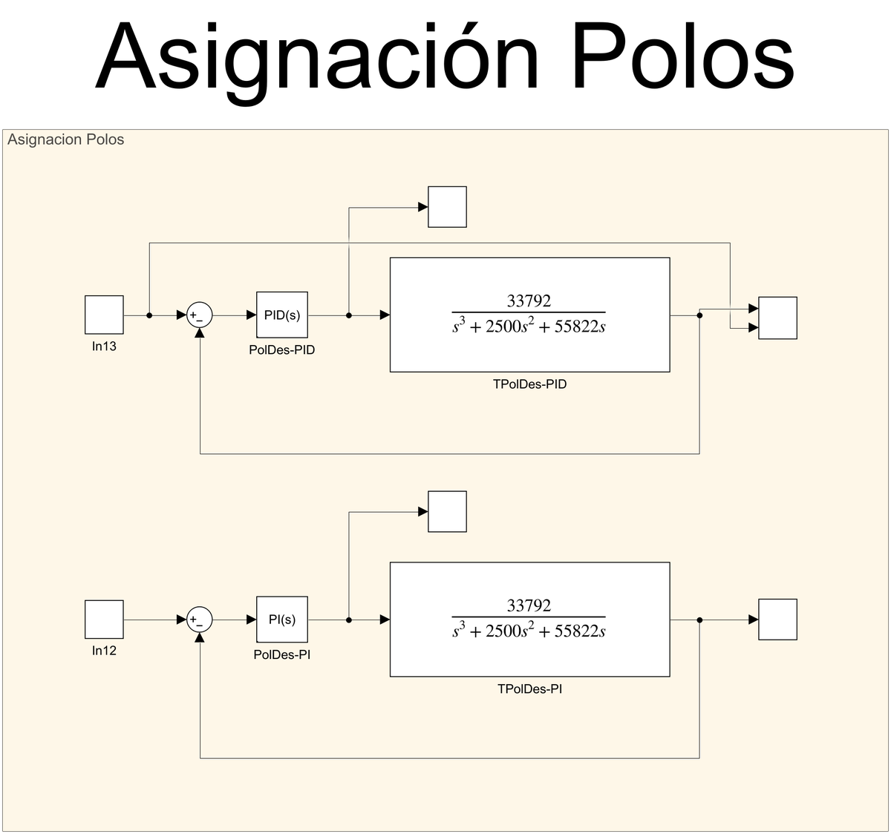
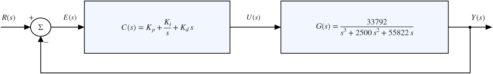
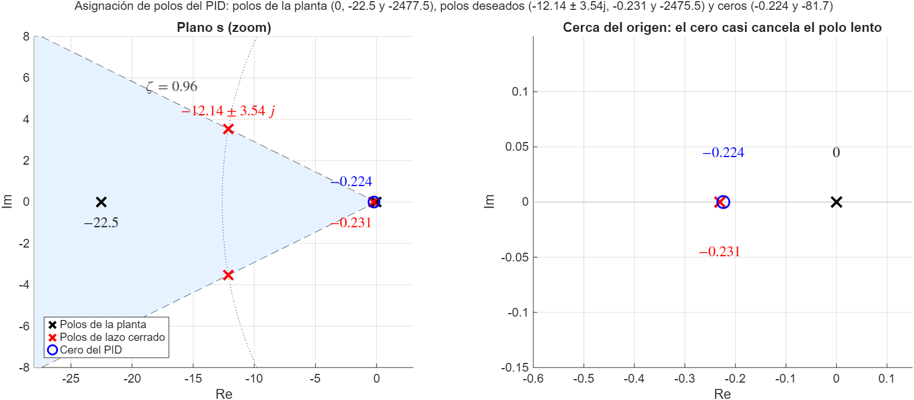
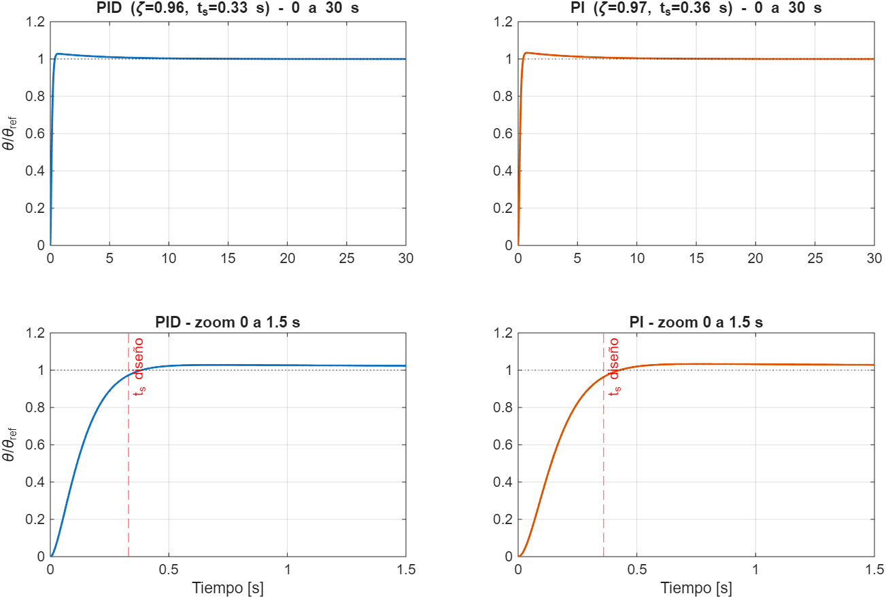

# Sintonización por Asignación de Polos (PI y PID)

En este método **no se prueban reglas empíricas**: se escribe el polinomio característico del lazo cerrado en función de las ganancias del controlador, se **elige dónde se quieren los polos** y se igualan coeficientes para despejar $K_p$, $K_i$ y $K_d$.

Se diseñaron dos controladores para la misma planta del motor (ver la [visión general](../README.md)):

$$
G(s)=\frac{\theta(s)}{V(s)}=\frac{33792}{s^3+2500\,s^2+55822\,s}
$$

- **PID**: $\zeta=0.96$, $t_s=0.33$ s
- **PI**: $\zeta=0.97$, $t_s=0.36$ s

---

## 0. Contenido

| Archivo | Descripción |
|---|---|
| `AsignacionPolos.slx` | Modelo Simulink con los dos lazos cerrados (PI y PID) |
| `images/` | Captura del modelo y figuras del diseño y la verificación |

  

---

## 1. Lazo cerrado con el controlador PID

Se parte del lazo con realimentación unitaria:

  

Se agrupa el controlador en una sola fracción y se multiplica por la planta:

$$
C(s)=K_p+\frac{K_i}{s}+K_d\,s=\frac{K_d\,s^2+K_p\,s+K_i}{s}
$$

$$
L(s)=C(s)\,G(s)=\frac{33792\,(K_d\,s^2+K_p\,s+K_i)}{s^2\,(s^2+2500\,s+55822)}
$$

El lazo cerrado es $T(s)=L(s)/(1+L(s))$, y su denominador es el **polinomio característico**:

$$
\boxed{\,s^4+2500\,s^3+(55822+33792\,K_d)\,s^2+33792\,K_p\,s+33792\,K_i\,}
$$

Dos cosas importantes de este polinomio:

1. Es de **cuarto orden** (los 3 polos de la planta + el integrador del controlador), así que hay **cuatro polos** que ubicar.
2. Los parámetros del controlador solo aparecen en los coeficientes de $s^2$, $s^1$ y $s^0$. El coeficiente de $s^3$ **siempre vale 2500**, sin importar $K_p$, $K_i$, $K_d$; es decir, la **suma de los cuatro polos queda fija en −2500**.

---

## 2. Diseño del PID

### 2.1 Especificaciones y par de polos dominante

Se piden $\zeta=0.96$ y $t_s=0.33$ s (criterio del 2 %). La frecuencia natural se obtiene de:

$$
\omega_n=\frac{4}{\zeta\,t_s}=\frac{4}{0.96\cdot0.33}\approx12.64\ \text{rad/s}
$$

Polinomio deseado de segundo orden:

$$
s^2+2\zeta\omega_n\,s+\omega_n^2 = s^2+24.271\,s+159.77
$$

### 2.2 Los otros dos polos

- **Tercer polo:** se deja **cerca del polo rápido de la planta** (−2477.5), para no pelear con la dinámica eléctrica: $p_3=-2475.5$.
- **Cuarto polo:** no se elige, **queda determinado** por la restricción de la suma (sección 1):

$$
p_4=-2500+2\zeta\omega_n+2475.5=-2500+24.271+2475.5\approx-0.2312
$$

### 2.3 Polinomio deseado de cuarto orden

$$
P_d(s)=(s^2+24.271\,s+159.77)(s+0.2312)(s+2475.5)
$$

$$
P_d(s)=s^4+2500\,s^3+60820\,s^2+409438\,s+91442
$$

### 2.4 Igualar coeficientes

| Coeficiente | Ecuación | Resultado |
|---|---|---|
| $s^2$ | $55822+33792\,K_d=60820$ | $K_d=0.1479$ |
| $s^1$ | $33792\,K_p=409438$ | $K_p=12.12$ |
| $s^0$ | $33792\,K_i=91442$ | $K_i=2.706$ |

$$
\boxed{K_p=12.12\qquad K_i=2.706\qquad K_d=0.148}
$$

---

## 3. Diseño del PI

Con $C(s)=K_p+K_i/s$ el polinomio característico es

$$
s^4+2500\,s^3+55822\,s^2+33792\,K_p\,s+33792\,K_i
$$

Aquí el PI **ya no puede cambiar** el coeficiente de $s^2$ (queda en 55822), así que solo hay libertad en $s^1$ y $s^0$. El procedimiento es el mismo:

1. $\zeta=0.97$, $t_s=0.36$ s $\Rightarrow\omega_n\approx11.5$ rad/s (en el manuscrito se usó 11.48). Par dominante: $s^2+22.271\,s+131.79$.
2. Tercer polo cerca del de la planta: $p_3=-2477.5$.
3. Cuarto polo por la restricción de la suma: $p_4=-2500+22.271+2477.5\approx-0.2288$.
4. $P_d(s)=(s^2+22.271\,s+131.79)(s+0.2288)(s+2477.5)\approx s^4+2500\,s^3+55822\,s^2+339164\,s+74705$.

> Al multiplicar los factores el coeficiente de $s^2$ da ≈ 55 880; el manuscrito lo iguala a 55 822, que es el valor que el PI no puede modificar (diferencia de 0.1 %).

Igualando:

| Coeficiente | Ecuación | Resultado |
|---|---|---|
| $s^1$ | $33792\,K_p=339164$ | $K_p=10.04$ |
| $s^0$ | $33792\,K_i=74705$ | $K_i=2.21$ |

$$
\boxed{K_p=10.04\qquad K_i=2.21}
$$

---

## 4. Resultados

| Controlador | $\zeta$ | $t_s$ [s] | $\omega_n$ [rad/s] | $p_3$ | $p_4$ | $K_p$ | $K_i$ | $K_d$ |
|---|:-:|:-:|:-:|:-:|:-:|:-:|:-:|:-:|
| **PID** | 0.96 | 0.33 | 12.64 | −2475.5 | −0.2312 | 12.12 | 2.706 | 0.148 |
| **PI** | 0.97 | 0.36 | 11.48 | −2477.5 | −0.2288 | 10.04 | 2.21 | — |

Función de transferencia de los controladores:

$$
C_{PID}(s)=12.12+\frac{2.706}{s}+0.148\,s\qquad\qquad C_{PI}(s)=10.04+\frac{2.21}{s}
$$

---

## 5. Verificación

Los valores del manuscrito se comprobaron numéricamente:

- Al **expandir** $P_d(s)$ se recuperan los coeficientes del manuscrito (60 820 · 409 438 · 91 442 en el PID y 339 164 · 74 705 en el PI).
- Con las ganancias de la sección 4 los **polos de lazo cerrado del PID son los diseñados**: **−12.14 ± 3.54 j** (que corresponde a $\zeta=0.96$, $\omega_n=12.64$), **−0.231** y **−2475.5**. En el PI: −11.12 ± 2.84 j, −0.229 y −2477.5.
- El controlador PID tiene dos ceros, en ≈ −82 y en **≈ −0.224**. Este último queda **casi encima del polo lento** (−0.231): se cancelan casi por completo, y lo que queda es una cola de baja amplitud.

  

  

Respuesta al escalón unitario (arriba, 30 s; abajo, zoom a 1.5 s), simulada con el filtro derivativo $N=100$ de los bloques de Simulink:

| | Sobrepico | Llega al 98 % en | Polos de lazo cerrado |
|---|:-:|:-:|---|
| PID | 2.8 % | 0.34 s | −12.14 ± 3.54 j · −0.231 · −2475.5 |
| PI | 3.3 % | 0.39 s | −11.12 ± 2.84 j · −0.229 · −2477.5 |

**Lo que se cumple y lo que no.** El tiempo de subida y el amortiguamiento diseñados se cumplen: el PID alcanza el 98 % de la referencia a los 0.34 s, casi exactamente el $t_s=0.33$ s pedido. Pero el **polo lento ($\approx-0.23$)** impone una cola que decae con constante de tiempo de ≈ 4.3 s, por lo que el **Ts observado en el osciloscopio** (9 – 14 s en `Analisis5Metodos.xlsx`) es mucho mayor que el de diseño. Esa cola aparece en la comparación general como el principal punto débil de este método. Es consecuencia directa de la restricción de la suma de polos: con la planta dada, si el par dominante es rápido y $p_3\approx-2477$, el cuarto polo **tiene** que quedar cerca del origen.

---

## 6. Observaciones

1. **Valores en los modelos Simulink.** Este README usa las ganancias del cálculo analítico (sección 4). Los modelos guardan valores ligeramente distintos: $K_p=12.11$, $K_d=0.147$ y $K_i=2.5$ en `AsignacionPolos.slx`, y $K_i=2.4$ en `ComparacionMetodos.slx` (de ahí salen los resultados del Excel). Con cualquiera de esos valores el sobrepico se mantiene entre 2.5 y 2.8 %, así que la respuesta casi no cambia.
2. **Cálculo de $\omega_n$ del PI.** En el manuscrito aparece $4/(0.96\cdot0.33)=11.48$, pero con $\zeta=0.97$ y $t_s=0.36$ s la cuenta da $11.45$. La diferencia es despreciable y los polinomios del manuscrito son consistentes con 11.48.
3. **Polo de la planta.** La planta tiene polos en $0$, $-22.5$ y $-2477.5$. El de $-2477.5$ es el **rápido** (eléctrico); el más lento es el de $-22.5$.
