# Sintonización por el Método del Relé (Ciclo Último)

Este método obtiene los datos para sintonizar **sin modelo matemático de la planta**: se cierra el lazo con un **relé** en lugar del controlador, la planta entra en un **ciclo límite** (oscilación sostenida) y de la amplitud y el periodo de esa oscilación se calculan la **ganancia última $K_u$** y el **periodo último $P_u$**. Con $K_u$ y $P_u$ se aplican reglas de sintonización tipo Ziegler–Nichols.

La ventaja frente al ensayo clásico de ganancia crítica es que la oscilación es **autolimitada** (la amplitud la fija el relé), así que no hay que llevar la planta al borde de la inestabilidad.

Se usó un relé **con histéresis $\varepsilon$** y se repitió el experimento para **seis valores de $\varepsilon$** (0.1, 0.2, 0.3, 0.5, 0.7 y 1). Con cada uno se calcularon controladores por **cuatro familias de reglas** y se eligió el mejor.

---

## 0. Contenido

| Archivo | Descripción |
|---|---|
| `MetodoRele.slx` | Modelo Simulink: experimento del relé + 36 lazos cerrados (6 histéresis × 6 controladores) |
| `Sintonizacion_Rele.xlsx` | Datos medidos, cálculo de ganancias y análisis de desempeño (hojas *Datos*, *PI*, *PID*, *Análisis*) |
| `images/` | Capturas del modelo, tablas de reglas y figuras de verificación |

---

## 1. Fundamento

### 1.1 El experimento

Se aplica a la planta $G(s)$ realimentación **negativa con un relé** de amplitud $d$ e histéresis $\varepsilon$. La salida oscila con **amplitud $a$** y **periodo $P_u$**, mientras la señal de control es una onda cuadrada de $\pm d$.

  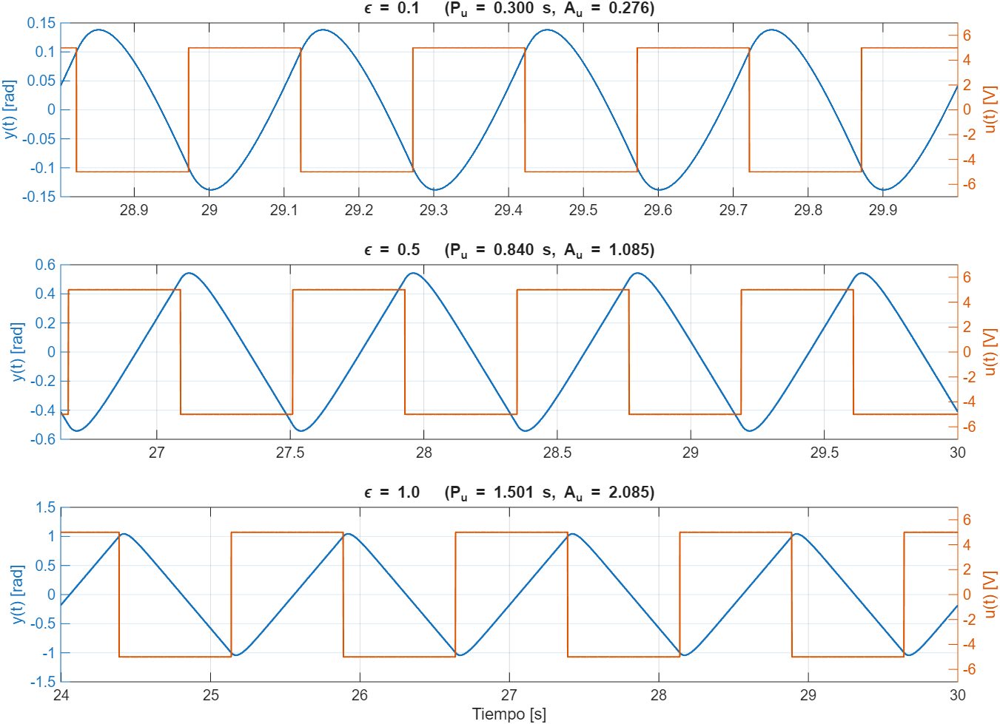

Simulación con la planta del motor y $d=5$ V. Se ve cómo, al crecer $\varepsilon$, aumentan la amplitud y el periodo.

### 1.2 Ganancia última

Con la aproximación de la **función descriptiva** del relé con histéresis, la ganancia última se calcula a partir de la amplitud de la oscilación de la salida:

$$
K_u=\frac{4\,d}{\pi\sqrt{a^2-\varepsilon^2}}\qquad a=\frac{A_u}{2}
$$

donde $A_u$ es la amplitud **pico a valle** medida en el osciloscopio. ($1/K_u$ es la parte real del punto $-1/N(a)$ de la función descriptiva del relé.) Si $\varepsilon=0$ se reduce a la fórmula clásica $K_u=4d/(\pi a)$.

El periodo último $P_u$ es el periodo de la oscilación.

### 1.3 Por qué se prueban varios $\varepsilon$

La histéresis cambia el punto de operación del ciclo límite: con $\varepsilon$ pequeño se identifica un punto de **más alta frecuencia** (mayor $K_u$, menor $P_u$), y con $\varepsilon$ grande uno de **menor frecuencia**. Como el punto elegido es el que se usa para sintonizar, cada $\varepsilon$ produce un juego distinto de ganancias, y de ahí el análisis de las secciones 3 y 4.

  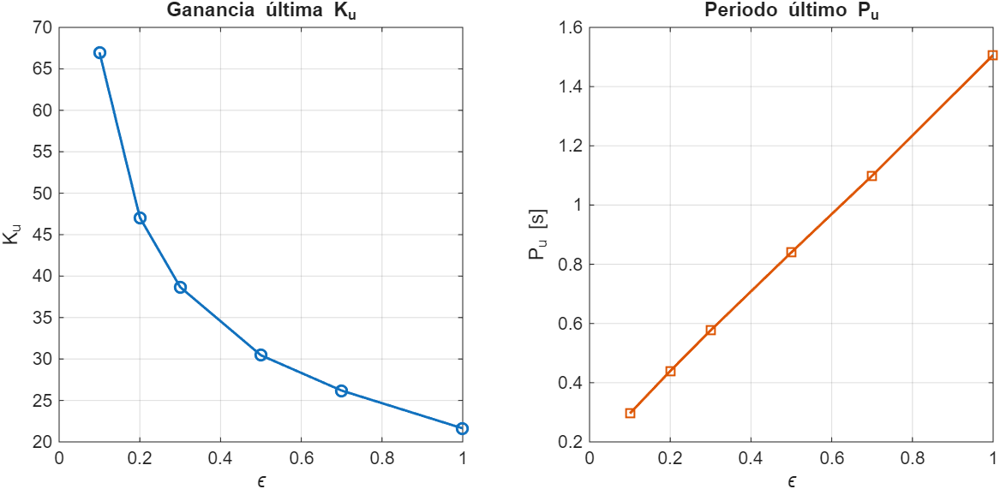

---

## 2. Datos del experimento

Relé de amplitud **$d=5$ V**, planta $G(s)=33792/(s^3+2500s^2+55822s)$. $P_u$ y $A_u$ se leyeron en el osciloscopio de `MetodoRele.slx` (hoja *Datos* del Excel):

| $\varepsilon$ | $P_u$ [s] | $A_u$ (pico a valle) | $a=A_u/2$ | $K_u$ |
|:-:|:-:|:-:|:-:|:-:|
| 0.1 | 0.2962 | 0.2759 | 0.1379 | 66.99 |
| 0.2 | 0.4396 | 0.4829 | 0.2414 | 47.06 |
| 0.3 | 0.5766 | 0.6844 | 0.3422 | 38.67 |
| 0.5 | 0.8401 | 1.0839 | 0.5420 | 30.45 |
| 0.7 | 1.0988 | 1.4820 | 0.7410 | 26.19 |
| 1 | 1.5066 | 2.0848 | 1.0424 | 21.63 |

**Verificación independiente.** Se simuló el lazo relé + planta (misma $G(s)$, $d=5$, mismas histéresis) y los resultados coinciden con las lecturas del Excel:

| $\varepsilon$ | $P_u$ simulado | $P_u$ Excel | $A_u$ simulado | $A_u$ Excel |
|:-:|:-:|:-:|:-:|:-:|
| 0.1 | 0.2996 | 0.2962 | 0.2762 | 0.2759 |
| 0.2 | 0.4412 | 0.4396 | 0.4833 | 0.4829 |
| 0.3 | 0.5752 | 0.5766 | 0.6847 | 0.6844 |
| 0.5 | 0.8400 | 0.8401 | 1.0850 | 1.0839 |
| 0.7 | 1.1044 | 1.0988 | 1.4851 | 1.4820 |
| 1.0 | 1.5008 | 1.5066 | 2.0850 | 2.0848 |

(La simulación está en `../GraficarFiguras.m`.)

### Modelo del experimento

  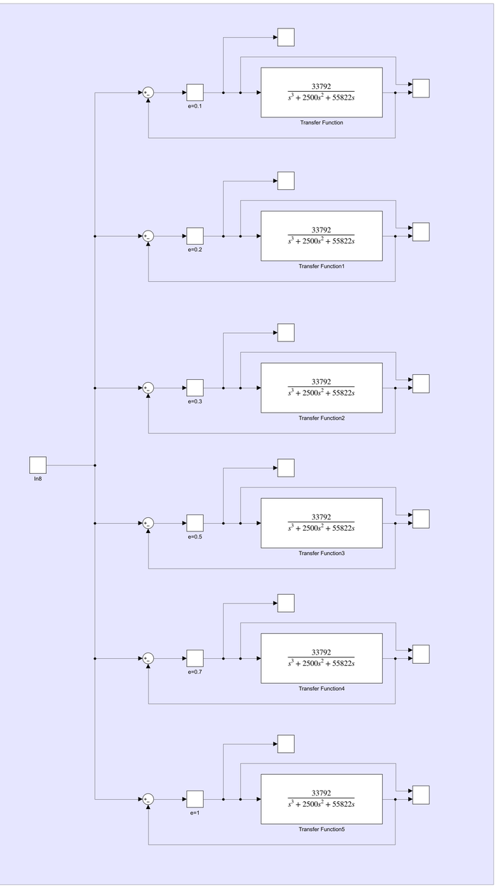

El bloque *Método Relé Análisis de Histéresis* de `MetodoRele.slx` contiene **seis lazos idénticos**, cada uno con un `Relay` de salida ±5 y umbral $\pm\varepsilon$ (`e=0.1 … e=1`) cerrado sobre la misma planta, con un scope para leer $P_u$ y $A_u$.

---

## 3. Reglas de sintonización

Con $K_u$ y $P_u$ se calcularon controladores con cuatro familias de reglas. Para todas: $K_i=K_p/T_i$ y $K_d=K_p\,T_d$.

| Familia | Tipo | $K_p$ | $T_i$ | $T_d$ |
|---|:-:|:-:|:-:|:-:|
| **Ziegler–Nichols** | P | $0.5\,K_u$ | — | — |
| | PI | $0.45\,K_u$ | $P_u/1.2$ | — |
| | PID | $0.6\,K_u$ | $P_u/2$ | $P_u/8$ |
| **Smith** | PID | $0.75\,K_u$ | $0.625\,P_u$ | $0.1\,P_u$ |
| **Tan** | PID | $0.5\,K_u$ | $P_u$ | $0.125\,P_u$ |
| **Corripio** | PID | $0.75\,K_u$ | $0.63\,P_u$ | $0.1\,P_u$ |

Son **seis controladores por cada $\varepsilon$**: Z-N (P), Z-N (PI), Z-N (PID), Smith (PID), Tan (PID) y Corripio (PID); en total **36 combinaciones**. Cada una se simuló en lazo cerrado con la planta y se registraron el **sobreimpulso MS** y el **tiempo de asentamiento Ts**.

Cada panel del modelo (`e=0.1 … e=1`) pone los seis controladores en paralelo sobre la misma planta y la misma referencia (de arriba hacia abajo: Z-N P, Z-N PI, Z-N PID, Smith, Tan y Corripio):

| $\varepsilon=0.1$ | $\varepsilon=0.2$ | $\varepsilon=0.3$ |
|:-:|:-:|:-:|
| 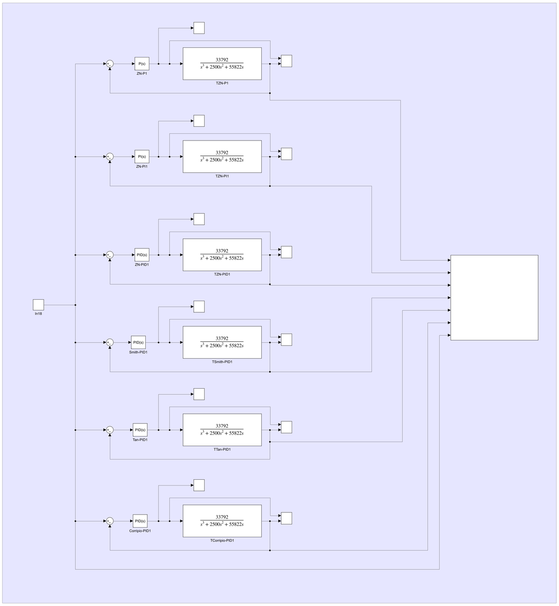 | 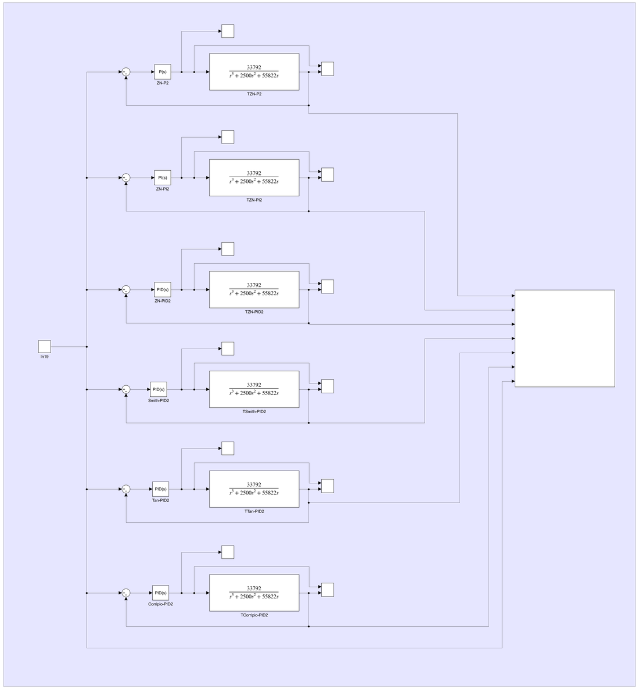 | 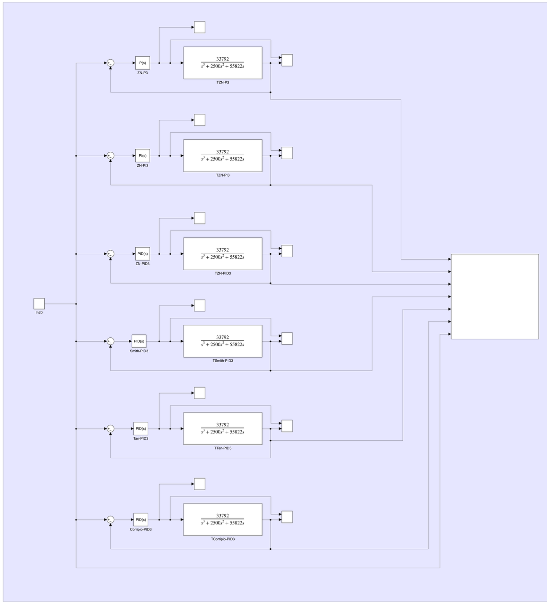 |

| $\varepsilon=0.5$ | $\varepsilon=0.7$ | $\varepsilon=1$ |
|:-:|:-:|:-:|
| 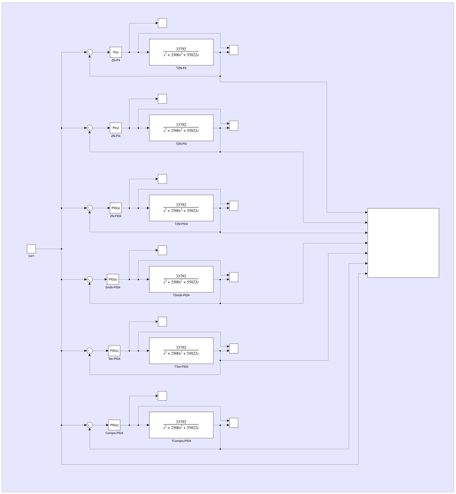 | 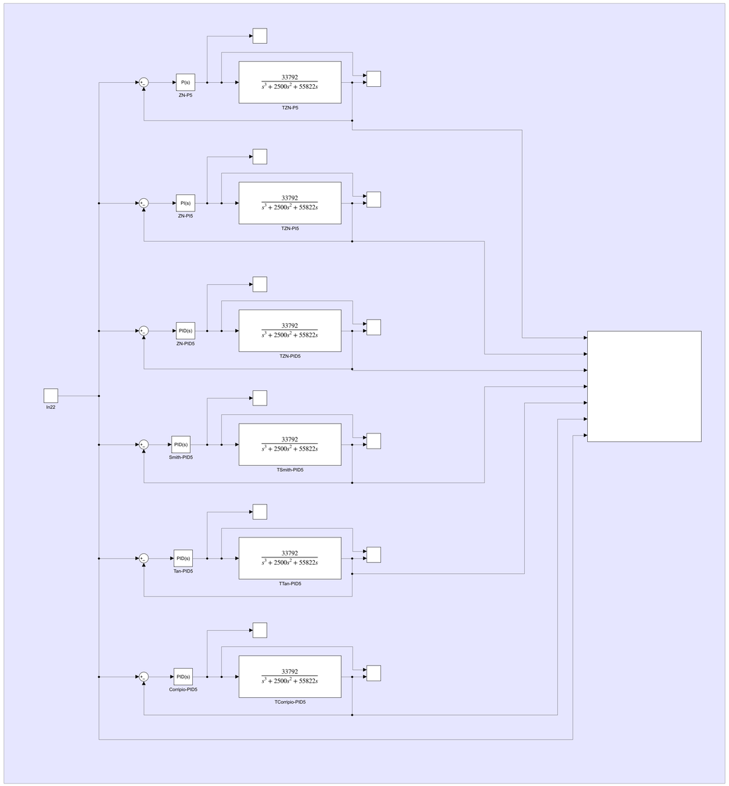 | 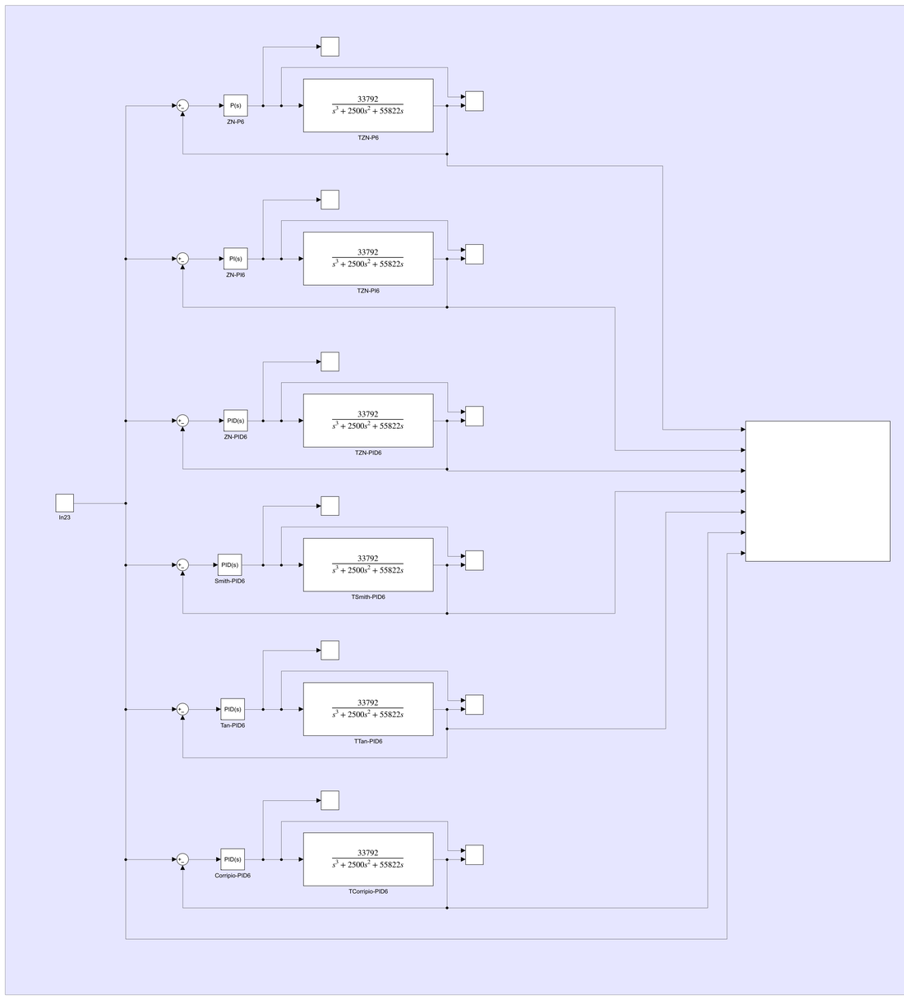 |

---

## 4. Resultados

### 4.1 Z-N: P y PI

| $\varepsilon$ | P: $K_p$ | P: MS [%] | P: Ts [s] | PI: $K_p$ | PI: $T_i$ [s] | PI: $K_i$ | PI: MS [%] | PI: Ts [s] |
|:-:|:-:|:-:|:-:|:-:|:-:|:-:|:-:|:-:|
| 0.1 | 33.497 | 14.55 | 0.6 | 30.147 | 0.2468 | 122.13 | 37.13 | 1.2 |
| 0.2 | 23.531 | 8.05 | 0.6 | 21.178 | 0.3663 | 57.81 | 26.89 | 1.8 |
| 0.3 | 19.336 | 4.98 | 0.7 | 17.402 | 0.4805 | 36.22 | 21.45 | 2.4 |
| 0.5 | 15.225 | 2.01 | 0.6 | 13.703 | 0.7001 | 19.57 | 15.71 | 2.8 |
| 0.7 | 13.096 | 0.77 | 0.6 | 11.786 | 0.9157 | 12.87 | 12.96 | 4.5 |
| 1 | 10.817 | **0.04** | 0.6 | 9.735 | 1.2555 | 7.75 | 10.65 | 7 |

### 4.2 PID (Z-N, Smith, Tan y Corripio)

| $\varepsilon$ | Método | $K_p$ | $T_i$ [s] | $T_d$ [s] | $K_i$ | $K_d$ | MS [%] | Ts [s] |
|:-:|---|:-:|:-:|:-:|:-:|:-:|:-:|:-:|
| 0.1 | Ziegler–Nichols | 40.196 | 0.1481 | 0.0370 | 271.41 | 1.488 | 18.32 | 0.8 |
| 0.1 | Smith | 50.245 | 0.1851 | 0.0296 | 271.41 | 1.488 | 16.20 | 0.65 |
| 0.1 | Tan | 33.497 | 0.2962 | 0.0370 | 113.09 | 1.240 | 11.97 | 1.2 |
| 0.1 | Corripio | 50.245 | 0.1866 | 0.0296 | 269.26 | 1.488 | 16.10 | 0.8 |
| 0.2 | Ziegler–Nichols | 28.238 | 0.2198 | 0.0549 | 128.47 | 1.552 | 14.04 | 1.3 |
| 0.2 | Smith | 35.297 | 0.2747 | 0.0440 | 128.47 | 1.552 | 11.02 | 1.1 |
| 0.2 | Tan | 23.531 | 0.4396 | 0.0549 | 53.53 | 1.293 | 9.81 | 1.8 |
| 0.2 | Corripio | 35.297 | 0.2769 | 0.0440 | 127.45 | 1.552 | 10.95 | 1 |
| 0.3 | Ziegler–Nichols | 23.203 | 0.2883 | 0.0721 | 80.48 | 1.672 | 12.17 | 1.8 |
| 0.3 | Smith | 29.003 | 0.3604 | 0.0577 | 80.48 | 1.672 | 9.36 | 1.6 |
| 0.3 | Tan | 19.336 | 0.5766 | 0.0721 | 33.53 | 1.394 | 8.67 | 2.4 |
| 0.3 | Corripio | 29.003 | 0.3633 | 0.0577 | 79.84 | 1.672 | 9.30 | 1.5 |
| 0.5 | Ziegler–Nichols | 18.270 | 0.4200 | 0.1050 | 43.50 | 1.919 | 10.14 | 1.6 |
| 0.5 | Smith | 22.838 | 0.5251 | 0.0840 | 43.50 | 1.919 | 7.73 | 2 |
| 0.5 | Tan | 15.225 | 0.8401 | 0.1050 | 18.12 | 1.599 | 7.22 | 2.8 |
| 0.5 | Corripio | 22.838 | 0.5293 | 0.0840 | 43.15 | 1.919 | 7.68 | 1.9 |
| 0.7 | Ziegler–Nichols | 15.715 | 0.5494 | 0.1373 | 28.60 | 2.158 | 8.94 | 3 |
| 0.7 | Smith | 19.643 | 0.6867 | 0.1099 | 28.60 | 2.158 | 6.77 | 3 |
| 0.7 | Tan | 13.096 | 1.0988 | 0.1373 | 11.92 | 1.799 | 6.58 | 4.5 |
| 0.7 | Corripio | 19.643 | 0.6922 | 0.1099 | 28.38 | 2.158 | 6.73 | 3 |
| 1 | Ziegler–Nichols | 12.980 | 0.7533 | 0.1883 | 17.23 | 2.444 | 7.87 | 5 |
| 1 | Smith | 16.225 | 0.9416 | 0.1507 | 17.23 | 2.444 | 5.94 | 4 |
| 1 | Tan | 10.817 | 1.5066 | 0.1883 | 7.18 | 2.037 | 5.83 | 7 |
| 1 | Corripio | 16.225 | 0.9492 | 0.1507 | 17.09 | 2.444 | 5.91 | 4 |

### 4.3 Reglas usadas (tablas del Excel)

| Ziegler–Nichols | Smith |
|:-:|:-:|
| 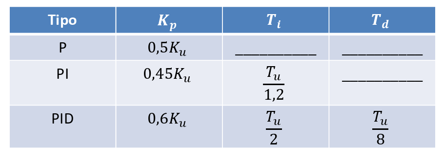 | 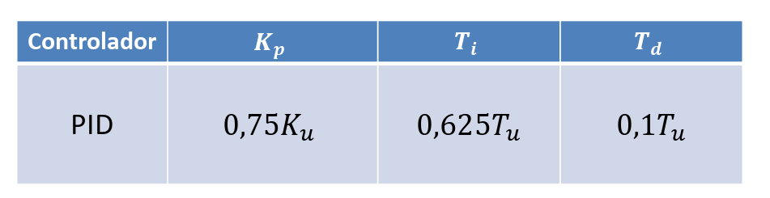 |

| Tan | Corripio |
|:-:|:-:|
| 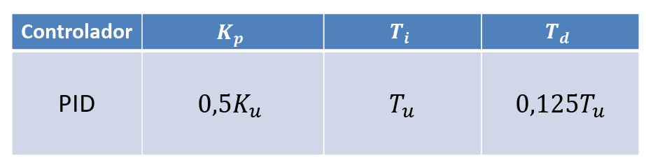 | 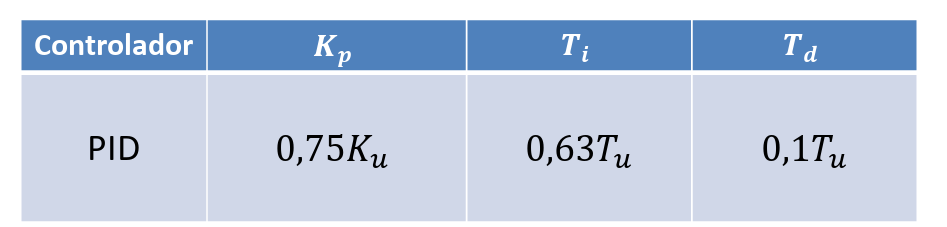 |

---

## 5. Selección del mejor controlador

La hoja *Análisis* del Excel elige el mejor de los 36 casos con el criterio **menor sobreimpulso (MS) y menor tiempo de asentamiento (Ts)**:

1. **Dentro de cada $\varepsilon$** se compararon los 6 controladores. A cada uno se le asigna su puesto en MS y su puesto en Ts (1 = mejor) y se suman: ese es el *score*. Si hay empate, desempata el MS y después el Ts.
2. Se tomaron los **2 mejores de cada $\varepsilon$** (12 candidatos) y se repitió el ranking de forma global.
3. De ahí salen los 3 mejores en general.

**Mejores 2 por histéresis:**

| $\varepsilon$ | 1.º | 2.º |
|:-:|---|---|
| 0.1 | Z-N (P) — MS 14.55 %, Ts 0.6 s | Tan (PID) — 11.97 %, 1.2 s |
| 0.2 | Z-N (P) — 8.05 %, 0.6 s | Corripio (PID) — 10.95 %, 1.0 s |
| 0.3 | Z-N (P) — 4.98 %, 0.7 s | Corripio (PID) — 9.30 %, 1.5 s |
| 0.5 | Z-N (P) — 2.01 %, 0.6 s | Corripio (PID) — 7.68 %, 1.9 s |
| 0.7 | Z-N (P) — 0.77 %, 0.6 s | Corripio (PID) — 6.73 %, 3.0 s |
| 1 | Z-N (P) — 0.04 %, 0.6 s | Corripio (PID) — 5.91 %, 4.0 s |

**Los 3 mejores en general:**

| Puesto | Método | $\varepsilon$ | $K_p$ | MS [%] | Ts [s] |
|:-:|---|:-:|:-:|:-:|:-:|
| 🥇 1.º | Z-N (P) | 1 | 10.817 | 0.04 | 0.6 |
| 🥈 2.º | Z-N (P) | 0.7 | 13.096 | 0.77 | 0.6 |
| 🥉 3.º | Z-N (P) | 0.5 | 15.225 | 2.01 | 0.6 |

### El mejor de todos

> **Ziegler–Nichols (P), $\varepsilon=1$:** $K_p=10.817$, sobreimpulso 0.04 %, $T_s=0.6$ s.

Este controlador es el que entra a la comparación final con los otros cuatro métodos (modelo `ComparacionMetodos.slx`, ver la [visión general](../README.md)): ahí se confirma con la escalera de 10 saltos un sobrepico ≈ 0.05 % y Ts entre 0.5 y 0.7 s.

---

## 6. Observaciones

- **Por qué gana el control P.** La planta $G(s)$ ya contiene un integrador (es de tipo 1), así que un P basta para error cero ante escalón. Agregar la acción integral (PI/PID) solo empeora el sobreimpulso, como se ve en las tablas: con $\varepsilon=1$ el P tiene MS = 0.04 % y el PI 10.65 %.
- **Efecto de $\varepsilon$.** Al aumentar $\varepsilon$, $K_u$ baja y por tanto **todas las ganancias bajan**, y el sobreimpulso baja con ellas. A cambio los controladores PI/PID tienen mayor $T_i$ y por eso un Ts mayor (por ejemplo, el PI pasa de 1.2 s a 7 s entre $\varepsilon=0.1$ y $1$).
- **MS y Ts.** Son los valores registrados en las columnas *MS* y *Ts* del Excel para cada lazo; sirven para **comparar** controladores entre sí.
- **Modelo.** En `MetodoRele.slx` hay además un panel *Best 3 Analysis* con los tres mejores lazos (Z-N P con $\varepsilon=1$, 0.7 y 0.5) en paralelo.

  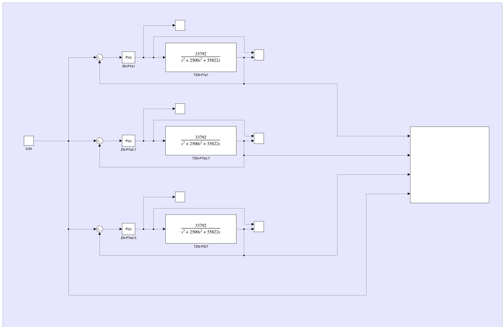

