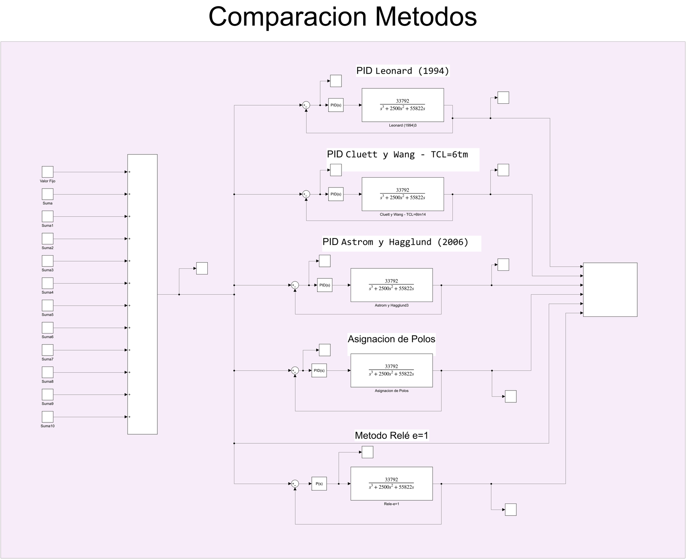
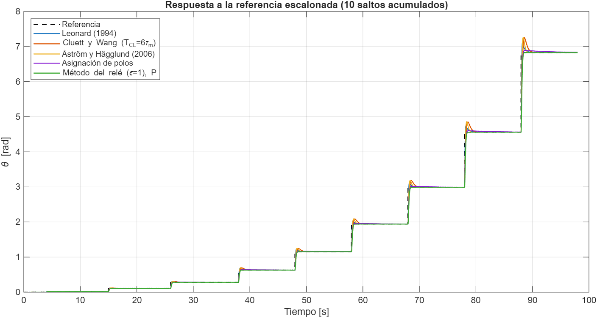
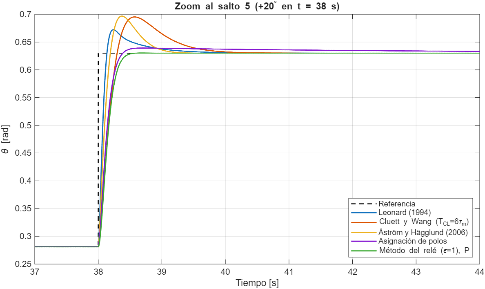

# Control de Posición del Servomotor del SCARA

Esta carpeta reúne el trabajo de **sintonización del controlador de posición** del servomotor que mueve cada articulación rotacional del SCARA (motor DC con reductor). El objetivo es llegar a un PI/PID (o P) que siga una referencia de ángulo con **poco sobreimpulso y tiempo de asentamiento corto**.

Para lograrlo se compararon **cinco métodos de sintonización** sobre la misma planta:

<div align="center">

| # | Método | Subcarpeta |
|---|---|---|
| 1 | Reglas de **literatura** para el modelo IPD — Leonard (1994) | [`SintonizacionLiteratura`](./SintonizacionLiteratura/README.md) |
| 2 | Reglas de **literatura** para el modelo IPD — Cluett y Wang (1997) | [`SintonizacionLiteratura`](./SintonizacionLiteratura/README.md) |
| 3 | Reglas de **literatura** para el modelo IPD — Åström y Hägglund (2006) | [`SintonizacionLiteratura`](./SintonizacionLiteratura/README.md) |
| 4 | **Asignación de polos** (diseño analítico PI y PID) | [`Asignacion_Polos`](./Asignacion_Polos/README.md) |
| 5 | **Método del relé** (ciclo último) con reglas Ziegler–Nichols, Smith, Tan y Corripio | [`Metodo_Rele`](./Metodo_Rele/README.md) |

</div>

Cada subcarpeta tiene su propio README con el procedimiento completo; este documento es la **visión general y la comparación final**.

---

## 0. Contenido de la carpeta

```text
8.Control_Motor/
├── README.md                          Este documento
├── ComparacionMetodos.slx             Modelo Simulink que compara los 5 métodos con la misma referencia
├── Analisis5Metodos.xlsx              Sobrepico y Ts observados por salto y por método
├── GraficarFiguras.m                  Script que reproduce las figuras de los README (Control System Toolbox)
├── images/
├── SintonizacionLiteratura/           Caracterización del motor (modelo IPD) + reglas del Handbook de O'Dwyer
│   ├── ControladoresLibro.slx
│   └── README.md
├── Asignacion_Polos/                  Diseño PI y PID por asignación de polos
│   ├── AsignacionPolos.slx
│   └── README.md
└── Metodo_Rele/                       Experimento del relé con histéresis + 4 familias de reglas
    ├── MetodoRele.slx
    ├── Sintonizacion_Rele.xlsx
    └── README.md
```

---

## 1. La planta

Todos los métodos se aplican sobre el **mismo modelo del motor**, construido en Simscape (circuito de armadura + convertidor electromecánico + inercia + amortiguamiento + reductor), igual que en [`5. Matlab_Simscape/Modelado Motor DC`](../5.%20Matlab_Simscape/Modelado%20Motor%20DC/README.md) pero con los parámetros del servomotor del proyecto:

<div align="center">

| Parámetro | Valor |
|---|---|
| Resistencia de armadura $R$ | $2.5\ \Omega$ |
| Inductancia de armadura $L$ | $1\ \text{mH}$ |
| Constante del motor $K=K_a=K_m$ | $5.8857\times10^{-3}\ \text{V·s/rad}$ |
| Inercia del rotor $J_m$ | $6.3173\times10^{-7}\ \text{kg·m}^2$ |
| Fricción viscosa $\beta$ (`Dm`) | $2.5\times10^{-7}\ \text{N·m·s/rad}$ |
| Reductor $N$ | $275.6923:1$ |
| Inercia de la carga $J_l$ | $2\times10^{-6}\ \text{kg·m}^2$ |

</div>

Linealizando este modelo (voltaje de armadura → posición angular **a la salida del reductor**) se obtiene la función de transferencia que se usa en todos los lazos:

$$
G(s)=\frac{\theta(s)}{V(s)}=\frac{33792}{s^3+2500\,s^2+55822\,s}=\frac{33792}{s\,(s+22.5)(s+2477.5)}
$$

Esta función sale de la misma expresión de la carpeta de modelado del motor, $\theta/V = K\big/\big(N\,s\,[(Ls+R)(Js+\beta)+K^2]\big)$, con $J=J_m+J_l/N^2$. Evaluada con los parámetros de arriba da $33792.8\,/\,(s^3+2500.4\,s^2+55822.9\,s)$, es decir, la de los modelos.

Sus polos son:

<div align="center">

| Polo | Valor | Origen |
|---|---|---|
| $s=0$ | $0$ | Integrador: velocidad → posición |
| $s_1$ | $-22.5$ | Polo mecánico (el dominante) |
| $s_2$ | $-2477.5$ | Polo eléctrico ($\approx R/L=2500$) |

</div>

Como la planta ya tiene un integrador, es de **tipo 1**: cualquier controlador estable la lleva a **error nulo ante un escalón** de referencia.

### Aproximación por modelo IPD

Para aplicar las reglas del Handbook, la planta se aproxima por un **integrador más retardo (IPD)**:

$$
G_m(s)=\frac{K_m\,e^{-s\,\tau_m}}{s}\qquad K_m\approx 0.61\ \tfrac{\text{rad/s}}{\text{V}},\quad \tau_m = 0.0464\ \text{s}
$$

Los parámetros $K_m$ y $\tau_m$ se obtuvieron de **ensayos al escalón** (1 V, 2.5 V y 5 V); el procedimiento está en [`SintonizacionLiteratura`](./SintonizacionLiteratura/README.md).

---

## 2. Referencia usada para comparar

Para probar los controladores con distintas amplitudes en una sola simulación se usa una **escalera de 10 saltos acumulados** (bloques `Step` del modelo `ComparacionMetodos.slx`):

<div align="center">

| Salto | Tiempo [s] | Incremento $\Delta r$ [°] | Incremento [rad] | Nivel final [°] |
|:-:|:-:|:-:|:-:|:-:|
| 1 | 1 | 0.1 | 0.0017453 | 0.1 |
| 2 | 4 | 1 | 0.0174533 | 1.1 |
| 3 | 15 | 5 | 0.0872665 | 6.1 |
| 4 | 26 | 10 | 0.1745329 | 16.1 |
| 5 | 38 | 20 | 0.3490659 | 36.1 |
| 6 | 48 | 30 | 0.5235988 | 66.1 |
| 7 | 58 | 45 | 0.7853982 | 111.1 |
| 8 | 68 | 60 | 1.0471976 | 171.1 |
| 9 | 78 | 90 | 1.5707963 | 261.1 |
| 10 | 88 | 130 | 2.268928 | 391.1 |

</div>

El sobrepico de cada salto se calcula como

$$
\text{Sobrepico}\ [\%]=\frac{\text{pico observado}-\text{nivel objetivo}}{\Delta r}\times100
$$

---

## 3. Modelo de comparación

<p align="center">
  
</p>

`ComparacionMetodos.slx` pone **los cinco lazos cerrados en paralelo**, todos con la misma planta $G(s)$ y la misma escalera de referencia:

<div align="center">

| Lazo | Controlador (bloque PID de Simulink) |
|---|---|
| PID Leonard (1994) | $K_p=26.1447,\ K_i=46.1855,\ K_d=0.4974$ |
| PID Cluett y Wang, $T_{CL}=6\tau_m$ | $K_p=9.5711,\ K_i=15.6962,\ K_d=0.0564$ |
| PID Åström y Hägglund (2006) | $K_p=15.8988,\ K_i=42.8309,\ K_d=0.3689$ |
| Asignación de polos (PID) | $K_p=12.11,\ K_i=2.4,\ K_d=0.147$ (valores del bloque; el cálculo analítico da $12.12,\ 2.706,\ 0.148$) |
| Método del relé $\varepsilon=1$ (Z-N, **P**) | $K_p=10.817$ |

</div>

Todos los bloques usan filtro derivativo $N=100$. Los scopes y el `Mux` de la derecha agrupan las señales para compararlas.

---

## 4. Resultados

Valores leídos de los osciloscopios y registrados en [`Analisis5Metodos.xlsx`](./Analisis5Metodos.xlsx) (hoja *Resumen*). Cada celda es **sobrepico / tiempo de asentamiento**:

<div align="center">

| Salto | t [s] | Δr [°] | Leonard (1994) | Cluett y Wang ($T_{CL}=6\tau_m$) | Åström y Hägglund (2006) | Asignación de polos | Relé $\varepsilon=1$ (P) |
|:-:|:-:|:-:|:-:|:-:|:-:|:-:|:-:|
| 1 | 1 | 0.1 | 8.3 % / 0.90 s | 20.3 % / 1.40 s | 20.3 % / 0.90 s | 3.1 % / 9.2 s | 0.03 % / 0.5 s |
| 2 | 4 | 1.0 | 12.0 % / 1.7 s | 18.9 % / 2.2 s | 19.5 % / 1.4 s | 2.9 % / 9.29 s | 0.04 % / 0.5 s |
| 3 | 15 | 5.0 | 12.1 % / 2.1 s | 18.7 % / 2.25 s | 19.3 % / 1.5 s | 2.4 % / 12 s | 0.04 % / 0.6 s |
| 4 | 26 | 10.0 | 12.1 % / 2.5 s | 18.7 % / 2.5 s | 19.1 % / 1.6 s | 2.2 % / 12 s | 0.06 % / 0.6 s |
| 5 | 38 | 20.0 | 12.1 % / 2.7 s | 18.7 % / 2.7 s | 19.1 % / 1.6 s | 2.6 % / 12 s | 0.04 % / 0.6 s |
| 6 | 48 | 30.0 | 12.1 % / 2.7 s | 18.7 % / 2.7 s | 19.1 % / 1.6 s | 2.7 % / 13 s | 0.05 % / 0.65 s |
| 7 | 58 | 45.0 | 12.1 % / 2.7 s | 18.7 % / 2.7 s | 19.1 % / 1.6 s | 2.7 % / 13 s | 0.04 % / 0.65 s |
| 8 | 68 | 60.0 | 12.1 % / 2.8 s | 18.7 % / 2.8 s | 19.0 % / 1.7 s | 2.8 % / 14 s | 0.04 % / 0.7 s |
| 9 | 78 | 90.0 | 12.1 % / 2.8 s | 18.7 % / 2.8 s | 19.1 % / 1.7 s | 2.7 % / 14 s | 0.05 % / 0.7 s |
| 10 | 88 | 130.0 | 12.1 % / 2.8 s | 18.7 % / 2.8 s | 19.0 % / 1.7 s | 2.8 % / 14 s | 0.05 % / 0.7 s |

</div>

Resumen (saltos 2 a 10; el salto 1 queda afectado por la resolución de lectura, al ser de solo 0.1°):

<div align="center">

| Método | Sobrepico | Ts observado |
|---|:-:|:-:|
| Leonard (1994) | ≈ 12.1 % | 1.7 – 2.8 s |
| Cluett y Wang ($T_{CL}=6\tau_m$) | ≈ 18.7 % | 2.2 – 2.8 s |
| Åström y Hägglund (2006) | ≈ 19.1 % | 1.4 – 1.7 s |
| Asignación de polos | ≈ 2.7 % | 9.3 – 14 s |
| **Relé $\varepsilon=1$ (P)** | **≈ 0.05 %** | **0.5 – 0.7 s** |

</div>

<p align="center">
  
</p>

<p align="center">
  
</p>

> Las dos figuras se generaron con `GraficarFiguras.m`, que reconstruye los cinco lazos con los $K_p$, $K_i$, $K_d$ guardados en los bloques PID de los modelos. Los **sobrepicos simulados coinciden con los del Excel** (Leonard 12.1 %, Cluett y Wang 18.7 %, Åström y Hägglund 19.1 %, asignación de polos 2.5–2.8 %, relé 0.05 %).

### Lectura de los resultados

- **Reglas de literatura (IPD):** responden rápido, pero con **12 – 19 % de sobrepico**. Son reglas pensadas para un compromiso general y no para un servo de posición.
- **Asignación de polos:** el sobrepico es bajo (≈ 2.7 %) y el **tiempo de subida cumple lo diseñado** (el PID llega al 98 % a los 0.34 s, contra los 0.33 s pedidos), pero queda una **cola lenta** (polo en ≈ −0.23, casi cancelado por un cero del controlador en ≈ −0.22) que alarga el Ts observado a 9–14 s. Detalle en su [README](./Asignacion_Polos/README.md).
- **Método del relé, $\varepsilon=1$, control P:** el mejor en ambos criterios (sobrepico ≈ 0.05 % y Ts ≈ 0.6 s). Funciona bien porque la planta ya tiene integrador, así que un P basta para error cero en escalón. El análisis de los 36 casos (6 histéresis × 6 reglas) está en [`Metodo_Rele`](./Metodo_Rele/README.md).

> **Nota sobre el Ts:** en el Excel el Ts crece con el tamaño del salto aunque el sistema es lineal; esto indica que el valor depende del criterio de lectura en el osciloscopio. Sirve para **comparar métodos entre sí**, no como valor absoluto.

---

## 5. Cómo reproducir

1. Abrir en MATLAB (con Simulink, Simscape y Simscape Electrical) el modelo que se quiera revisar: `ComparacionMetodos.slx`, `Asignacion_Polos/AsignacionPolos.slx`, `Metodo_Rele/MetodoRele.slx` o `SintonizacionLiteratura/ControladoresLibro.slx`.
2. Para regenerar las figuras de los README (necesita **Control System Toolbox**):

   ```matlab
   run('GraficarFiguras.m')
   ```

---

## 6. Observaciones

1. **Ganancias de asignación de polos.** El README de la subcarpeta usa las del cálculo analítico ($K_p=12.12$, $K_i=2.706$, $K_d=0.148$). Los modelos guardan valores un poco distintos ($K_i=2.5$ en `AsignacionPolos.slx` y $K_i=2.4$ en `ComparacionMetodos.slx`, de donde salen los resultados del Excel); el efecto en la respuesta es mínimo (sobrepico 2.5–2.8 %).
2. **Valores de la caracterización.** Los controladores se calcularon con $K_m=0.610$ y $\tau_m=0.0464$ s (el $K_m$ del ensayo de 2.5 V). Esto se comprobó recalculando los seis controladores: coinciden con los bloques PID hasta la cuarta cifra decimal.
