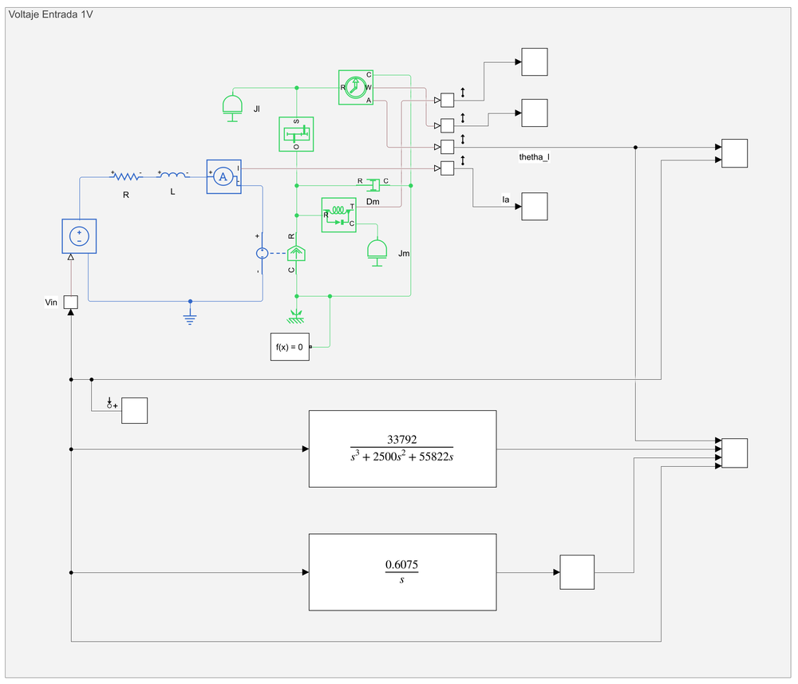
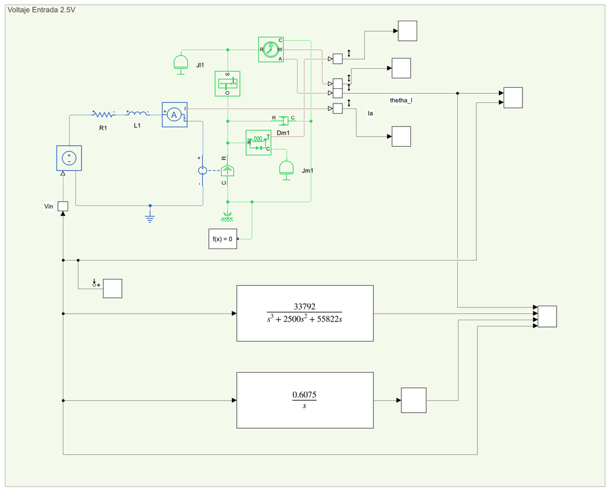
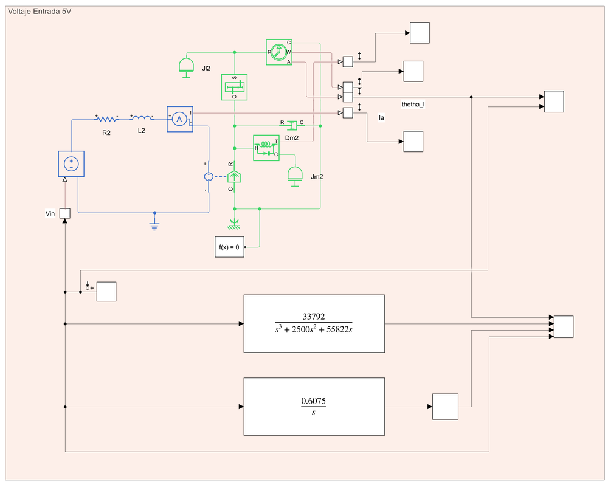
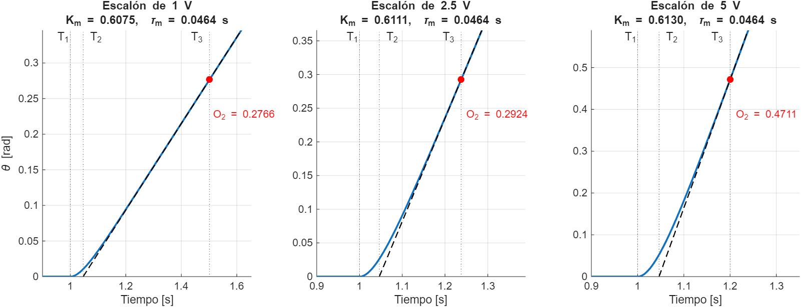
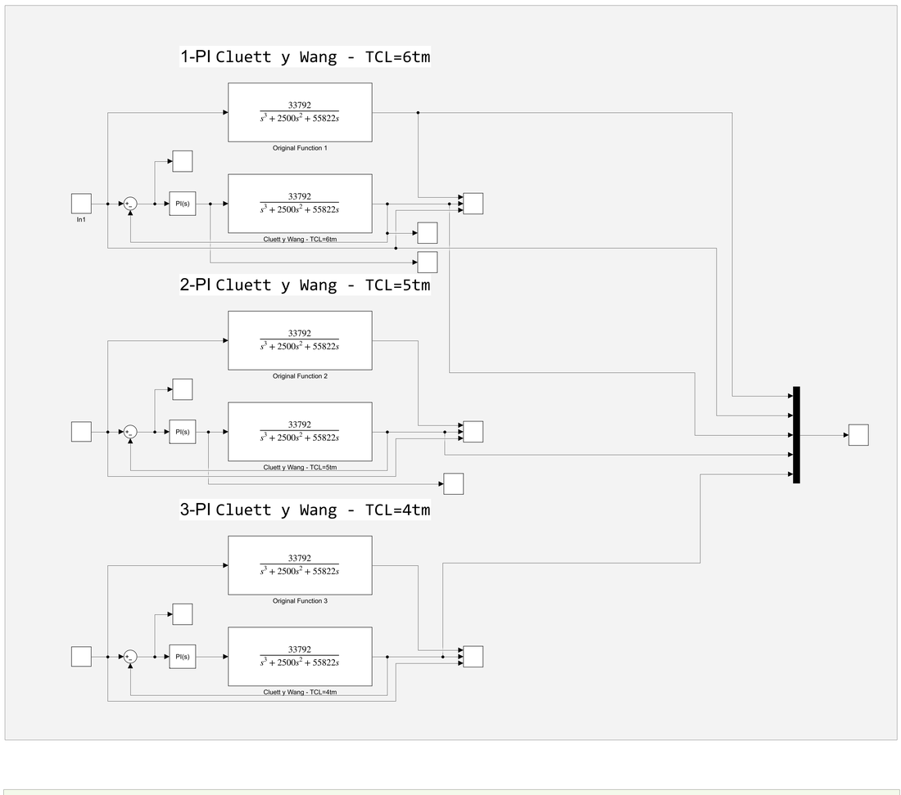
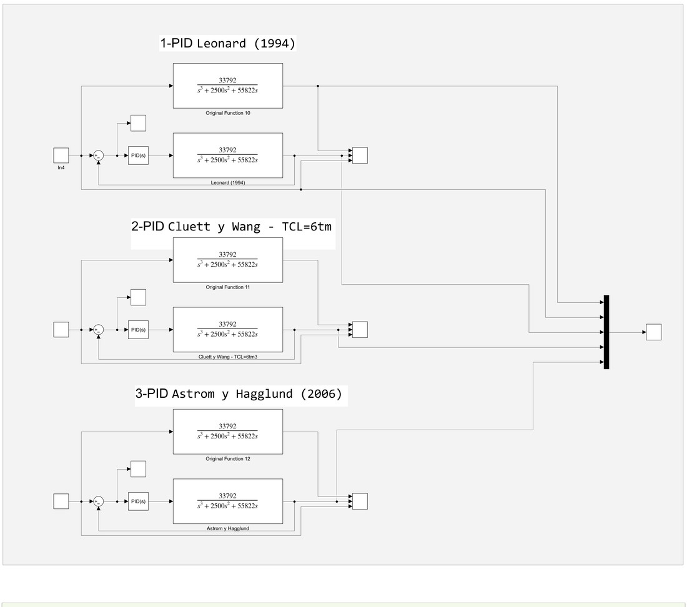
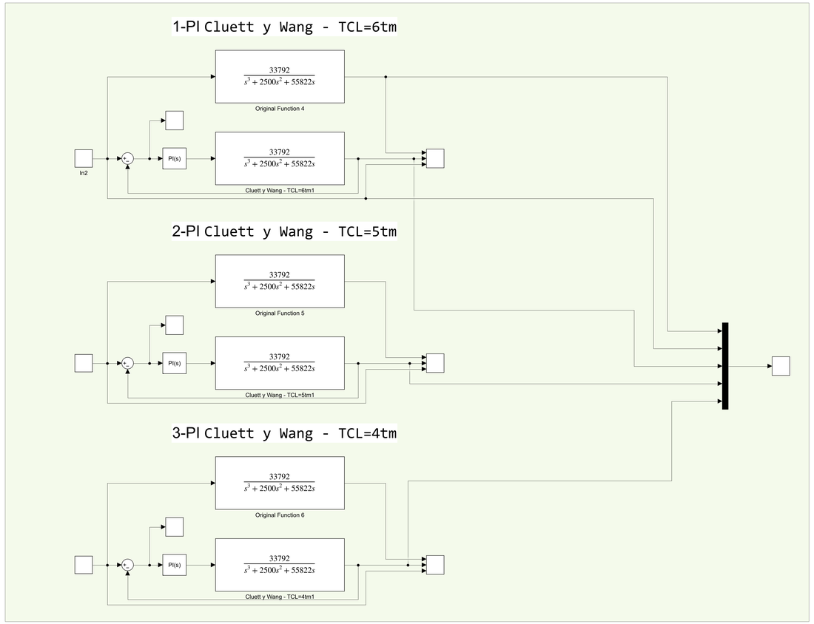
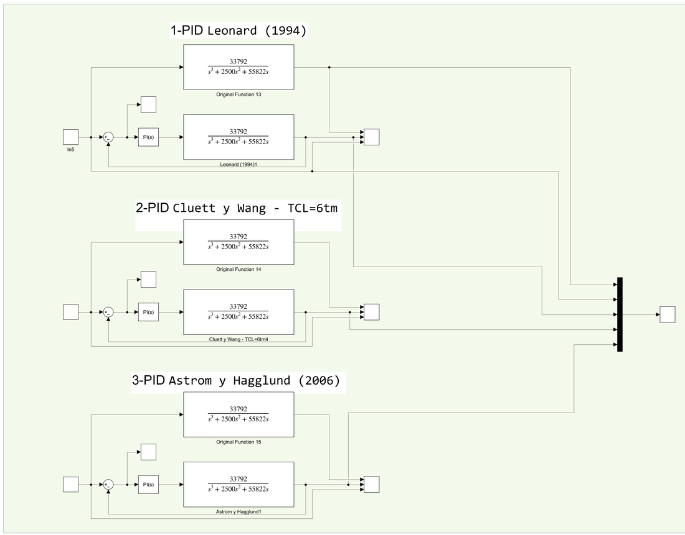
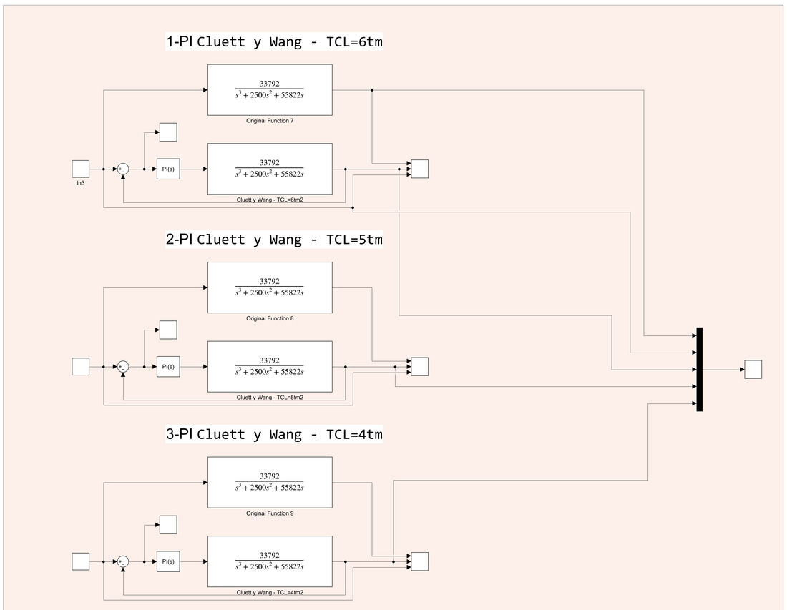
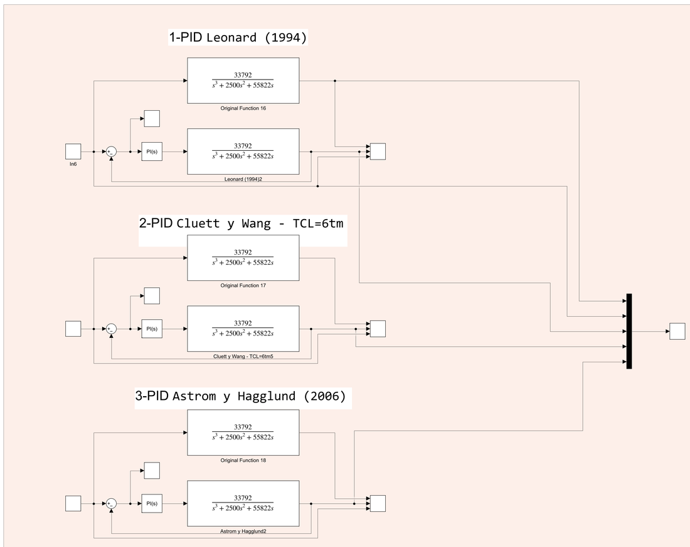

# Sintonización con Reglas de la Literatura (Modelo IPD)

En este método se **aprovechan reglas de sintonización ya publicadas**: se aproxima el motor por un modelo sencillo de dos parámetros, se buscan en el *Handbook of PI and PID Controller Tuning Rules* (A. O'Dwyer, Imperial College Press) las reglas disponibles para ese modelo y se calculan las ganancias con fórmulas cerradas.

El proceso tiene tres pasos:

1. **Caracterizar** el motor con ensayos al escalón y extraer los parámetros del modelo **IPD** (integrador más retardo): $K_m$ y $\tau_m$.
2. **Elegir reglas** del Handbook para ese modelo (capítulo 4, tablas de PI y PID) y calcular $K_p$, $T_i$, $T_d$.
3. **Probar** los controladores en Simulink con la planta del motor.

---

## 0. Contenido

| Archivo | Descripción |
|---|---|
| `ControladoresLibro.slx` | Modelo Simulink: motor en Simscape para 1, 2.5 y 5 V, comparación contra el modelo IPD y los lazos con los mejores PI y PID |
| `images/` | Figuras de la caracterización y paneles del modelo |

---

## 1. Modelo de proceso: integrador más retardo (IPD)

El Handbook agrupa en el capítulo 4 las reglas para **procesos sin autorregulación** ("non-self-regulating"), es decir, procesos con integrador, que es el caso de un motor cuya salida es la **posición angular**. El modelo (sección *IPD model*) es:

$$
G_m(s)=\frac{K_m\,e^{-s\,\tau_m}}{s}
$$

con $K_m$ la **ganancia de velocidad** (rad/s por voltio) y $\tau_m$ el **retardo aparente**.

### 1.1 Cómo se obtienen $K_m$ y $\tau_m$

Se aplica un **escalón de voltaje** a la planta y se mide la respuesta de posición, que después de un pequeño transitorio es una **rampa**. Sobre la gráfica se leen los instantes y niveles:

| Símbolo | Significado |
|---|---|
| $T_1$ | Instante en que se aplica el escalón |
| $T_2$ | Instante en que la recta de la rampa **corta el nivel inicial** de la salida |
| $T_3$ | Un instante cualquiera sobre la parte recta de la rampa |
| $I_1,\ I_2$ | Entrada antes y después del escalón |
| $O_1,\ O_2$ | Salida inicial y salida en $T_3$ |

$$
K_m=\frac{O_2-O_1}{(I_2-I_1)\,(T_3-T_2)}\qquad\qquad \tau_m=T_2-T_1
$$

La pendiente de la rampa dividida entre la amplitud del escalón es $K_m$, y el desfase de la rampa respecto al instante del escalón es el retardo $\tau_m$.

### 1.2 Ensayos realizados

El ensayo se hizo con el modelo Simscape del motor para **tres amplitudes de escalón: 1 V, 2.5 V y 5 V** (si el modelo fuera perfectamente lineal el resultado sería el mismo en los tres; las pequeñas diferencias vienen de la lectura de los instantes en el osciloscopio).

En cada ensayo el modelo pone en paralelo la salida del **motor en Simscape**, la **función de transferencia linealizada** $33792/(s^3+2500s^2+55822s)$ y el **modelo IPD** ($0.6075/s$ con un retardo de 0.0464 s):

| 1 V | 2.5 V | 5 V |
|:-:|:-:|:-:|
|  |  |  |

La respuesta de posición de la planta a cada escalón, con los instantes leídos ($T_1=1$ s, $T_2=1.0464$ s y $T_3$ sobre la rampa), la recta de la rampa y el punto $(T_3,\ O_2)$:

  

**Lecturas y resultados:**

| Ensayo | $T_1$ [s] | $T_2$ [s] | $T_3$ [s] | $I_2$ | $O_2$ | $K_m$ | $\tau_m$ [s] |
|:-:|:-:|:-:|:-:|:-:|:-:|:-:|:-:|
| 1 V | 1 | 1.0464 | 1.5017 | 1 | 0.2766 | **0.6075** | 0.0464 |
| 2.5 V | 1 | 1.0464 | 1.2378 | 2.5 | 0.2924 | **0.6111** | 0.0464 |
| 5 V | 1 | 1.0464 | 1.2001 | 5 | 0.4711 | **0.6130** | 0.0464 |

En los tres casos $I_1=O_1=0$. Ejemplo (1 V):

$$
K_m=\frac{0.2766-0}{(1-0)(1.5017-1.0464)}=0.6075\qquad \tau_m=1.0464-1=0.0464\ \text{s}
$$

Los modelos IPD que resultan de cada ensayo son:

| Ensayo | Modelo IPD |
|:-:|:-:|
| 1 V | $G_m(s)=\dfrac{0.6075\,e^{-0.0464\,s}}{s}$ |
| 2.5 V | $G_m(s)=\dfrac{0.6111\,e^{-0.0464\,s}}{s}$ |
| 5 V | $G_m(s)=\dfrac{0.6130\,e^{-0.0464\,s}}{s}$ |

### 1.3 Parámetros adoptados

Los tres valores de $K_m$ son muy parecidos (variación menor al 1 %); su promedio es 0.6105, así que se adoptó:

$$
\boxed{K_m=0.610\ \tfrac{\text{rad/s}}{\text{V}}\qquad\tau_m=0.0464\ \text{s}\qquad K_m\tau_m=0.028304}
$$

### 1.4 ¿Es razonable la aproximación?

Se puede comprobar contra la función de transferencia completa $G(s)=33792/\big(s(s+22.5)(s+2477.5)\big)$:

- **Ganancia:** a baja frecuencia la planta se comporta como un integrador de ganancia $33792/55822=0.605$ rad/s por voltio, que coincide con el $K_m$ medido (0.6075 – 0.613).
- **Retardo:** los dos polos no integradores se pueden aproximar por un retardo de $1/22.5+1/2477.5\approx0.045$ s, muy cerca del $\tau_m=0.0464$ s medido.

---

## 2. Reglas del Handbook utilizadas

Las reglas están en el **capítulo 4** del Handbook (*Controller Tuning Rules for Non-Self-Regulating Process Models*), sección 4.1 (modelo IPD): **Tabla 58** (PI, págs. 350–358 del libro) y **Tabla 59** (PID, págs. 359–363). En el PDF corresponden a las páginas 365–378.

> Las tablas del libro tienen decenas de reglas para este modelo. A continuación aparecen las que se llevaron a Simulink.

### 2.1 PI — Cluett y Wang (1997)

**Tabla 58, pág. 353.** Una familia de reglas parametrizada por el **tiempo de lazo cerrado deseado** $T_{CL}=x_4\,\tau_m$:

$$
K_c=\frac{x_1}{K_m\tau_m}\qquad T_i=x_2\,\tau_m
$$

| $T_{CL}$ | $x_1$ | $x_2$ | $K_p$ | $T_i$ [s] | $K_i=K_p/T_i$ |
|:-:|:-:|:-:|:-:|:-:|:-:|
| $4\tau_m$ | 0.3752 | 9.1925 | 13.2561 | 0.4266 | 31.0787 |
| $5\tau_m$ | 0.3144 | 11.1637 | 11.1080 | 0.5180 | 21.4441 |
| $6\tau_m$ | 0.2709 | 13.1416 | 9.5711 | 0.6098 | 15.6962 |

Un $T_{CL}$ mayor da un controlador **más suave** (menor $K_p$, mayor $T_i$).

### 2.2 PID

**Tabla 59, págs. 360–362.** Controlador ideal $G_c(s)=K_c\big(1+1/(T_i s)+T_d s\big)$:

| Regla | Tabla / pág. | $K_c$ | $T_i$ | $T_d$ | Comentario del libro |
|---|:-:|:-:|:-:|:-:|---|
| **Leonard (1994)** | 59 / 360 | $0.74/(K_m\tau_m)$ | $12.2\,\tau_m$ | $0.41\,\tau_m$ | Sobreimpulso < 10 % con escalón; mínimo IAE (rampa de perturbación) |
| **Cluett y Wang (1997)**, $T_{CL}=6\tau_m$ | 59 / 361 | $0.2709/(K_m\tau_m)$ | $13.1416\,\tau_m$ | $0.1269\,\tau_m$ | Familia con $T_{CL}=x_4\tau_m$ |
| **Åström y Hägglund (2006)**, págs. 263–264 | 59 / 362 | $0.45/(K_m\tau_m)$ | $8\,\tau_m$ | $0.5\,\tau_m$ | $M_s=M_t=1.4$ |

Ganancias resultantes (con $K_m\tau_m=0.028304$), en la forma paralela que usa el bloque PID de Simulink: $K_i=K_p/T_i$ y $K_d=K_p\,T_d$:

| Regla | $K_p$ | $T_i$ [s] | $T_d$ [s] | $K_i$ | $K_d$ |
|---|:-:|:-:|:-:|:-:|:-:|
| Leonard (1994) | 26.1447 | 0.5661 | 0.01902 | 46.1855 | 0.4974 |
| Cluett y Wang ($6\tau_m$) | 9.5711 | 0.6098 | 0.00589 | 15.6962 | 0.0564 |
| Åström y Hägglund (2006) | 15.8988 | 0.3712 | 0.0232 | 42.8309 | 0.3689 |

Estos valores se **verificaron contra los bloques PID** de `ControladoresLibro.slx` y de `ComparacionMetodos.slx`: coinciden en $K_p$, $K_i$ y $K_d$ hasta la cuarta cifra decimal.

---

## 3. Modelo Simulink

`ControladoresLibro.slx` reúne en una sola hoja las tablas del Handbook (con flechas que marcan las reglas candidatas), los ensayos de caracterización y los lazos de prueba. Los lazos de prueba están organizados en **tres grupos de colores**, uno por cada amplitud del escalón de entrada (**1 V** gris, **2.5 V** verde, **5 V** rojo), y cada grupo tiene dos columnas:

- ***3 Best PI*:** los tres PI de Cluett y Wang con $T_{CL}=6\tau_m$, $5\tau_m$ y $4\tau_m$.
- ***3 Best PID*:** Leonard (1994), Cluett y Wang ($6\tau_m$) y Åström y Hägglund (2006).

En cada subsistema se compara la respuesta de la planta original (*Original Function*) con la del lazo cerrado con el controlador, en el mismo scope. Todos los bloques usan filtro derivativo $N=100$ y la planta $G(s)=33792/(s^3+2500s^2+55822s)$.

| | **3 Best PI** | **3 Best PID** |
|:-:|:-:|:-:|
| **1 V** |  |  |
| **2.5 V** |  |  |
| **5 V** |  |  |

> **Ojo con el modelo:** los tres PID (Leonard, Cluett y Wang y Åström y Hägglund) están cargados con sus ganancias solo en el grupo de **1 V**. En los grupos de 2.5 V y 5 V los bloques de la columna *3 Best PID* quedaron como controladores de tipo **PI** con las ganancias de Cluett y Wang (se ve en la etiqueta `PI(s)` de los bloques), copiados de la columna de PI.

---

## 4. Resultados

Los tres PID se llevaron a la comparación final con los otros métodos (`ComparacionMetodos.slx`, referencia de 10 saltos acumulados). Valores del Excel [`Analisis5Metodos.xlsx`](../Analisis5Metodos.xlsx) (saltos 2 a 10):

| Regla | Sobrepico | Ts observado |
|---|:-:|:-:|
| Leonard (1994) | ≈ 12.1 % | 1.7 – 2.8 s |
| Cluett y Wang ($T_{CL}=6\tau_m$) | ≈ 18.7 % | 2.2 – 2.8 s |
| Åström y Hägglund (2006) | ≈ 19.1 % | 1.4 – 1.7 s |

  

**Lectura:**

- Las tres reglas llevan el motor a la referencia en **1.4 – 2.8 s**, pero con **sobrepico alto**: entre 12 y 19 %.
- **Leonard (1994)** es la de menor sobrepico, aunque supera el 10 % que anuncia el libro. Es esperable que haya diferencia: la cifra del libro es para el modelo IPD ideal y aquí el modelo reemplaza dos polos de la planta por un retardo.
- **Åström y Hägglund (2006)** es la más rápida (Ts ≈ 1.5 s) y la de mayor sobrepico.
- **Cluett y Wang** es la más suave de las tres en esfuerzo de control (menor $K_p$ y $K_d$), pero tiene un sobrepico casi igual al de Åström y Hägglund y el Ts mayor del grupo.
- Frente a los otros dos métodos de la carpeta (asignación de polos y relé), estas reglas **quedan por detrás en sobrepico**; ver la [comparación general](../README.md).

Los tres PI de Cluett y Wang están en el modelo para probarse con 1, 2.5 y 5 de escalón, pero sus resultados no se tabularon en el Excel de comparación.

---

## 5. Observaciones

- **Las reglas son para un modelo aproximado.** El IPD reemplaza dos polos de la planta por un retardo; por eso el sobrepico real puede ser mayor que el que anuncia el libro.
- **Linealidad.** Los tres $K_m$ difieren menos de 1 % (0.6075, 0.6111 y 0.6130), de modo que el modelo IPD es válido en el rango de 1 a 5 V ensayado.
- **Bloque IPD de los modelos.** En `ControladoresLibro.slx` el bloque IPD de los tres ensayos usa $0.6075/s$ con retardo de 0.0464 s; las ganancias de los controladores se calcularon con el $K_m$ promedio (0.610).
